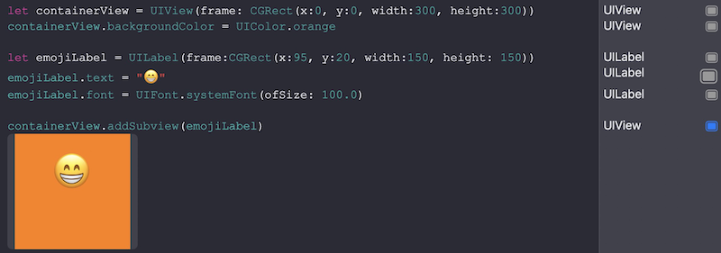

# 第02章 用Playground玩转Swift第一弹
## 1. Optional变量
Optional变量是Swift的一种内置数据类型，表示值可能为空。在声明的时候需要缀上一个 `?` ：
``` swift
var jobTitle: String?   // 该变量没有初值，在赋初值之前为nil
```

注意：<font color=red>给一个String变量赋nil是不允许的，</font>这也说明可选变量是一种**独立的**数据类型。
在从可选变量取值的时候，要么通过可选绑定获取确定的实值，要么始终在变量后面加 ? 以提醒程序员，这个值可能为空：
``` swift
var x:String?

print("hello \(x?.count)") // Xcode会强行在x后面加?，并且这样会有编译warning

// 通过可选绑定（Optional Binding），获取确定的实值
if let x=x{
    print("hello \(x.count)")
}
// ↑↓上下两种写法是等价的
if x != nil{
    print("hello \(x!.count)")
}
```

# Playground 可以直接显示/调试界面元素
``` swift
// 创建一块View，设置背景和文字
let containerView = UIView(frame: CGRect(x:0, y:0, width:300, height:300))
containerView.backgroundColor = UIColor.orange

let emojiLabel = UILabel(frame:CGRect(x:95, y:20, width:150, height: 150))
emojiLabel.text = "😁"
emojiLabel.font = UIFont.systemFont(ofSize: 100.0)

containerView.addSubview(emojiLabel)
```
展开右侧方块，会在 containerView 下面呈现这个view的样子


