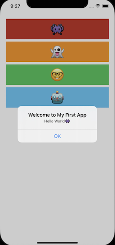
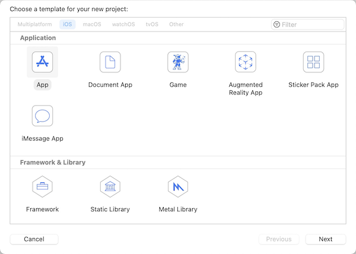
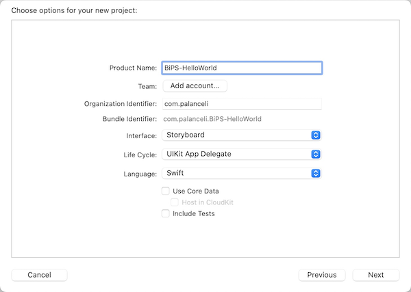
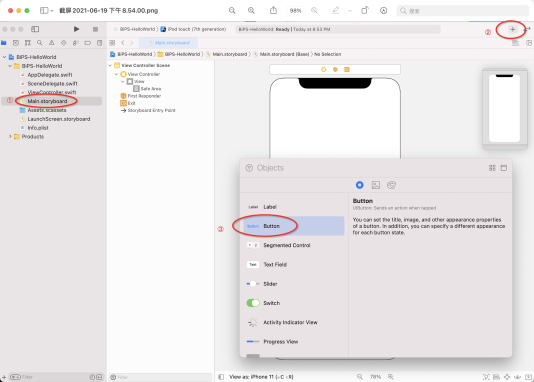
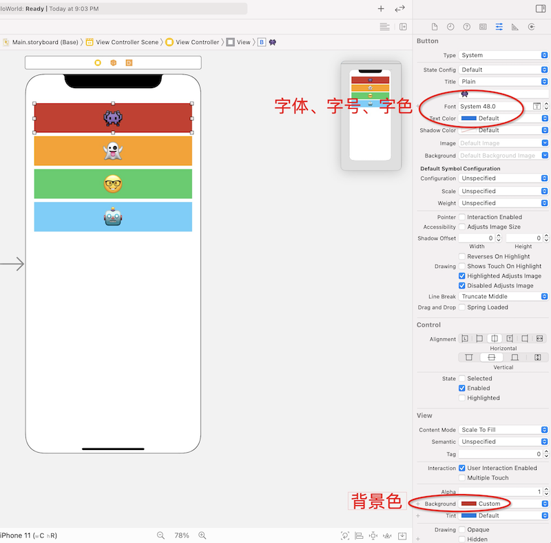
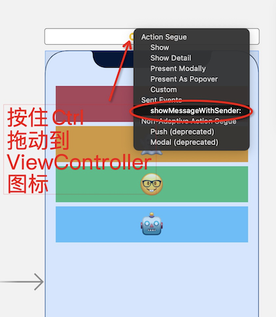
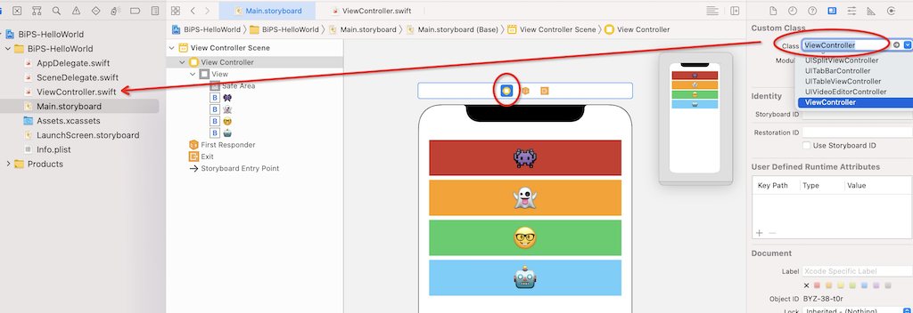
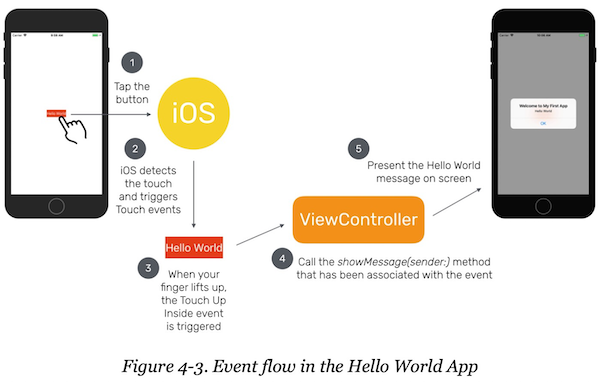
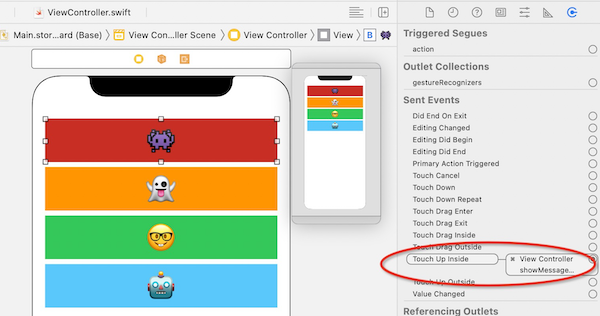
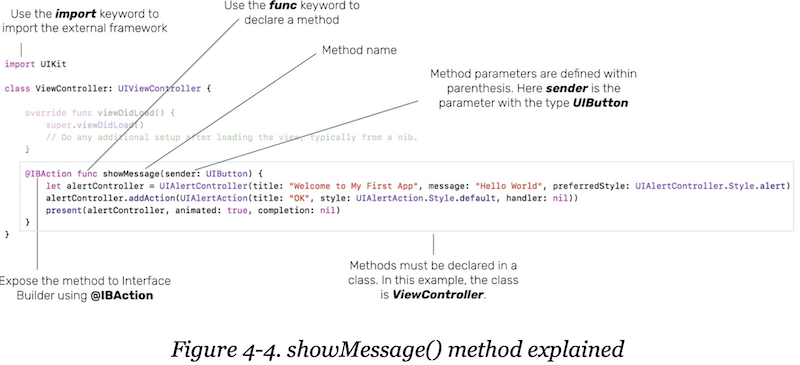

# 第03章 构建第一个Swift应用——Hello World
第一个应用如下所示，纵向排列4个按钮，每个按钮点击后弹出提示，并将按钮文字传递给提示窗：



## 1. 创建工程
选择iOS - App - 输入工程名 - 语言选择Swift



## 2. 搭界面
打开Main.storyboard - 点击加号 - 拖一个Button到主界面上：

设置按钮文字为👾，并修改字体、字号、字色、背景色：


## 3. 编写响应代码
在ViewController.swift 中添加响应代码：
``` swift
@IBAction func showMessage(sender: UIButton){
    // 获取被点击的按钮
    let selectedButton = sender
    // alert中的文字是从button传递进来的
    // 按钮文字可能为空，因此需要做可选绑定
    if let wordToLookup = selectedButton.titleLabel?.text{
        let strTitle = "Welcome to My First App"
        let strMsg = "Hello World" + wordToLookup
        let alertController = UIAlertController(title: strTitle, message: strMsg, preferredStyle: UIAlertController.Style.alert)
        alertController.addAction(UIAlertAction(title: "OK", style: UIAlertAction.Style.default, handler: nil))
        present(alertController, animated: true, completion: nil)
    }
}
```

## 4. 把响应代码关联到Button
按住Ctrl拖动每个按钮到ViewController图标上去，在弹出菜单点击`showMessageWithSender` ：


## 5. 问题
- **按钮横向居中布局** 有两种方法可以实现：
  - 方法一： 给按钮添加居中约束+宽度约束
  - 方法二： 给按钮添加相对屏幕左右两个边缘的约束

  方法二在多机型下适配性更好。

- <font color=red>第4步中把按钮拖动到ViewController上时，在哪里定义了这个ViewController就是代码里的ViewController.swift？</font>

如下图在UI编辑器中点击ViewController图标，看右侧 Identify Inspector / Custom Class / Class 中设置了该UI对应的类名为`ViewController`：


- <font color=red>界面上按钮到类消息的关联关系记录在哪里？怎么取消？</font>
这个问题在第4章有介绍
- <font color=red>storyboard是怎么被应用加载起来的？它的实现机制是什么？</font>
- <font color=red>响应代码中的问号什么意思？</font>
``` swift
if let wordToLookup = selectedButton.titleLabel?.text{ // 这个问号啥意思？
    let strTitle = "Welcome to My First App"
    let strMsg = "Hello World" + wordToLookup
    let alertController = UIAlertController(title: strTitle, message: strMsg, preferredStyle: UIAlertController.Style.alert)
    alertController.addAction(UIAlertAction(title: "OK", style: UIAlertAction.Style.default, handler: nil))
    present(alertController, animated: true, completion: nil)
}
```
if let 用于可选绑定：等号右值是一个可能为 nil 的变量，通过可选绑定，确认等号左值非空，令紧跟其后的代码段是安全的。
但是上端代码，等号左值在取值过程中有一个 ? ，这似乎和 if let 无关
答案在：[Optional变量](02.md)
https://www.yuque.com/weizheng-q8niv/uq1ldn/gqhc8y#vEkae

# 第04章 Hello World详解
本章主要解答针对上一章的问题：
- storyboard中的ViewController是怎么和ViewController.swift中的VC类关联起来的？
- showMessage(sender:)方法中的代码是什么含义？它是如何告诉iOS显示“Hello World”消息的？
- @IBAction关键字是什么意思？
- 按钮是如何检测到点击，并触发showMessage(sender:)方法的？
- viewDidLoad()方法是干嘛的？
- Xcode的“Run”按钮是如何工作的？编译一个app又是什么意思？

## 问题
### 当用户点击按钮时发生了什么？

1. 手指摁下按钮
2. iOS检测到触摸并触发触屏消息
3. 当指尖从屏幕抬起时，触发 Touch Up Inside 事件
4. 按钮把该事件关联到了VC的 showMessage(sender:) 方法，因此调用该方法
5. 在屏幕呈现Hello World消息对话框

### 按钮如何关联到VC并找到处理函数？
打开Main.storyboard，点击按钮，打开Connections Inspector，Send Events可以看到Touch Up Inside被关联到的VC和函数showMessage(sender:) 


### IBAction方法
@IBAction关键字可以令代码和Interface Builder中的UI对象关联起来，该关键字意味着该方法可以暴露给Interface Builder
