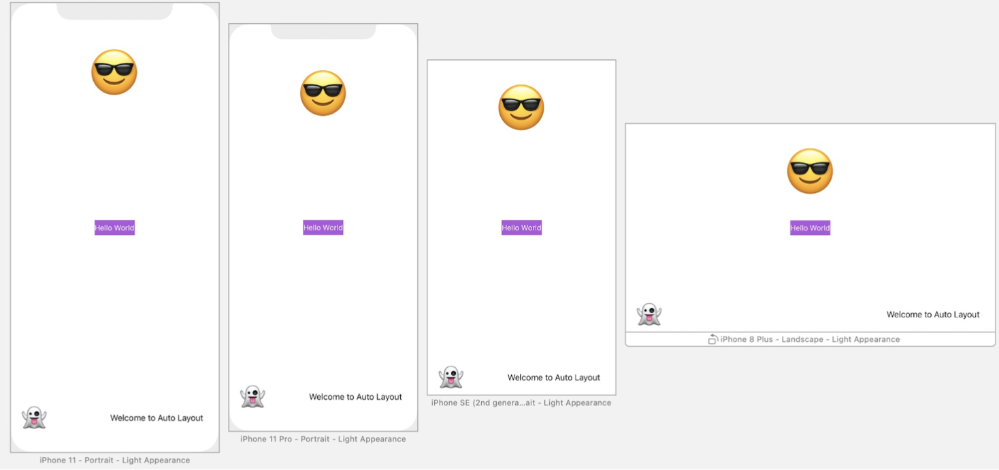
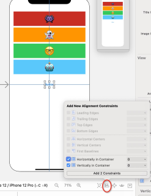
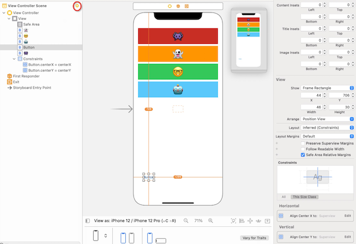
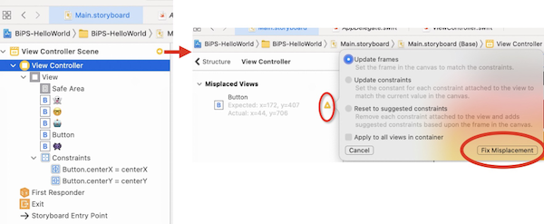
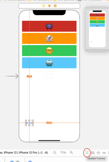
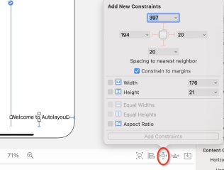
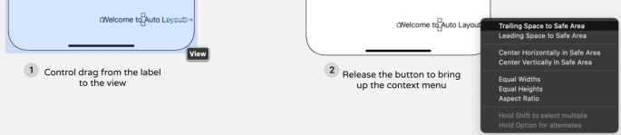
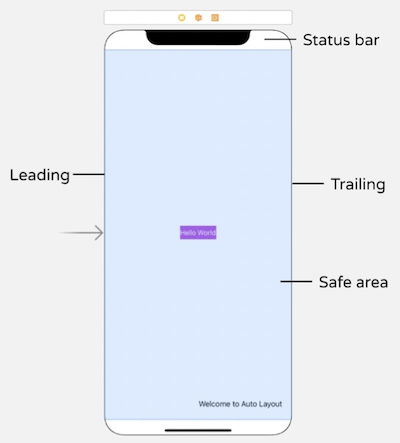

# 第05章 自动布局
本章主要介绍自动布局的使用、操作和相关概念，作业是实现如下布局：

其中：
- Hello World按钮为水平、竖直居中
- Welcome to Auto Layout 距离Safe Area右、下边缘各20
- 😎 居Safe Area上边缘33，水平居中
- 👻 距离Safe Area左、下边缘各20

## 不同机型的尺寸
机型| points| pixcels|
----|----|----|
iPhone SE|320×568|640×1136|
iPhone 6/6s/7/8/SE（新）|320×568|640×1136|
iPhone 6/6s/7/8 Plus|414×736|1242×2208|
iPhone X/XS/11 Pro|375×812|1125×2436|
iPhone XR/11|414×896|828×1792|
iPhone XS Max/11 Pro Max|414×896|1242×2688|
iPhone 4s|320×480|640×960|

最初3.5英寸的iPhone 3G/3GS出现的时候，屏幕是`320×480`像素，后来iPhone 4引入了retina屏，像素升级到`640×960`像素。苹果在计量单位上引入points，前者是320×480，每个point是1个像素；后者points依然是320×480，每个point是2个像素。

**为什么使用points作为计量单位？** 书里说是为了让程序员使用更方便。我觉得这个答案存疑，因为随着机型不同，points也在变化，这和直接使用pixcels有区别吗？

针对上面的iPhone 3G→4迭代的例子，如果程序员操作的单位是points，那么从3G到4，尽管屏幕的分辨率更高了，但程序员的操作精度达不到那么精细，因为程序员的可控粒度是points。

## 布局约束
如下图可以为按钮的水平/竖直居中添加布局约束。添加后，按钮就会多出两条蓝线表示这两个约束：

如果添加了布局约束，又把按钮拖到非居中位置，界面编辑器就会触发issue，同时约束线由蓝变橙：

1. 可以把按钮再拽回到橙色虚线框里，解决该issue；
2. 也可以点击中间的布局树视图中出现的橙色箭头：

3. 还可以直接点击右下角的 Update Frames 按钮

以上三个方法都能解决布局冲突的issue。

## 添加约束
除了在界面编辑器右下角点击 Add New Contraints 外

还可以Ctrl拖动被约束的元素，例如，要将下图Label固定到右下角，只需Ctrl拖动该Lebel到所在VC，选择 `Trailing space to Safe Area` ，然后再来一次，选择 `Bottom Space to Safe Area`

这就完成了两个约束的添加。

## Safe Area
刘海屏在屏幕上下有一部分弧形区域，不适合用于内容显示，因此苹果定义了中间的矩形区域为Safe Area：

