# 第06章 使用StackView设计UI
> 本章介绍了StackView的两种使用方法，和布局约束的操作方法。

作业是，不用编码，仅通过StackView实现如下适应不同屏幕的布局：
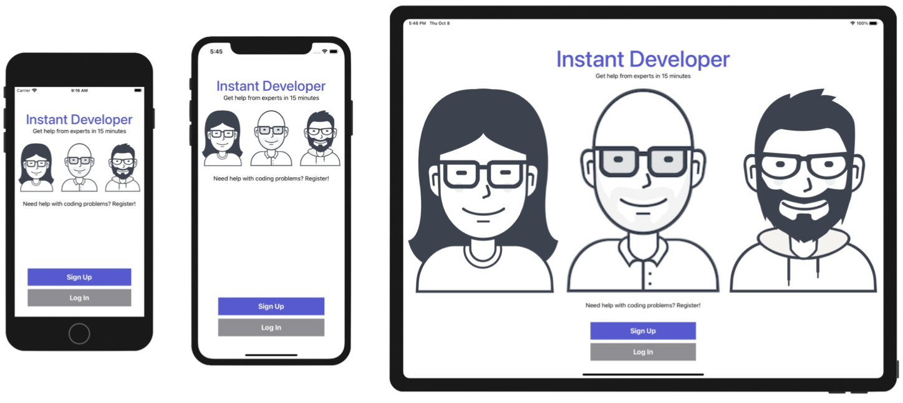
具体做法是
1. 将屏幕顶部的主标题、副标题组合成一个纵向StackView1
2. 把三个头像组合成一个横向StackView2
3. 再把这两个StackView和头像下面的文字组合成一个纵向StackView3，并设置距离顶部和左右的约束
4. 底部两个按钮则是一个纵向StackView，并设置距离底部和左右的约束
5. 最后再通过Size Class为手机横屏添加一个特化尺寸——令上面的StackView3在手机横屏下距离顶部边缘更小，以便底部两个按钮不会压住头像。

## StackView
- StackView用于纵向或横向排列一组view，它管理了这些子视图的布局。经过StackView的封装，简化了对内部自动布局的约束操作。具体怎么简化的呢？Xcode提供了两种使用StackView的方法：
    - 从对象库中直接拖出StackView到视图上，再把如图片、label之类的子视图拖入StackView；
    - 选择几个子视图，然后设置他们的Stack选项，把这些子视图装到一个StackView里去
## StackView的几种布局属性
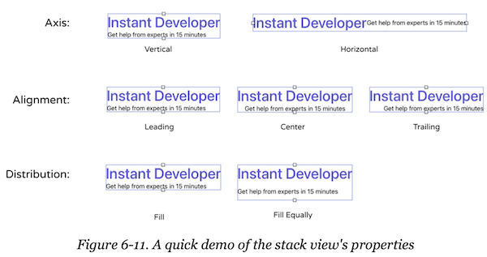
- **Alignment属性** 还可以取值Fill，在第10章中，把一个左图右文的横向StackView改为纵向上图下文时，就需要由Leading改为Fill，这样就会把图片横向拉伸填满整个StackView。
- **Distribution属性** 不止书中说的这两个取值，完整的取值含义如下：
  - **Fill** 
    - 如果StackView大小不确定，通过子元素大小，确定StackView的大小
    - 如果StackView大小确定，前面的子元素遵循设置，调整最后一个子元素尺寸以适应填充StackView的空间
  - **Fill Equally** 等高或等宽以填满StackView的空间
  - **Fill Proportionally** 
    - 如果StackView大小不确定，通过子元素大小，确定StackView的大小
    - 如果StackView大小确定，子元素会等比例缩放，以适配StackView的大小
  - **Equal Spacing** 仅在StackView大小确定的情况下使用，子元素间距相等
  - **Equal Centering** 仅在StackView大小确定的情况下使用，子元素中轴线距离相等

> - 当在水平方向放两个Label，组合成StackView后，再令StackView的`Distribution`为Fill，设置距离设备上、左、右边框分别为100，会得到两个`Content Priority Ambiguity`警告：“Set horizontal hugging priority to ...”，这是什么意思？该怎么解决？
只要设置其中一个Label的`Content Hugging Priority/Horizontal`从251改为252即可；或者设置StackView的`Distribution`属性为其他选项都OK。这么看来如果设置成Fill，它要缩放的元素要参照每个元素的`Content Hugging Priority`属性，而不是上面说的*调整最后一个元素*。

## 图片格式
- 光栅图
光栅图是指用网格来组织像素集合，形成一张图片，通常以PNG/JPEG为后缀。光栅图的缺点是放大效果会失真。因此苹果建议给每张光栅图提供3种规格：

|规格|适用机型
|----|----
|@3x|iPhone Xs Max/Xs/X/8 Plus/7 Plus/6s Plus
|@2x|iPad Pro/iPad/iPad mini/iPhone XR/8/7/6s/SE
|没有后缀|非retina屏
具体可参见 [Image Size and Resolution](https://developer.apple.com/design/human-interface-guidelines/ios/icons-and-images/image-size-and-resolution/)。

- 向量图
向量图是由路径而不是像素组成，通常以PDF/SVG为后缀。向量图放大不会失真。

## 组织图片和图标资源
iOS应用的图片和图标资源在 Asserts.xcassets 目录下，只需要把资源拖到这下面即可：
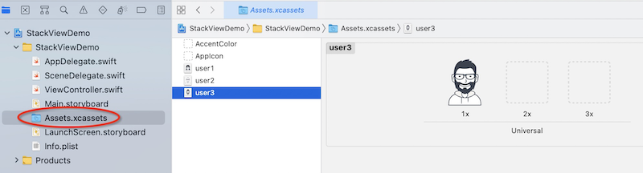

## 例程步骤
### 使用StackView 布局标题文字：
1. 在VC上拖入一个vertical stack view。
2. 在stack view 内拖入两个label，上下布局，UI文本分别为：“Instant Developer”和“Get help from experts in 15 minutes” 。

### 使用StackView 布局头像图片
1. 向主视图拖入一个image view，由于前面已经往assert里拖入了需要的图片，因此选择image view的Attributes Inspector - image，可直接选择图片user1。

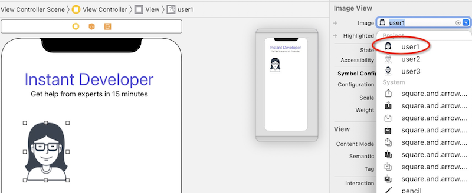

2. 重复步骤1，添加user2和user3。
3. 在每张图片上按住Ctrl横划，在弹出菜单上**选择Aspect Ratio，保证每张图片宽高比恒定**。
4. 按住⌘选中三张图，点击右下角Embed in按钮，选择Stack View。这会把三张图片装在新添加的Stack View中。

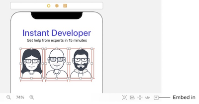

5. 同样的方法，选中上下两个Stack View，并把他们再装到一个Vertical Stack View里。

### 为Stack View 添加布局约束
1. 设置Stack View距离上、左、右的边缘分别为50、10、10

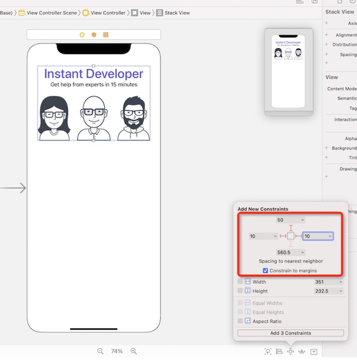

2. 如果字体过大，可能会导致在有的机型上显示不全，可以为字号选择**AutoShrink属性**，并设值为20，这样iOS**会在不同机型下选择合适的字号，让文字能显示完整**：

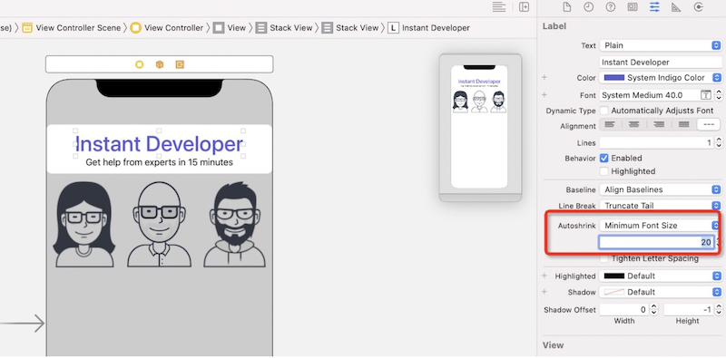

3. 在图片下面再添加一行文字：往Stack View 的底部拖入一个label，在鼠标松开前，Stack View 底部会有一条蓝线，表明label被插入的位置，松开鼠标后，label会作为StackView的一个元素被插入到StackView的下面。文本设置为“Need help with coding problems？ Register！”同样设置Autoshrink属性。

### 使用Stack View 布局两个按钮
1. 在主视图底部添加一个按钮，设置好文字、尺寸、前景/背景色后，直接 ⌘-D ，就会复制出一个按钮
2. 同样的方法把这两个按钮上下并排，包在一个新Stack View中。
3. 选择Align，将该Stack View 水平居中：

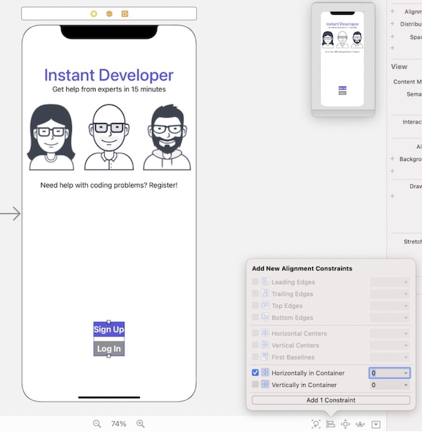

4. 设置距离底部30 points
5. 此时的Stack View有点太窄了，可以Ctrl-横划该Stack View，选择Width：

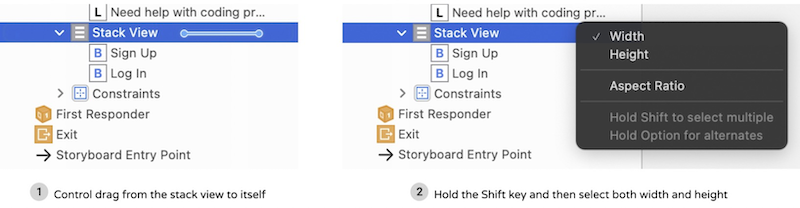

这会添加一个宽度布局约束，设置为200：

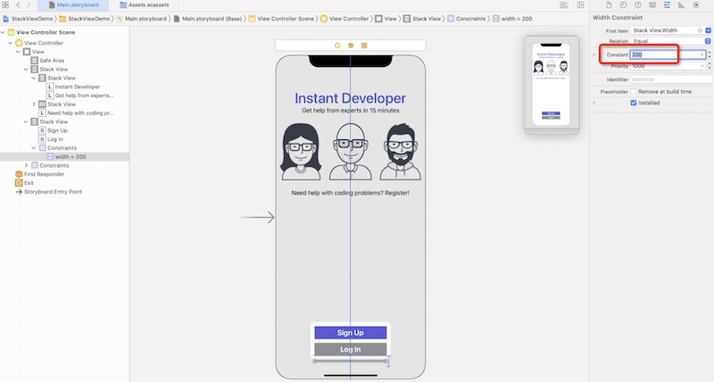

6. ⌘-选中两个按钮，再为他们添加一个高度布局约束：

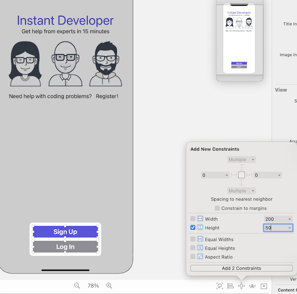

### size classes
size classes是给布局约束添加了特例情况。比如正常情况下给stack view添加 Stack view.top = Safe area.top+50 的约束，希望横屏的时候这个约束是15，则可以为50添加一个wA-hC的条件，在此条件下，该值为15：
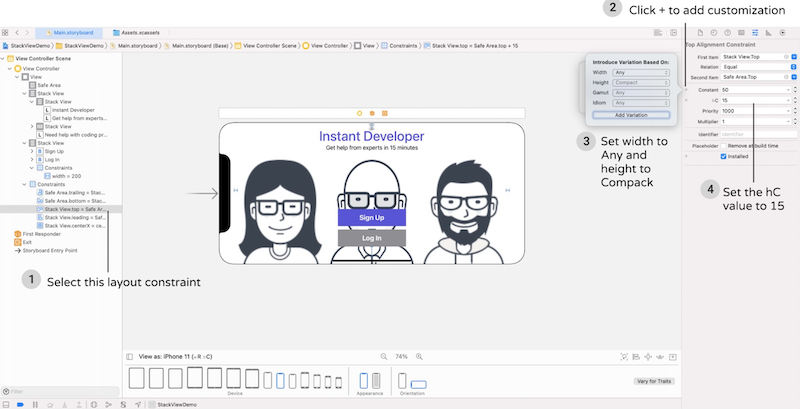

类似的对齐、布局约束都可以专门为某些屏幕尺寸添加独立约束。具体尺寸规格如下表所示：
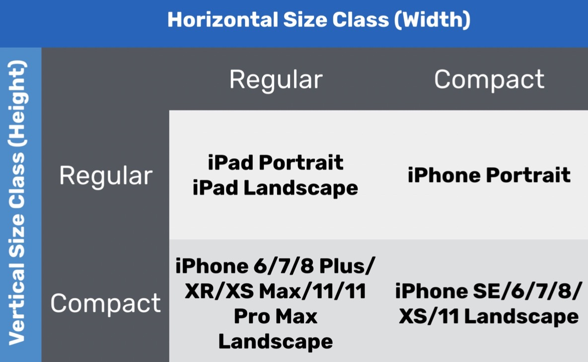
基本上手机横屏都是Height Compact（hC）

# 第07章 关于原型工具
## 画原型图的工具：
- [Pop](https://marvelapp.com/10c52gg6)
- [Sketch](https://www.sketchapp.com) 还可以去Sketch的[线上资源库](http://www.sketchappsources.com)找到很多付费/免费Sketch 资源。
- [Figma](http://www.sketchappsources.com) Sketch的云版本
- [Adobe XD](http://www.adobe.com/products/experience-design.html) 将移动app和云版本合二为一。
- [Invision](https://www.invisionapp.com/)
- [Flinto](https://www.flinto.com)
- Keynote 这里有[如何使用keynote制作原型](http://webdesign.tutsplus.com/tutorials/how-to-demo-an-ios-prototype-in- keynote--cms-22279)的教程，这里是苹果的60秒[原型视频](https://developer.apple.com/videos/play/wwdc2017/818/)。