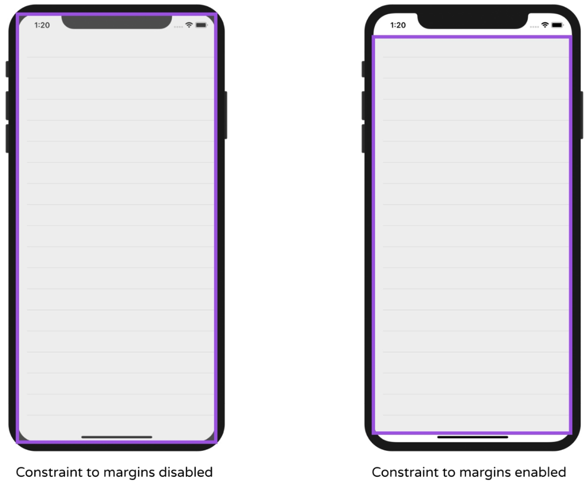
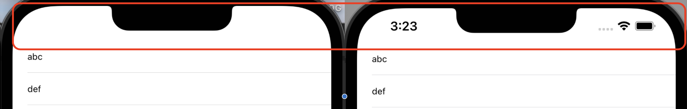
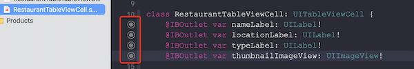

# 第08章 创建一个基于简单Table的APP
本章完成一个APP，它基于最简单的Table如下图所示：

本章采用Table View的第一种做法——在标准VC中拖入一个Table View，并将其数据代理指向VC，令VC实现UITableViewDataSource 和 UITableViewDelegate 协议，数据都是本地的。

## 步骤
1. 创建工程，打开 Main.storyboard - Object library ，找到 Table View ，拖入主视图，并把table view贴合到视图边缘。
2. Attributes inspector，把Prototype Cells由0修改为1。
3. 选中cell，把 Attributes inspector  - Table View Cell  - Style  Cell style由Customer修改为Basic，这种风格可以同时显示文本和图片。把 identifier 设置为 datacell，这是为cell设置一个唯一id，后面会用到。
4. 选中Table View，添加新的约束，设置上下左右距离边缘均为0。在设置边缘约束时，有一个`Constrain to margins`选项：

不勾选和勾选后的约束范围如下：

5. 在 UIViewController 后面追加 UITableViewDataSource 和 UITableViewDelegate 协议。
6. 添加 UITableViewDataSource 协议必须的两个方法，并定义一个字符串数组用来保存列表数据。 
``` swift
class ViewController: UIViewController, UITableViewDataSource, UITableViewDelegate {
    // 列表数据
    var restaurantNames = ["Cafe Deadend", "Homei", "Teakha", "Cafe Loisl", "Petite Oyster",
                           "For Kee Restaurant", "Po's Atelier", "Bourke Street Bakery",
                           "Haigh's Chocolate", "Palomino Espresso", "Upstate", "Traif",
                           "Graham Avenue Meats And Deli", "Waffle & Wolf", "Five Leaves", "Cafe Lore",
                           "Confessional", "Barrafina", "Donostia", "Royal Oak", "CASK Pub and Kitchen"]
    
    // UITableViewDataSource必须的两个方法

    // tableview共有多少行
    func tableView(_ tableView: UITableView, numberOfRowsInSection section: Int) -> Int {
        return restaurantNames.count
    }
    
    // 每行的内容
    func tableView(_ tableView: UITableView, cellForRowAt indexPath: IndexPath) -> UITableViewCell {
        // 已在Attribute inspector中为TableViewCell设置过Identifier为"datacell"
        let cellIdentifier = "datacell"
        // 获取该cell
        let cell = tableView.dequeueReusableCell(withIdentifier: cellIdentifier, for: indexPath)
        // 设置文本信息
        cell.textLabel?.text = restaurantNames[indexPath.row]
        // 设置图片信息
        cell.imageView?.image = UIImage(named: "restaurant")
        return cell
    }
    
    override var prefersStatusBarHidden: Bool{
        return true // 不显示顶部的状态栏
    }

    // ……
}
```
是否隐藏状态栏的差别如下：

7. 将TableView的Datasource代理设置为ViewController。具体做法：按住Ctrl，选中 Table View 拖到 View Controller ，在弹出菜单中选择 dataSource。 也可以选中 Table View 在 Connections Inspector/Outlets/dataSource 中选择 View Controller 。
8. 为TableView添加缩略图。下载http://www.appcoda.com/resources/swift53/simpletable-images1.zip，这里包含了2x、3x图片，把他们拖到Assets.xcassets下，并在 tableView(_:cellForRowAtIndexPath:) 为cell添加图片。
9. 重载 prefersStatusBarHidden 方法，不显示顶部状态栏。

> - 什么是framework？
> framework用来组织一些相关的API和类，UIKit就是最常用的一个framework，它用来管理和构建用户界面，所有在Interface Builder里提供的元素都在UIKit中有对应的类——从Object library中拖出一个UI元素，点开Identity inspector就可以看到它对应的类名。

## 视图、协议和代理类之间的关系
视图和数据是分离的，视图向代理类询问数据，询问的具体方式是通过协议。具体到UITableView，如下图所示，ViewController向视图提供数据代理，通过两个协议：
UITableViewDataSource回答数据源的问题，如有多少段、多少行，每行数据显示什么信息；
UITableViewDelegate回答数据视图的问题，如每行多高，头部多高，每行缩进多少。


## dequeueResuableCell的作用
这个方法会根据cell identifier从队列中获取一个可重用的table cell。

<font color=red>这个玩意儿为什么要每个identifier一个呢？为什么不能全局共享一个队列？</font>

答案显然不能够，因为如果有两个TableView A和B，假如全局共享一个队列，那么#1保存的是A#1还是B#1的呢？他不仅需要ID，还需要知道row（行号），以便为每一个tableview保留一个可重用队列，每个队列也只需要屏幕大小的元素即可。

# 第09章 TableView的自定义——Prototype Cell, Diffable Data Source和Dark Mode
本章对TableView 做一些自定义设置，结果如下：


上一章是在普通VC中嵌入TableView，而本章则直接使用TableViewController，号称这是更主流的做法。其实仅用TableViewController一样可以通过实现 **tableView(:numberOfRowsInSection)** 和 **tableView(: cellForRowAt)** 两个接口来完成TableView，本章使用了**UITableViewDiffableDataSource** 和 **NSDiffableDataSourceSnapshot**。前者定义了数据源函数，后者定义了每个Section每行的文字。
另一个新知识就是把cell设置成自定义型，并实现一个UITableViewCell子类。

## 步骤
1. 在Main.storyboard中删除原先默认的view controller，并删除ViewController.swift文件。从Object Library中拖一个Table View Controller进来，并在Attribute inspector中勾选 Is Initial View Controller 。
2. 新建文件，选择模板：Cocoa Touch Class ，类名：RestaurantTableViewController，基类：UITableViewController。回到Main.storyboard中把 table view controller 的 custom class 设置为 RestaurantTableViewController，选中 Tabel View Cell 将其style设置为 Basic ，并设值Identifier为 datacell 
3. `打开RestaurantTableViewController.swift`，删除 numberOfSections(tableView) 和 tableView(tableView, numberOfRowsInSection) ，声明一个用来保存餐馆名称的数组。接下来将使用 UITableViewDiffableDataSource 来配置Table View的单元格，使用 NSDiffableDataSourceSnapshot 提供要显示的数据。
4. 声明一个枚举类型来定义section。
5. 定义函数 configureDataSource 返回 UITableViewDiffableDataSource。
6. 在 viewDidLoad 函数中定义 NSDiffableDataSourceSnapShot 对象。
7. 定义记录图片名称的数组，并将 cellProvider 返回的单元格根据数组获取图片资源
``` swift
class RestaurantTableTableViewController: UITableViewController {
    // 第③步，声明用来保存餐馆名称的数组
    var restaurantNames = ["Cafe Deadend", "Homei", "Teakha", "Cafe Loisl",
                           "Petite Oyster", "For Kee Restaurant", "Po's Atelier",
                           "Bourke Street Bakery", "Haigh's Chocolate",
                           "Palomino Espresso", "Upstate", "Traif",
                           "Graham Avenue Meats", "Waffle & Wolf", "Five Leaves",
                           "Cafe Lore", "Confessional", "Barrafina", "Donostia",
                           "Royal Oak", "CASK Pub and Kitchen"]
    // 第⑦步，定义图片名称数组
    var restaurantImages = ["cafedeadend", "homei", "teakha", "cafeloisl",
                            "petiteoyster", "forkee", "posatelier",
                            "bourkestreetbakery", "haigh", "palomino",
                            "upstate", "traif", "graham", "waffleandwolf",
                            "fiveleaves", "cafelore", "confessional", "barrafina",
                            "donostia", "royaloak", "cask"]
    
    // 第④步，定义所有section，本例中只有一个
    enum Section {
        case all
    }
    
    // 如果不加lazy，dataSource是在类实例初始化时赋值，此时self尚不可用，因此不能调用实例函数，必须注以lazy，等类完成初始化后再赋值
    lazy var dataSource = configureDataSource()
    
    override func viewDidLoad() {
        super.viewDidLoad()

        // 第⑥步，定义NSDiffableDataSourceSnapshot对象
        tableView.dataSource = dataSource
        // snapshot的作用就是填写每一行的文字
        var snapshot = NSDiffableDataSourceSnapshot<Section, String>()
        snapshot.appendSections([.all])
        snapshot.appendItems(restaurantNames, toSection: .all)
        dataSource.apply(snapshot, animatingDifferences: false)
    }
    
    // 第⑤步，返回table view 单元格数据
    func configureDataSource() -> UITableViewDiffableDataSource<Section, String >{
        let cellIdentifier = "datacell"
        // 声明一个对象
        let dataSource = UITableViewDiffableDataSource<Section, String>(
            tableView: tableView,   // tableView是UITableViewController的成员变量
            // 这是一个函数，用来返回指定位置的cell
            cellProvider: {  tableView, indexPath, restaurantName in
                let cell = tableView.dequeueReusableCell(withIdentifier: cellIdentifier, for: indexPath)
                cell.textLabel?.text = restaurantName
                // 根据行号获取图片
                cell.imageView?.image = UIImage(named: self.restaurantImages[indexPath.row])
                return cell
            })
        return dataSource
    }
}
```
到此，应用看起来如下：

<font color=red>我没有看明白：通过dataSource定义了数据源，为什么还要用NSDiffableDataSourceSnapshot？书里说前者定义数据，后者定义视图，可是从以上代码并没有看出和视图相关的比如尺寸之类的属性呢？这种方法和上一节指定UITableViewDataSource有什么差别呢？</font>
答：dataSource提供了提取数据的函数，而snapshot执行向tableView中添加Section和数据


## 在Interface Builder中设计单元格原型
接下来我们希望让tableview看起来更好看一些——使用大图，每行显示更多信息，并且支持暗黑模式：


1. 选中单元格，在Attributes inspector中把风格由 Basic 设置为 Custom ，把高度设置为140。拖一个Image View进去，设置X=20、Y=10、Width=120、Height=120，并把Content Mode 设置为 Aspect Fill 
2. 拖三个Lable到单元格里，纵向排列，分别命名为Name、Location和Type，在Attribute inspector中把字体分别设为 Title 2、Body 和 Subhead ，把Type的字体颜色设置为 Syste Gray Color 。选中三个Label，点击右下角 Embed in - Stack View ，把这三个Label框在Stack View中并设值 Space 为4。在选中前面创建的Image View 和Stacke View，把他们再框入一个横向的Stack View中，设置Space为20。
3. 选中stack view，右下角点击 Add New Contraints ，设置(top, left, bottom, right)=(0, 0, 0, 0)，并勾选 Constrain to margins。在document outline中选中image view，按住Ctrl从自己拖到自己，在弹出菜单中选中 width 和 height ，确保该image view的宽高是固定的。

## 为自定义单元格创建类
1.  新建文件，模板：Cocoa Touch Class， 类名： RestaurantTableViewCell，基类：UITableViewCell ，并声明四个outlet变量：
``` swift
@IBOutlet var nameLabel: UILabel!
@IBOutlet var locationLabel: UILabel!
@IBOutlet var typeLabel: UILabel!
@IBOutlet var thumbnailImageView: UIImageView!
```

> IBOutLet 表明该变量可以关联到story board中的视图对象，比如某个outlet对象关联到button上后，就可以通过该outlet对象改变button的颜色、标题；
IBAction 表明该行为方法可以由某个事件触发，比如用户点击按钮，就会触发某个行为方法被执行。

2. 在storyboard中选中cell，设置类名为RestaurantTableViewCell，在Document outline视图中右键cell，拖动菜单中的thumbnailImageView到storyboard中cell里的Image View，让二者关联起来，同样的方法在locationLabel、nameLabel和typeLabel和对应的label之间建立关联。


已经和视图关联的变量也可以在代码中看到其右侧有实心圆环：



3. 修改获取单元格的代码，原来获取到的还是 UITableViewCell ，应该改为RestaurantTableViewCell ，对nameLabel和thumbnailImageView 的赋值做相应的修改：
``` swift
// 返回table view 单元格数据
func configureDataSource() -> UITableViewDiffableDataSource<Section, String >{
    let cellIdentifier = "datacell"
    let dataSource = UITableViewDiffableDataSource<Section, String>(
        tableView: tableView,   // tableView是UITableViewController的成员变量
        cellProvider: {  tableView, indexPath, restaurantName in
            let cell = tableView.dequeueReusableCell(withIdentifier: cellIdentifier, for: indexPath) as! RestaurantTableViewCell  // 强制转换一下
            cell.nameLabel.text = restaurantName
            // 根据行号获取图片
            cell.thumbnailImageView.image = UIImage(named: self.restaurantImages[indexPath.row])
            return cell
        })
    return dataSource
}
```
> 由UITableViewCell转成RestaurantTableViewCell是一个向下转换，如果你确认可以正确转换，则使用 as! 如果不确认，则使用 as? ，后者在转换后应当检查转换是否成功。

## 将缩略图设置成圆角
有两种方法：
- 通过Story Board。在storyboard 中选中缩略图，Identity inspector - User Defined Runtime Attributes点击 + ，设置KeyPath=cornerRadius ，Type=number ，value=20 ，并确认在Attributes inspector/Drawing中 Clip to Bounds 是被选中的。
- 通过代码。在 RestaurantTableViewCell.swift 中为thumbnailImageView追加如下代码：
``` swift
@IBOutlet var thumbnailImageView: UIImageView! {
    didSet {
        thumbnailImageView.layer.cornerRadius = 20.0  // 设置圆角半径
        thumbnailImageView.clipsToBounds = true       // 设置圆角生效
    }
}
``` 
> didSet被称为属性观察者，每当该变量被赋值时，该函数就会被调用。

## 暗黑模式测试
可以通过Environment调出模拟器的暗黑模式开关，来切换和测试模拟器的暗黑模式：


# 第10章 处理TableView的选中事件并使用UIAlertController显示Alerts
本章修改了单元格样式，在storyboard上设计了两个样式，不过在应用时，仅用了其中一种（后面章节会将怎么在一个列表里同时使用俩样式）。本章重点在于编写响应代码——当点击单元格，弹出菜单，当设置收藏后，会在单元格右侧显示对勾。


## 步骤
1. 为TableView添加一个原型单元格。在document outline中选中Table View，在Attribute inspector中将 Prototype Cells 由1置为2，将第2个的Identity命名为favoritecell。
2. **设置favoritecell的布局**。到Size inspector中，将Row Height勾选为 Automatic 。将其根Stack View 的Axis由Horizontal改为Vertical。将其中image view 的宽度约束删除（在document outline中选中该image view，在其下找到Constraints，删除width项），将高度改为200。虽然image view 没有了宽度约束，但此时它并没有占满父窗口的宽度，需要到父窗口即Stack View中将Alignment由Leading改为Fill，为了让整体看起来更舒服，可以把Space由20改为5。此时document outline还有一个告警（因为Stack View 中的几个Label缺少约束），只要把Stack View的 Distribution由Fill改为Equal Space即可。再修改一下这个Stack View的缩进——到Size inspector 中将Layout Margins设置为 Language Directional ，并将Leading和Trailing均置为20。
3. 让TableView的单元格使用新样式。在RestaurantTableViewController.swift中，修改函数configureDataSource ，至此app就可以运行了
``` swift
// let cellIdentifier = "datacell"     将这一行修改如下：
let cellIdentifier = "favoritecell"
``` 
4. 在RestaurantTableViewController.swift中添加点击响应，同时对于每个选中状态的单元格，需要用一个数组来记录最新状态：
``` swift
class RestaurantTableTableViewController: UITableViewController {
    // ……
    
    // 记录单元格的收藏状态
    var restaurantIsFavorites = Array(repeating: false, count: 21)
    
    // 返回table view 单元格数据
    func configureDataSource() -> UITableViewDiffableDataSource<Section, String >{
        let cellIdentifier = "favoritecell"
        let dataSource = UITableViewDiffableDataSource<Section, String>(
            tableView: tableView,   // tableView是UITableViewController的成员变量
            cellProvider: {  tableView, indexPath, restaurantName in
                let cell = tableView.dequeueReusableCell(withIdentifier: cellIdentifier, for: indexPath) as! RestaurantTableViewCell  // 强制转换一下
                cell.nameLabel.text = restaurantName
                // 根据行号获取图片
                cell.thumbnailImageView.image = UIImage(named: self.restaurantImages[indexPath.row])
                
                // 根据数组为单元格的收藏状态赋值
                if self.restaurantIsFavorites[indexPath.row]{
                    cell.accessoryType = .checkmark
                }else{
                    cell.accessoryType = .none
                }
 
                return cell
            })
        return dataSource
    }
    
    override func tableView(_ tableView: UITableView, 
                            didSelectRowAt indexPath: IndexPath) {
        // 1. 创建一个Alert菜单
        let optionMenu = UIAlertController(title: nil, message: "你想弄啥咧？", 
                                           preferredStyle: .actionSheet)
        
        // 适配iPad，应该是制定菜单的弹出位置靠近哪一个单元格
        if let popoverController = optionMenu.popoverPresentationController {
            if let cell = tableView.cellForRow(at: indexPath) {
                popoverController.sourceView = cell
                popoverController.sourceRect = cell.bounds
            }
        }

        // 2. 为菜单装配行动项Cancel
        let cancelAction = UIAlertAction(title: "取消", style: .cancel, handler: nil)
        optionMenu.addAction(cancelAction)
        
        // 3. 为菜单装配行动项reserve
        // 这是点击reserve后的触发行为
        let reserveActionHandler = { (action: UIAlertAction!) -> Void in
            let alertMessage = UIAlertController(title: "施工中", message: "抱歉，该功能建设中，请稍后再试", preferredStyle: .alert)
            alertMessage.addAction(UIAlertAction(title: "OK", style: .default, 
                                                 handler: nil))
            self.present(alertMessage, animated: true, completion: nil)
        }
        
        let reserveAction = UIAlertAction(title: "Reserve a table", style: .default, handler: reserveActionHandler)
        optionMenu.addAction(reserveAction)
        
        // 4. 为菜单装配行动项favorite
        let favoriteAction = UIAlertAction(title: "收藏", style: .default, 
                                           handler: {(action: UIAlertAction!) -> Void in
            let cell = tableView.cellForRow(at: indexPath)
            cell?.accessoryType = .checkmark
            cell?.tintColor = .systemYellow  // 把对勾置为黄色
            self.restaurantIsFavorites[indexPath.row] = true
        } )
        optionMenu.addAction(favoriteAction)
        
        // 5. 弹出Alert菜单
        present(optionMenu, animated: true, completion: nil)
        
        // 6. 取消被点击行的选中状态，否则会一直有一个灰色背景
        tableView.deselectRow(at: indexPath, animated: false)
    }
}
```
对于TableView单元格，右侧保留了四种内建视图：显示指示器、详情按钮、复选标记和详细信息。