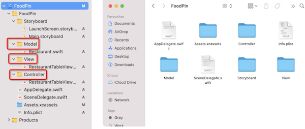

# 第11章 面向对象编程，工程组织和代码管理
本章的例程和上一章完全一致，只是实现手法上，上一章单独声明了Name、Location 和 Image数组，而本章则采用struct Restaurant来封装这些数据。需要注意在采用`NSDiffableDataSourceSnapshot`/`UITableViewDiffableDataSource`为TabelView填充内容时，NSDiffableDataSourceSnapshot::appendItems输入的是Restaurant数组，UITableViewDiffableDataSource的cellProvider参数接收到的也是Restaurant对象了。

## Struct和Class的区别
1. struct不允许继承
2. swift的数据类型有两种：值类型和引用类型，struct属于值类型，class属于引用类型
``` swift
class Car{
    var brand = "Tesla"
}
var car1 = Car()
var car2 = Car()
car1.brand = "Audi"   // car1.brand == "Audi"，car2.brand == "Audi"

struct Car{
    var brand = "Tesla"
}
var car1 = Car()
var car2 = Car()
car1.brand = "Audi"   // car1.brand == "Audi"，car2.brand == "Tesla"
```

## 封装Restaurant的数据
1. 新建文件，类型为Swift File，文件名为restaurant.swift，封装数据并定义初始化函数：
``` swift
struct Restaurant{
    var name: String
    var type: String
    var location: String
    var image: String
    var isFavorite: Bool
    
    init(name: String, type: String, location: String, image: String, isFavorite: Bool) {
        self.name = name
        self.type = type
        self.location = location
        self.image = image
        self.isFavorite = isFavorite
    }
    
    init(){
        self.init(name: "", type: "", location: "", image: "", isFavorite: false)
    }
}
```
2. 把原先cell中使用字符串数组记录的数据改为Restaurant数组：
``` swift
//
//  RestaurantTableTableViewController.swift
//  FoodPin
//
//  Created by BEI LI on 2021/8/4.
//
import UIKit

class RestaurantTableTableViewController: UITableViewController {
    // ❗️定义restaurant数据
    var restaurants:[Restaurant] = [
        Restaurant(name: "Cafe Deadend", type: "Coffee & Tea Shop", location: "Hong Kong",
                   image: "cafedeadend", isFavorite: false),
        Restaurant(name: "Homei", type: "Cafe", location: "Hong Kong", image: "homei",
                   isFavorite: false),
        Restaurant(name: "Teakha", type: "Tea House", location: "Hong Kong",
                   image: "teakha", isFavorite: false),
        Restaurant(name: "Cafe loisl", type: "Austrian / Causual Drink",
                   location: "Hong Kong", image: "cafeloisl", isFavorite: false),
        Restaurant(name: "Petite Oyster", type: "French", location: "Hong Kong",
                   image: "petiteoyster", isFavorite: false),
        Restaurant(name: "For Kee Restaurant", type: "Bakery", location: "Hong Kong",
                   image: "forkee", isFavorite: false),
        Restaurant(name: "Po's Atelier", type: "Bakery", location: "Hong Kong",
                   image: "posatelier", isFavorite: false),
        Restaurant(name: "Bourke Street Backery", type: "Chocolate", location: "Sydney",
                   image: "bourkestreetbakery", isFavorite: false),
        Restaurant(name: "Haigh's Chocolate", type: "Cafe", location: "Sydney",
                   image: "haigh", isFavorite: false),
        Restaurant(name: "Palomino Espresso", type: "American / Seafood",
                   location: "Sydney", image: "palomino", isFavorite: false),
        Restaurant(name: "Upstate", type: "American", location: "New York",
                   image: "upstate", isFavorite: false),
        Restaurant(name: "Traif", type: "American", location: "New York",
                   image: "traif", isFavorite: false),
        Restaurant(name: "Graham Avenue Meats", type: "Breakfast & Brunch",
                   location: "New York", image: "graham", isFavorite: false),
        Restaurant(name: "Waffle & Wolf", type: "Coffee & Tea", location: "New York",
                   image: "waffleandwolf", isFavorite: false),
        Restaurant(name: "Five Leaves", type: "Coffee & Tea", location: "New York",
                   image: "fiveleaves", isFavorite: false),
        Restaurant(name: "Cafe Lore", type: "Latin American", location: "New York",
                   image: "cafelore", isFavorite: false),
        Restaurant(name: "Confessional", type: "Spanish", location: "New York",
                   image: "confessional", isFavorite: false),
        Restaurant(name: "Barrafina", type: "Spanish", location: "London",
                   image: "barrafina", isFavorite: false),
        Restaurant(name: "Donostia", type: "Spanish", location: "London",
                   image: "donostia", isFavorite: false),
        Restaurant(name: "Royal Oak", type: "British", location: "London",
                   image: "royaloak", isFavorite: false),
        Restaurant(name: "CASK Pub and Kitchen", type: "Thai", location: "London",
                   image: "cask", isFavorite: false)
    ]
    
    // 定义所有section，本例中只有一个
    enum Section {
        case all
    }
    
    // 由于该变量依赖self的成员函数，因此必须注以lazy，等类完成初始化后才能赋值
    lazy var dataSource = configureDataSource()
    
    override func viewDidLoad() {
        super.viewDidLoad()

        tableView.dataSource = dataSource
        // ❗️泛型参数由String改为Restaurant
        var snapshot = NSDiffableDataSourceSnapshot<Section, Restaurant>()
        snapshot.appendSections([.all])
        // ❗️这里输入的数据类型也就是Restaurant数组了
        snapshot.appendItems(self.restaurants, toSection: .all)
        dataSource.apply(snapshot, animatingDifferences: false)
        tableView.separatorStyle = .none
        // 自动调整单元格的宽度，不至于在宽屏设备下太宽
        tableView.cellLayoutMarginsFollowReadableWidth = true
    }
    
    // 返回table view 单元格数据
    func configureDataSource() -> UITableViewDiffableDataSource<Section, Restaurant >{
        let cellIdentifier = "favoritecell"
        let dataSource = UITableViewDiffableDataSource<Section, Restaurant>(
            tableView: tableView,   // tableView是UITableViewController的成员变量
            // 这里接收到的item也是Restaurant了
            cellProvider: {  tableView, indexPath, restaurant in
                let cell = tableView.dequeueReusableCell(withIdentifier: cellIdentifier, for: indexPath) as! RestaurantTableViewCell  // 强制转换一下
                // ❗️cell的所有数据都取自restaurant
                cell.nameLabel.text = restaurant.name
                cell.locationLabel.text = restaurant.location
                cell.typeLabel.text = restaurant.type
                cell.thumbnailImageView.image = UIImage(named: restaurant.image)
                if restaurant.isFavorite{
                    cell.accessoryType = .checkmark
                }else{
                    cell.accessoryType = .none
                }
 
                return cell
            })
        return dataSource
    }
    
    override func tableView(_ tableView: UITableView, didSelectRowAt indexPath: IndexPath) {
        // 1. 创建一个Alert菜单
        let optionMenu = UIAlertController(title: nil, message: "你想弄啥咧？", preferredStyle: .actionSheet)
        
        if let popoverController = optionMenu.popoverPresentationController{
            if let cell = tableView.cellForRow(at: indexPath){
                popoverController.sourceView = cell
                popoverController.sourceRect = cell.bounds
            }
        }
        
        // 2. 为菜单装配行动项Cancel
        let cancelAction = UIAlertAction(title: "取消", style: .cancel, handler: nil)
        optionMenu.addAction(cancelAction)
        
        // 3. 为菜单装配行动项reserve
        // 这是点击reserve后的触发行为
        let reserveActionHandler = { (action: UIAlertAction!) -> Void in
            let alertMessage = UIAlertController(title: "施工中", message: "抱歉，该功能建设中，请稍后再试", preferredStyle: .alert)
            alertMessage.addAction(UIAlertAction(title: "OK", style: .default, handler: nil))
            self.present(alertMessage, animated: true, completion: nil)
        }
        
        let reserveAction = UIAlertAction(title: "Reserve a table", style: .default, handler: reserveActionHandler)
        optionMenu.addAction(reserveAction)
        
        // 4. 为菜单装配行动项favorite
        let favoriteAction = UIAlertAction(title: "收藏", style: .default, handler: {(action: UIAlertAction!) -> Void in
            let cell = tableView.cellForRow(at: indexPath)
            cell?.tintColor = .systemYellow  // 把对勾置为黄色
            if self.restaurants[indexPath.row].isFavorite{
            cell?.accessoryType = .none
                self.restaurants[indexPath.row].isFavorite = false
            }else{
                cell?.accessoryType = .checkmark
                self.restaurants[indexPath.row].isFavorite = true
            }
        } )
        optionMenu.addAction(favoriteAction)
        
        // 5. 弹出Alert菜单
        present(optionMenu, animated: true, completion: nil)
        
        // 6. 取消被点击行的选中状态，否则会一直有一个灰色背景
        tableView.deselectRow(at: indexPath, animated: false)
    }
}
```

## 组织Xcode中的文件
可以按照MVC组织Xcode 中的源码：



## 使用MARK组织Swift中的代码
可以用如下方式为Swift中的代码分段：
``` swift
// MARK: - UITableViewDelegate Protocol
```
在导航栏中可以看到Xcode的分段信息：

