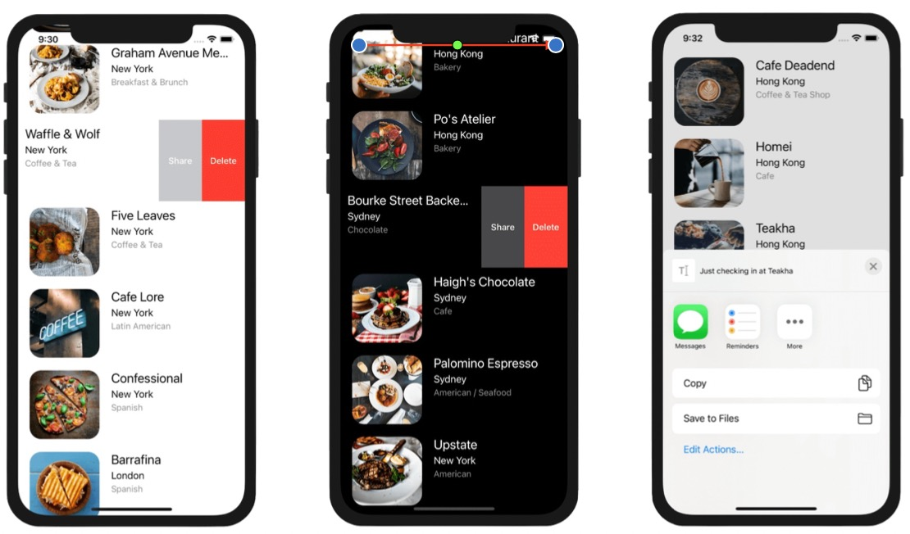
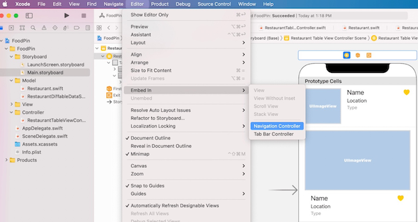
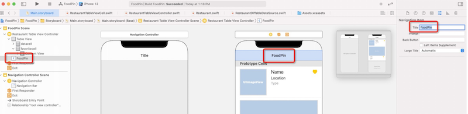
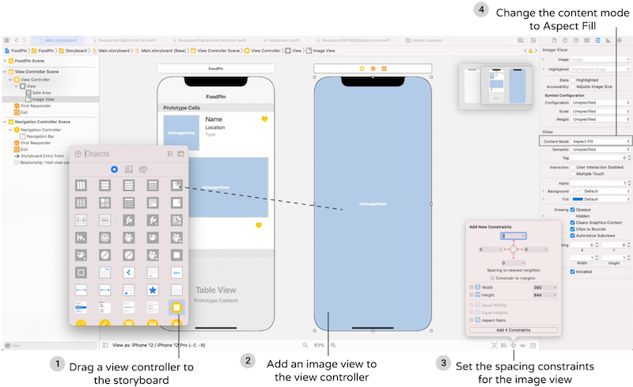
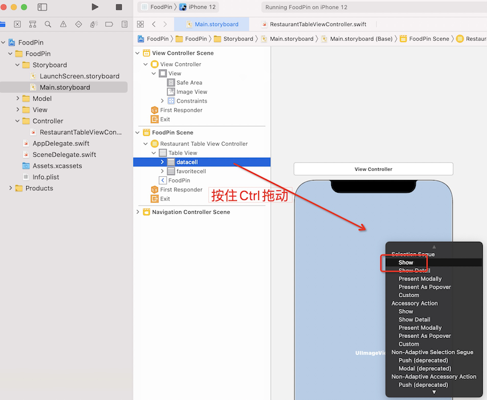
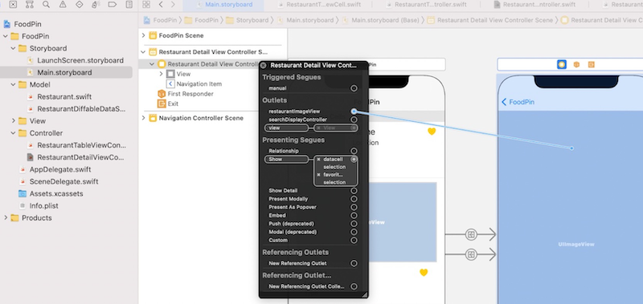
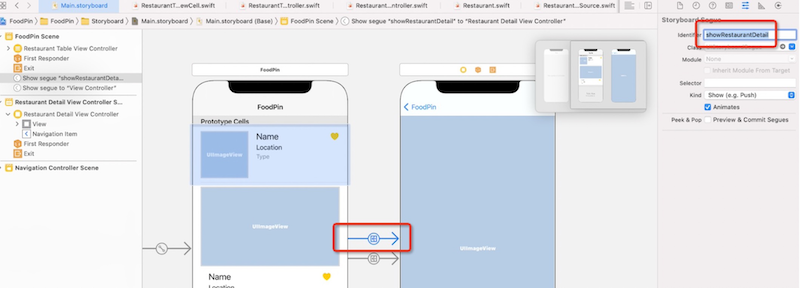

# 第12章 Table Row的删除、Swipe操作，Activity Controller和MVC
本章节主要针对TableViewCell的滑动做两件事儿：1、左划删除菜单并执行；2、自定义左划菜单。
- 基于`UITableViewDiffableDataSource`/`NSDiffableDataSourceSnapshot`实现的tableView，需要自定义`UITableViewDiffableDataSource`类，并实现**该类的**`tableView(_:canEditRowAt:)` 和 `tableView(_:commit:forRowAt:)`接口。需要注意`UITableViewController`类也有这两个接口，不要弄错了。
- 通过实现UITableViewController的
  - tableView(_:leadingSwipeActionsConfigurationForRowAt:) 
  - tableView(_:trailingSwipeActionsConfigurationForRowAt:)

  函数，在其中添加菜单项，实现自定义左划/右划菜单。如下：



## 左划删除菜单
左划行为是定义在UITableViewDiffableDataSource协议中的
1. 新建文件，类型：Cocoa Touch Class，名称：RestaurantDiffableDataSource，基类：UITableViewDiffableDataSource，该协议有两个关键接口：
``` swift
import UIKit

enum Section {
    case all
}

// 注意：这里是自己派生的DiffableDataSource类
class RestaurantDiffableDataSource: UITableViewDiffableDataSource<Section, Restaurant> {
    // 必须重载这个函数，单元格才是可编辑的，才能划出菜单
    override func tableView(_ tableView: UITableView, 
                            canEditRowAt indexPath: IndexPath) -> Bool {
        return true
    }
    
    // 重载了这个函数，单元格才能划出默认的“删除”菜单
    override func tableView(_ tableView: UITableView, 
                            commit editingStyle: UITableViewCell.EditingStyle, 
                            forRowAt indexPath: IndexPath) {
        // 定义删除菜单的处理逻辑
        if editingStyle == .delete{
            if let restaurant = self.itemIdentifier(for: indexPath){
                var snapshot = self.snapshot()
                snapshot.deleteItems([restaurant]) // 从snapshot中删除该项
                self.apply(snapshot, animatingDifferences: true)
            }
        }
    }
}
```
- <font color=red>如果只重载tableView:_:canEditRowAt而不重载tableView:_:commit:forRowAt会是什么表现？</font>
答案：如果只重载前者，左划什么也出现不了，二者必须同时实现才行。结合下文，可以在这里只重载前者，然后在TableViewController中自定义左划菜单

2. 在RestaurantTableViewController中修改dataSource：
``` swift
// 返回table view 单元格数据
func configureDataSource() -> UITableViewDiffableDataSource<Section, Restaurant >{
    let cellIdentifier = "favoritecell"
    // 修改dataSource的类型
    let dataSource = RestaurantDiffableDataSource(
        tableView: tableView,   // tableView是UITableViewController的成员变量
        cellProvider: {  tableView, indexPath, restaurant in
            let cell = tableView.dequeueReusableCell(withIdentifier: cellIdentifier, for: indexPath) as! RestaurantTableViewCell  // 强制转换一下
            // cell的所有数据都取自restaurant
            cell.nameLabel.text = restaurant.name
            cell.locationLabel.text = restaurant.location
            cell.typeLabel.text = restaurant.type
            cell.thumbnailImageView.image = UIImage(named: restaurant.image)
            if restaurant.isFavorite{
                cell.accessoryType = .checkmark
            }else{
                cell.accessoryType = .none
            }
 
            return cell
        })
    return dataSource
}
```
## 自定义左划菜单
在上例中左划，仅出现“删除”菜单。
> iOS8 到 iOS10，苹果提供了UITableViewRowAction来满足左划功能，iOS11以后，苹果进一步通过UISwipeActionsConfiguration和UIContextualAction提供了右划定制的能力。你可以利用UIContextualAction给任何table view定制左右划的能力。
在本节中我们使用
tableView(_:leadingSwipeActionsConfigurationForRowAt:)  // 定制右划能力
tableView(_:trailingSwipeActionsConfigurationForRowAt:)   // 定制左划能力
1. 删除RestaurantDiffableDataSource中的tableView(_:commit:forRowAt:)的实现
2. 在RestaurantTableViewController中实现如下接口：
``` swift
// 自定义左划行为
override func tableView(_ tableView: UITableView,
                        trailingSwipeActionsConfigurationForRowAt indexPath: IndexPath) -> UISwipeActionsConfiguration? {
    // 获取被选中的一行
    guard let restaurant = self.dataSource.itemIdentifier(for: indexPath)
    else {
        return UISwipeActionsConfiguration()  // 如果为空则返回
    }
    // 添加“删除”菜单，并实现删除操作
    let deleteAction = UIContextualAction(style: .destructive, 
                                          title: "Delete") 
    { (action, sourceView, completionHandler) in
        var snapshot = self.dataSource.snapshot()
        snapshot.deleteItems([restaurant])
        self.dataSource.apply(snapshot, animatingDifferences: true)
        // 调用complete handler来取消action button
        completionHandler(true)
    }
    
    // 设置背景色和图标
    deleteAction.backgroundColor = UIColor.systemRed
    deleteAction.image = UIImage(systemName: "trash")
    
    // 添加“分享”菜单，并实现对应操作
    let shareAction = UIContextualAction(style: .normal, 
                                         title: "Share") {
        (action, sourceView, completionHandler) in
        let defaultText = "Just checking in at " + restaurant.name
        let activityController: UIActivityViewController
        // 如果获取图片成功，把图片和文字放入剪贴板；否则仅把文字放入剪贴板
        if let imageToShare = UIImage(named: restaurant.image) {
            activityController = UIActivityViewController(activityItems: [defaultText, imageToShare], applicationActivities: nil) 
        }else {
            activityController = UIActivityViewController(activityItems: [defaultText], applicationActivities: nil)
        }
        self.present(activityController, animated: true, completion: nil)
        completionHandler(true)
    }    
    shareAction.backgroundColor = UIColor.systemOrange
    shareAction.image = UIImage(systemName: "square.and.arrow.up")
    
    // 装配两个菜单
    let swipeConfiguration = UISwipeActionsConfiguration(actions: [deleteAction, shareAction])
    return swipeConfiguration
}
```
<font color=red>我有个疑问：删除/分享菜单必须在滑动操作之前就被指定给tableView吧？否则当触发了滑动消息时，菜单就需要显示一部分了，这时候再准备装配，是不是就晚了？因此tableView:_:trailingSwipeActionsConfigurationForRowAt这个消息其实是在滑动动作开始，但绘制还未开始的时候，被调用一次？</font>
> UIActivityViewController提供了一些标准服务，比如拷贝到剪贴板，分享内容到社交媒体，发送到短信等。在真机上，这个VC提供的服务会根据机器上安装具体app而有所差别。app开发者可以向系统注册自定义服务，显示在该VC上。

> 从iOS13开始，苹果引入了一套系统符号字体，成为SF符号字体，可以去 https://devimages-cdn.apple.com/design/resources/download/SF-Symbols-2.dmg 下载。

# 第13章 导航控件和Segue
Scene是指屏幕中的一个场景（比如一个VC上的内容），Segue是指两个Scene之间的转场，通常可以通过Push或者弹出模态窗口两种方式来实现。

本节将table view controller装到一个navigation controller里，这样当用户点击任何一个restaurant的时候，APP将从TableViewController导航到restaurant详情VC。详情页比较简单，就是一张图片，本章重点在于通过源ViewController的`prepare(for:sender:)`将触发信息传递给目标ViewController。
## 创建navigation controller
1. 选中table view controller，点击菜单 Editor - Embed in - Navigation Controller



2. 选中NavigationBar，修改Title为 FoodPin 



3. Navigation Bar采用大字体。iOS 11引入了大字体，很多系统自带应用比如：邮件、设置都采用了该设置。当屏幕滚动后，大字体会切换成iOS 10 之前的那种普通字体。该设置默认是关闭的，可以在RestaurantTableViewController的viewDidLoad()函数中添加如下代码来打开设置：
``` swift
    override func viewDidLoad() {
        super.viewDidLoad()
        // 设置NavigationBar的标题为大字体
        navigationController?.navigationBar.prefersLargeTitles = true
        // ……
    }
```
## 添加用于显示详情的VC
1. 从Object Library拖入一个新的ViewController
2. 在该VC中再拖入一个ImageView
3. 设置空间约束，上下左右四边距均为0
4. 设置ImageView的填充模式为Aspect Fill



5. 按住Ctrl键从单元格拖动到VC，并在弹出菜单中选择 Show ，这就在点击单元格到VC之间创建了一个转场



> 包括 Show 转场共有四种类型：
> - **Show**： 新窗口将被压到VC栈的顶部，navigation bar显示回退按钮，点击后将退回到前一个VC
> - **Show detail**： 和Show的差别在于它将用新的VC替代当前VC，没有回退navigation bar
> - **Present modally**： 新窗口将从屏幕底部弹出，并覆盖全屏。通常在各类“添加”逻辑中会采用这种转场类型显示具体要添加的数据
> - **Present as popover**： 在已有的窗口上弹出一个非全屏的窗口。

## 在两个VC间转场传递数据
1. 为新的VC创建对应的类。New File... - Cocoa Touch Class - 类名：RestaurantDetailViewController，基类：UIViewController。回到Main.storyboard，选中VC - Identify inspector，将Class设置为RestaurantDetailViewController。
2. 为RestaurantDetailViewController定义两个变量：
``` swift
class RestaurantDetailViewController: UIViewController {
    @IBOutlet var restaurantImageView:UIImageView!
    var restaurantImageName = ""
    // ……
}
```
再回到Main.storyboar，右键RestaurantDetailViewController，在弹出菜单中将restaurantImageView拖到ImageView上去，将storyboard对象关联到代码变量：



3. 在RestaurantDetailViewController的 viewDidLoad 函数中根据restaurantImageName创建restaurantImageView：
``` swift
override func viewDidLoad() {
    super.viewDidLoad()
    restaurantImageView.image = UIImage(named: restaurantImageName)
}
```
4. 由于一个工程当中可能有很多个转场，有必要给每个转场设定唯一标识。在Main.storyboard中选中转场，在Attribute inspector中设置identifier为showRestaurantDetail：



5. 在转场之间传递图片信息。给RestaurantTableViewController添加如下函数：
``` swift
override func prepare(for segue: UIStoryboardSegue, sender: Any?) {
    if segue.identifier == "showRestaurantDetail"{
        if let indexPath = tableView.indexPathForSelectedRow{
            // 把当前选中行的图片名称传给下一个VC
            let destinationController = segue.destination as! RestaurantDetailViewController
            destinationController.restaurantImageName = self.restaurants[indexPath.row].image
        }
    }
}
```
> 当触发转场时，在视觉交互发生之前，系统会调用源VC的 prepare(for:sender:) 函数，通过重载这个函数，你可以把数据从源VC传递给目标VC

## 问题
1. 我第一版完成后，有个崩溃，直接抛异常，一直没定位到原因。
2. 本章结尾说可以给RestaurantDetailViewController的viewDidLoad添加如下代码，来控制navigationItem的大字体模式：
``` swift
    override func viewDidLoad() {
        super.viewDidLoad()
        restaurantImageView.image = UIImage(named: restaurantImageName)
        navigationItem.largeTitleDisplayMode = .never
    }
```
但是我尝试赋 .never 、 .always 和 .automatic 均没有差异，因为原本也不是大字体模式，这和前面 navigationController?.navigationBar.prefersLargeTitles = true 的设置是什么关系？