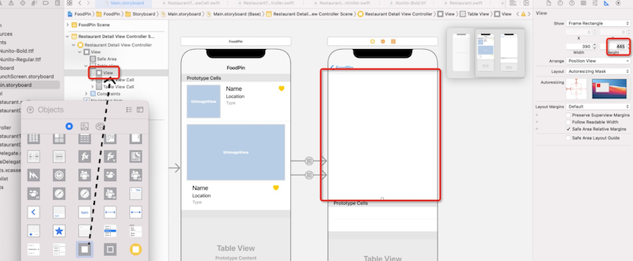
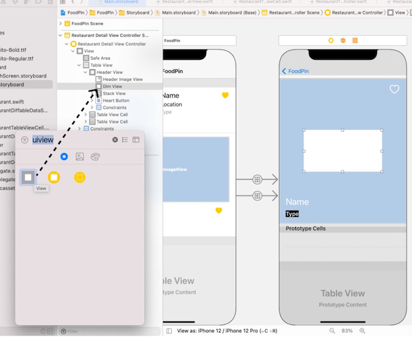

# 第14章 通过自定义字体、自适应单元格尺寸来定制详情页
Detail View 的组织方式如下所示，它包含一个TableView，上面是Header部分，下面两行是两个单元格：


接着上一章，点击首页tableView中任一项，进入该详情页，数据怎么传递在上一章已经介绍过了，本章主要介绍如何在一个tableView中实现两个不同样式的单元格。

此外，在实现方式上，详情页的VC中嵌入了一个tableView，并将该VC设置为tableView的DataSource和Delegate，本章又引入了一种新的实现方式——通过extension扩展VC能力，而不是直接在VC上修改代码。

## 设计Table View Header
1. 往Detail View Controller上拖一个TableView，并设置上下左右边距约束为0，在Attribute inspector中设置 Prototype Cells 为2。
2. 从Object Library中拖一个View 到Table View 的header上，在document outline中，该view在Table View下，在其第一个celler上。在Size inspector中将该view的高度设为445：



在document outline中将该view的名称修改为Header View。
3. 往Header View 中再拖入一个ImageView，命名为Header Image View，并设置四边距约束均为0。


4. 往Header Image View的左下角拖入一个Lable，颜色：white，字体：Title 1，Text：Name


在Name下面再拖入一个Lable，背景色：black，字色：white，字体：headline，对齐方式：center，Text：Type


5. 在Header Image View的右上角拖入一个Button，Title为空，Image：heart，Default Symbol Configuration/configuration：Point Size，Point Size：30，tint color：white
6. 接下来为上面几个元素添加布局约束。选中Heart Button，添加上、右边距均为10，Width=37，Height=31：


7. 选中Name和Type两个Label，点击Embed in，选择Stack View将二者框起来，设置该Stack View的Spacing=10，再添加左、下、右边距约束分别为20、20、150：


8. 新建Cocoa Touch Class文件，文件名RestaurantDetailHeaderView，基类UIView，为前面创建的界面元素定义变量：
``` swift
class RestaurantDetailHeaderView: UIView {
    @IBOutlet var headerImageView: UIImageView!
    @IBOutlet var nameLabel:UILabel!
    @IBOutlet var typeLabel:UILabel!
    @IBOutlet var headerButton:UIButton!
    // ……
}
```
回到Main.storyboard，选中Header View将其Class设置为RestaurantDetailHeaderView。在document outline中右键Header View，将四个变量分别关联到Storyboard中对应的元素上。

9. 在RestaurantDetailViewController中为tableView和headerView添加变量，并在viewDidLoad中更新界面元素：
``` swift
class RestaurantDetailViewController: UIViewController {
    @IBOutlet var tableView: UITableView!
    @IBOutlet var headerView: RestaurantDetailHeaderView!

    var restaurant: Restaurant = Restaurant()
    
    override func viewDidLoad() {
        super.viewDidLoad()

        navigationController?.navigationBar.prefersLargeTitles = false
        
        // 设置headerView的图文信息
        headerView.nameLabel.text = restaurant.name
        headerView.typeLabel.text = restaurant.type
        headerView.headerImageView.image = UIImage(named: restaurant.image)
        
        // 根据是否选择收藏决定心形按钮的属性
        let heartImage = restaurant.isFavorite ? "heart.fill":"heart"
        headerView.heartButton.tintColor = restaurant.isFavorite ? .systemYellow : .white
        headerView.heartButton.setImage(UIImage(systemName: heartImage), for: .normal)
    }
}
```
最后回到Main.storyboard右键RestaurantDetailViewController将tableView和headerView关联到界面对应元素。
> Image View的拉伸方式
● Scale to Fill（默认）：使图片缩放至充满容器
● Aspect Fit： 保持长宽比缩放图片，使图片在容器内完整显示出来
● Aspect Fill：保持长宽比缩放图片，使图片充满容器
具体效果如下：


## 文本截断/多行处理
Label可以选择单行或多行模式，可以在Attribute inspector/Lines中设置：1表示单行；0表示多行。也可以通过代码设置：
``` swift
class RestaurantDetailHeaderView: UIView {
    @IBOutlet var nameLabel:UILabel!{
        didSet{
            nameLabel.numberOfLines = 0 // 设置多行模式
        }
    }
    // ……
}
```
如果是单行，对于较长的文本会根据尺寸约束可能被截断。
## 调整Image View的明暗度
当图片的文字区域和文字颜色靠色时，会导致文字看不清楚，可以给Image View加一个蒙层。
1. 从Object Library中拖一个View到Header Image View下，命名为`Dim View`，设置四个边距均为0，也就是说和Image View保持一样大。



2. 设置Background：`Black Color`，Alpha：0.2。这个Alpha取值范围[0, 1]，0表示完全透明。
## 自定义字体和Dynamic Type
> 谷歌在https://fonts.google.com放出了大量的英文字体
1. 创建两个子Group：FoodPin/Resources/Fonts，把需要的字体拖到Fonts下，会弹出如下提示，设置如下选择：


在Xcode中选中这两个字体，在右侧File inspector中勾选`Target membership/BiPSWork`。

2. 在Info.plist中添加一行，key为Fonts provided by application，增加两个item，value分别为在第1步中加入的两个字体文件名：


3. 接下来就可以在代码中使用该字体了：
``` swift
class RestaurantDetailHeaderView: UIView {
    @IBOutlet var nameLabel:UILabel!{
        didSet{
            nameLabel.numberOfLines = 0 // 设置多行模式
            if let customFont = UIFont(name: "Nunito-Bold", size: 40.0){
                nameLabel.font = UIFontMetrics(forTextStyle: .title1).scaledFont(for: customFont)
            }
        }
    }
    @IBOutlet var typeLabel:UILabel!{
        didSet{
            if let customFont = UIFont(name: "Nunito-Bold", size: 20.0){
                typeLabel.font = UIFontMetrics(forTextStyle: .headline).scaledFont(for: customFont)
            }
        }
    }
    // ……
}
```
<font color=red>Dynamic Type是咋回事儿？没有介绍呢？</font>

## 设计单元格#1
1. 往第一个单元格内拖入一个Label，设置Text：Description，字体：Body，添加四边距约束均为0，并勾选Constrain to margins选项<font color=red>（这个选项是干嘛的？）</font>：


2. 为单元格创建类文件：New file... - Cocoa Touch Class，文件名：RestaurantDetailTextCell，继承自UITableViewCell。
3. 为UI元素声明变量：
``` swift
class RestaurantDetailTextCell: UITableViewCell {
    @IBOutlet var descriptionLabel:UILabel!{
        didSet{
            descriptionLabel.numberOfLines = 0
        }
    }
	// ...
}
```
回到Main.storyboard中将第一个单元格的Class和Identifier都设置为RestaurantDetailTextCell。再在RestaurantDetailTextCell上右键，将descriptionLabel关联到对应的UI元素：


## 设计单元格#2
1. 把第二个单元格高度稍微拖大一些，比如140，在里面纵向拖入两个Label。第一个Text：Address，字体：Headline；第二个Text：Full Address，字体Body。
2. 选中两个Label，点击右下角Embed in - 选择Stack view将两个Label框起来，设置Distribution：Equal Spacing，Spacing：8。
3. 按住Stack View 拖动，可以再复制一个Stack View 出来，将其中的Label Text分别设置为：Phone和Phone Number。选中两个Stack View，Embed in - 选择Stack View 将两个Stack View再横向框起来。设置顶层Stack View： alignment=Top，distribution=Fill Equally，Spacing=10


最后为该顶层Stack View设置四边距约束均为0，并勾选Constrain to margins。
4. 选中第二个单元格，在Size inspector中，Row Height勾选Automatic，确保该单元格高度随设备尺寸而自动调整。
5. 为该单元格创建类，New File... - Cocoa Touch Class，文件名为RestaurantDetailTwoColumnCell，继承自UITableViewCell，为UI元素添加变量：
``` swift
class RestaurantDetailTwoColumnCell: UITableViewCell {
    @IBOutlet var column1TitleLabel: UILabel!{
        didSet{
            column1TitleLabel.text = column1TitleLabel.text?.uppercased()
            column1TitleLabel.numberOfLines = 0
        }
    }
    
    @IBOutlet var column1TextLabel:UILabel!{
        didSet{
            column1TextLabel.numberOfLines = 0
        }
    }
    
    @IBOutlet var column2TitleLabel:UILabel!{
        didSet{
            column2TitleLabel.text = column2TitleLabel.text?.uppercased()
            column2TitleLabel.numberOfLines = 0
        }
    }
    
    @IBOutlet var column2TextLabel:UILabel!{
        didSet{
            column2TextLabel.numberOfLines = 0
        }
    }
    // ...
}
```
6. 回到Main.storyboard中，选中第二个单元格，设置Identifier和Class均为RestaurantDetailTwoColumnCell，右键该单元格，建立关联关系：column1TitleLabel→Address，column1TextLabel→Full Address，column2TitleLable→Phone，column2TextLabel→Phone Number


## 完成详情页加载
第13章讲了如何转场，在RestaurantTableViewController中将选中的Resuaurant通过prepare(for: sender:)传递给RestaurantDetailViewController。前面已经捯饬好了TableViewHeader和两个单元格，接下来就需要让RestaurantDetailViewController作为TableView的数据源完成数据接口的实现了。

前面章节介绍过如下的做法：
``` swift
class RestaurantDetailViewController: UIViewController, UITableViewDataSource, 
UITableViewDelegate {
}
```
本节介绍另一种实现手段。
1. 通过extension关键字来扩展一个已经存在的类，在RestaurantDetailViewController的定义后面添加扩展代码
``` swift
class RestaurantDetailViewController: UIViewController {
    @IBOutlet var tableView: UITableView!
    @IBOutlet var headerView: RestaurantDetailHeaderView!

    var restaurant: Restaurant = Restaurant()
    
    override func viewDidLoad() {
        super.viewDidLoad()
        // ② 把delegate和dataSource都设置为自己
        tableView.delegate = self
        tableView.dataSource = self

        navigationController?.navigationBar.prefersLargeTitles = false
        
        // 设置headerView的图文信息
        headerView.nameLabel.text = restaurant.name
        headerView.typeLabel.text = restaurant.type
        headerView.headerImageView.image = UIImage(named: restaurant.image)
        
        // 根据是否选择收藏决定心形按钮的属性
        let heartImage = restaurant.isFavorite ? "heart.fill":"heart"
        headerView.heartButton.tintColor = restaurant.isFavorite ? .systemYellow : .white
        headerView.heartButton.setImage(UIImage(systemName: heartImage), for: .normal)
    }
}

// ① 扩展该类，实现DataSource和Delegate两个协议
extension RestaurantDetailViewController: UITableViewDataSource, UITableViewDelegate{
    // 返回单元格数
    func tableView(_ tableView: UITableView, numberOfRowsInSection section: Int) -> Int {
        return 2
    }
    // 返回两个单元格的实例
    func tableView(_ tableView: UITableView, cellForRowAt indexPath: IndexPath) -> UITableViewCell {
        switch indexPath.row {
        case 0:
            // 注意：我们在前面把两个单元格的identifier和类名设置成一样了，这样的好处是
            // 在这里不必hardcode identifier，只需要取类名就可以了
            let cell = tableView.dequeueReusableCell(withIdentifier: String(describing: RestaurantDetailTextCell.self), for: indexPath) as! RestaurantDetailTextCell
            cell.descriptionLabel.text = restaurant.description
            return cell
        case 1:
            let cell = tableView.dequeueReusableCell(withIdentifier: String(describing: RestaurantDetailTwoColumnCell.self), for: indexPath) as! RestaurantDetailTwoColumnCell
            cell.column1TitleLabel.text = "Address"
            cell.column1TextLabel.text = restaurant.location
            cell.column2TitleLabel.text = "Phone"
            cell.column2TextLabel.text = restaurant.phone
            return cell
        default:
            fatalError("Failed to instantiate the table view cell for detail view controller")
        }
    }   
}
```
2. 如#9行，把tableView的delegate和dataSource都设置为RestaurantDetailViewController自己

## 自动调整单元格的高度
在本例中，由于单元格中包含的Label被设置成多行的属性，因此当文字比较多的时候，行高可能会比较高，为了让单元格具备该能力，需要做到：
1. 单元格要定义auto layout约束
2. 要给table view 设置estimatedRowHeight属性
3. 要将table view 的rowHeight设置为UITableViewAutomaticDemension（即在设置单元格#2的第4步）。
其中在iOS11 之前，2、3需要手动处理。

## 问题
1. 变量在定义时后面加!是啥意思来着？@IBOutlet var headerImageView: UIImageView!
2. Table View作为DataSource和Delegate返回的单元格都是通过dequeueResableCell取出来的，case 0和case 1取出来的是不同类型的cell。那么谁负责第一次创建，并且塞到队列里的呢？他怎么知道针对0和1分别要塞进去哪种Cell对象呢？


## 注意
1. 当把类变量关联到具体UI元素后，如果变量改名，则需要重新关联，否则会触发运行时崩溃。

关于Swift的Extension相关材料，可以参见：https://docs.swift.org/swift-book/LanguageGuide/Extensions.html

# 第15章 自定义导航栏，暗黑模式 和 Dynamic Type
本章将定制导航栏并修改顶部状态栏的展现形态，如下图：


1. 自定义透明导航栏，当列表上划时，不会盖住列表项
2. 自定义大字体标题栏和回退按钮。原来的默认回退是`＜标题`，改为自定义图标且不带文字
3. 修改状态栏颜色，以更好地适应暗黑模式

本节都是对导航栏属性的细节设置，需要注意的是这些属性的名称以及设置时机。

## 设置透明的导航栏和定制标题字体
iOS13以后，苹果引入了UINavigationBarAppearance类实现导航栏的可定制。
1. 修改RestaurantTableViewController的viewDidLoad函数，完成上左图①和②
``` swift
override func viewDidLoad() {
    super.viewDidLoad()
        
    if let appearance = navigationController?.navigationBar.standardAppearance{
        appearance.configureWithTransparentBackground()  // 设置导航栏透明
        if let customFont = UIFont(name: "Nunito-Bold", size: 45.0){
            // 分别设置LargeTitle和Title字色
            appearance.titleTextAttributes = [.foregroundColor:UIColor(red: 218/255, green: 96/255, blue: 51/255, alpha: 1.0)]
            appearance.largeTitleTextAttributes = [.foregroundColor:UIColor(red: 218/255, green: 96/255, blue: 51/255, alpha: 1.0), .font:customFont]
        }
            
        // 常规状态
        navigationController?.navigationBar.standardAppearance = appearance
        // 小屏幕手机横屏的状态
        navigationController?.navigationBar.compactAppearance = appearance
        // 被ScrollView向下拉的状态
        navigationController?.navigationBar.scrollEdgeAppearance = appearance
    }
        
    // Enable large title for navigation bar
    navigationController?.navigationBar.prefersLargeTitles = true
        
    // ……
}
```
> 关于LargeTitle和Title
iOS11 UINavigationBar引入了preferLargeTitle属性。当设置为true，标题会显示在左边，并为大标题；向上滚动页面后，标题变成普通标题，显示在正中。
2. 在详情页中，不希望系统状态栏把表头顶下去。因此，在RestaurantDetailViewController的viewDidLoad中修改如下：
``` swift
override func viewDidLoad() {
    super.viewDidLoad()
    
    // 不要让表头被系统状态栏顶下去，直接叠加到状态栏上
    tableView.contentInsetAdjustmentBehavior = .never
    
    // ……
}
```
下图中，左边是.always的表现，右边是.never的表现：


## 导航栏回退图标定制
回退图标定制是一个全局生效的操作，因此不应该放到某一个VC内部，而应该在AppDelegate的application(_:didFinishLaunchingWithOptions:)里调用：
``` swift
func application(_ application: UIApplication, didFinishLaunchingWithOptions launchOptions: [UIApplication.LaunchOptionsKey: Any]?) -> Bool {
    // 创建一个NavigationBarAppearance实例
    let navBarAppearance = UINavigationBarAppearance()
    // 设置返回图标
    var backButtonImage = UIImage(systemName: "arrow.backward", withConfiguration: UIImage.SymbolConfiguration(pointSize: 20.0, weight: .bold))
    backButtonImage = backButtonImage?.withAlignmentRectInsets(UIEdgeInsets(top: 0, left: -10, bottom: 0, right: 0))
    navBarAppearance.setBackIndicatorImage(backButtonImage, transitionMaskImage: backButtonImage)
    // 设置生效场景
    UINavigationBar.appearance().tintColor = .white
    UINavigationBar.appearance().standardAppearance = navBarAppearance
    UINavigationBar.appearance().compactAppearance = navBarAppearance
    UINavigationBar.appearance().scrollEdgeAppearance = navBarAppearance
        
    return true
}
```
当由RestaurantTableViewController转场到RestaurantDetailViewController后，如果希望导航栏仅显示回退图标，而不要文字，可以在RestaurantTableViewController的viewDidLoad中修改如下：
``` swift
override func viewDidLoad() {
    super.viewDidLoad()
        
    navigationItem.backButtonTitle = ""   // 不要显示文字
}
```
> <font color=red>为什么是在RestaurantTableViewController 而不是在 RestaurantDetailViewController中设置？这个文字不是在后者显示出来的么？</font>
答：因为添加导航栏是被添加到在前者的

## 上划隐藏导航栏
这是iOS8引入的新特性，选中Navigation Controller，在Attribute inspector中可以找到Hide Bars On Swipe复选框：


勾选该复选框就能令视图上划时不显示导航栏。但是这个选项的影响范围是全局的——当在首页列表视图中上划，导航栏隐藏后，点击item进入详情页，导航栏依然是隐藏状态，这会导致回退按钮不显示，无法回退到首页了。因此需要通过代码控制导航栏隐藏状态。

## 隐藏/显示导航栏
调用如下代码就可以设置：在上划视图后隐藏导航栏。
``` swift
navigationController?.hidesBarsOnSwipe = false
```
如果在viewDidLoad中设置，即首页VC的viewDidLoad设置为true，详情页VC的viewDidLoad中设置为false。会有几个问题：
1. viewDidLoad函数仅在view首次加载时调用，当操作路径由：
`首页（不上划，直接点击到）→详情页→首页`，
hidesBarsOnSwipe值分别被设置为true、false，再回到首页由于不再调用viewDidLoad，因此依然保持为false，所以即使再上划，导航栏也不会隐藏了。
因此应该在`viewWillAppear`中执行设置，该生命周期函数在view每次显示时都会调用。
2. hidesBarsOnSwipe仅控制当视图上划时要不要隐藏导航栏，它并不能令已经隐藏的导航栏显示出来。因此当操作路径由：首页（上划）→详情页，上划导致导航栏被隐藏，进入详情页即使hidesBarsOnSwipe再次置为false，回退按钮依然是隐藏的。
因此需要额外调用navigationController?.setNavigationBarHidden(false, animated: true)使之显示出来。
正确的代码如下：
``` swift
// RestaurantTableViewController.swift
class RestaurantTableViewController: UITableViewController {   
    override func viewWillAppear(_ animated: Bool) {
        super.viewWillAppear(animated)
        navigationController?.hidesBarsOnSwipe = true  // 设置上划隐藏为true
    }
    // ……
}


// RestaurantDetailViewController.swift
class RestaurantDetailViewController: UIViewController {
    override func viewWillAppear(_ animated: Bool) {
        super.viewWillAppear(animated)
        navigationController?.hidesBarsOnSwipe = false  // 设置上划隐藏为false
        navigationController?.setNavigationBarHidden(false, animated: true) // 显示导航栏
    }
    // ……
}
```
## Swift中的Extensions
Extensions允许你为已经存在的class或struct或Enum定义额外的功能，比如前面使用UIColor，它接收RGB参数均为[0, 1]的float值，更易读的方式是直接接收三个[0, 255]的整型数值，因此可以为UIColor创建一个Extensions。New Files... → Swift File → 命名为UIColor+Ext.swift：
``` swift
import UIKit
extension UIColor {
    convenience init(red: Int, green: Int, blue: Int) {
        let redValue = CGFloat(red) / 255.0
        let greenValue = CGFloat(green) / 255.0
        let blueValue = CGFloat(blue) / 255.0
        self.init(red: redValue, green: greenValue, blue: blueValue, alpha
: 1.0) }
}
```
在使用新的UIColor时，
``` swift
// 原先的代码：
appearance.titleTextAttributes = [.foregroundColor: UIColor(red: 218/255,
green: 96/255, blue: 51/255, alpha: 1.0)]

// 可以写作：
appearance.titleTextAttributes = [.foregroundColor: UIColor(red: 218, gree
n: 96, blue: 51, alpha: 1.0)]
```
## 适配Dark Mode
Dark Mode是iOS13引入的新功能，苹果引入了两种内置颜色：system colors和semantic colors，这两种颜色都能适配light和dark mode。因此，苹果建议开发者试用这两种色彩体系，而不要自己创建UIColor对象来hardcode色彩值。


## 自定义色彩
如果要自定义色彩，可以点开asset，在空白处右键 - 选择Color Set来添加一套色彩值：


如下可以给该色彩值命名为NavigationBarTitle，并且设置light和dark mode下的色彩值：


于是，上面UIColor 的hardcode写法
``` swift
appearance.titleTextAttributes = [.foregroundColor: UIColor(red: 218, gree
n: 96, blue: 51, alpha: 1.0)]

// 可以改为：
appearance.titleTextAttributes = [.foregroundColor: UIColor(named: "Naviga
tionBarTitle")!]
```
这样就能适配两种系统模式了。

## 修改系统状态栏的风格
系统状态栏在屏幕顶部，包括时间、电量、Wi-Fi信号，默认是黑色的，使用UIStatusBarStyle可以修改系统状态栏的风格。有两种修改方法：1、修改应用的全局设置；2、只修改某个VC局部设置。
### 修改状态栏风格仅在某个VC局部生效
重载VC的preferredStatusBarStyle属性就能修改该VC显示时的状态栏风格：
``` swift
override var preferredStatusBarStyle: UIStatusBarStyle{
    return .lightContent
}
```
直接在RestaurantDetailViewController中插入该行，却发现没有效果，原因是**当显示详情页时，顶层窗口是一个UINavigationController，而不是RestaurantDetailViewController**，因此需要自定义新的UINavigationController，并重载其属性：
``` swift
// 新建NavigationController.swift
class NavigationController: UINavigationController {
    override var preferredStatusBarStyle: UIStatusBarStyle{
        // 返回顶层窗口的状态栏风格值
        return topViewController?.preferredStatusBarStyle ?? .default
    }
    // ……
}

// RestaurantDetailViewController.swift
class RestaurantDetailViewController: UIViewController {
    override var preferredStatusBarStyle: UIStatusBarStyle{
        return .lightContent
    }
    // ……
}
```
在Main.storyboar中，将Navigation Controller的类名设置为NavigationController，NavigationController的顶层窗口就是RestaurantDetailViewController，因此进入详情页，RestaurantDetailViewController.preferredStatusBarStyle将生效。
### 修改状态栏风格全局生效
1. 在project navigator中选择根项 - General - Status Bar Style，修改全局设置：


2. Xcode默认**优先使用每个VC的局部设置**，因此如果要让全局设置生效，必须关掉该默认行为：选择Info.plist - 添加一行 - 设置Key为View controller-based status bar appearance ，类型为Boolean，Value为NO：


## 动态字体
**什么是动态字体？** iOS系统中，设置 - 辅助功能 - 显示与文字大小 - 更大字体，打开这个开关，支持动态字体的App将会调整为系统设置的字体大小。系统自带应用都支持动态字体，而**三方App需要主动适配**。
> 我在设置 - 现实与亮度 - 文字大小，发现也有一样的设置，并且是一样的说明文字，这俩是一个开关吗？

适配的方法也很简单，我们之前**在设置字体时采用text style，而不是固定字号，应用就能自动适配动态字体**：


不过，这只能令应用在启动时适配动态字体。如果希望在运行时修改了系统设置，应用实时生效，需要勾选Label的Automatically Adjusts Font开关：

