# 第16章 使用地图

本章将详情页的单元格原型由2改为3，在第三格中插入地图，点击后转场到地图详情页，如下图：
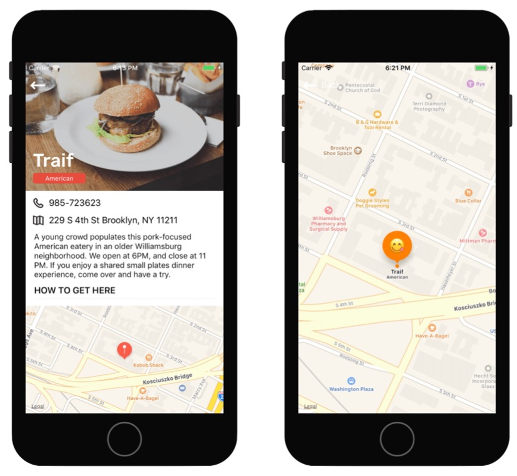
- 地图使用了MapKitView
- 展示了如何将地址串通过云服务转成坐标
- 自定义了地图标识

## 添加地图
1. 选择project - target - 点击+ Capacity - 搜索Maps双击添加：

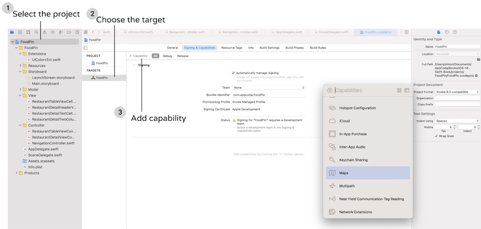

2. 打开Main.storyboard，将detail view controller的table view的单元格由2改为3，选中复制出来的第3个单元格，删除包裹它的stack view


3. 添加一个Map Kit View到新的单元格里，设置约束：四边距均为0，高度200，不要勾选Constrain to margins。测试Map Kit View超出了设备的高度，可以在Document outline中选中Restaurant Detail View Controller，在size inspector 中将simulated size由Fixed修改为Freeform，并设值高度为1000，模拟器就会被抻高到1000，以方便编辑。来看Map Kit View的属性，不要勾选Scrolling、Rotating、和3D View，在本章尽量保持该视图简单。
4. 为地图创所在单元格建对应的类，New File... - Cocoa Touch Class - 命名为RestaurantDetailMapCell，基类为UITableViewCell，代码如下：
``` swift
import UIKit
import MapKit   // 引入MapKit，以支持MKMapView

class RestaurantDetailMapCell: UITableViewCell {
    @IBOutlet var mapView: MKMapView!   // 定义地图view

    override func awakeFromNib() {
        super.awakeFromNib()
        // Initialization code
    }

    override func setSelected(_ selected: Bool, animated: Bool) {
        super.setSelected(selected, animated: animated)
        // Configure the view for the selected state
    }
}
```
5. 在Main.storyboard中将新建单元格的identifier和类名均设置为RestaurantDetailMapCell，并将mapView和对应的视图元素建立关联：

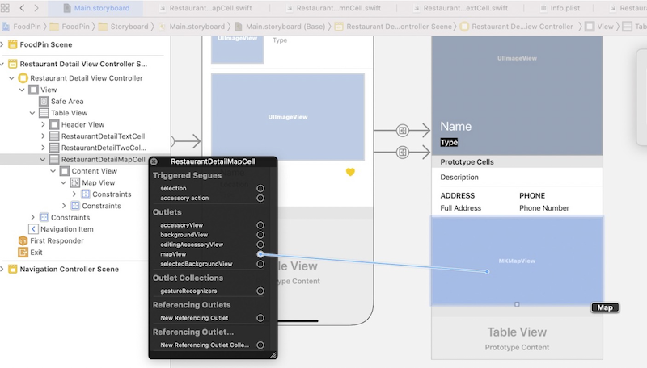
6. 修改RestaurantDetailViewController.swift如下：
``` swift
extension RestaurantDetailViewController: UITableViewDataSource, UITableViewDelegate {
    
    func tableView(_ tableView: UITableView, numberOfRowsInSection section: Int) -> Int {
        return 3   // 返回三个单元格
    }
    
    func tableView(_ tableView: UITableView, cellForRowAt indexPath: IndexPath) -> UITableViewCell {
        switch indexPath.row {
        case 0:
            // ……
            
        case 1:
            // ……
        case 2:    // 定义第3个单元格
            let cell = tableView.dequeueReusableCell(withIdentifier: String(describing: RestaurantDetailMapCell.self), for: indexPath) as! RestaurantDetailMapCell
            return cell
        default:
            fatalError("Failed to instantiate the table view cell for detail view controller")
        }
    }
}
```
## 显示全屏地图
1. 拖入一个新的view controller，再在这个VC里拖入一个Map Kit View，并将四个边距设置为0
2. 摁住Ctrl将鼠标从RestaurantDetailMapCell拖到新的VC，并在弹出菜单中选择Show，在两个UI间创建一个转场（注意一定是从RestaurantDetailMapCell，而不是MapKitView，否则不会弹出菜单），并将该转场的identifier命名为ShowMap

## 将地址转换成地图坐标
framework提供了Geocoder类将文本地址转换成地图坐标，这个过程被称为正向geocoding；反过来也可以，被称为逆向geocoding。代码如下：
``` swift
let geoCoder = CLGeocoder()
geoCoder.geocodeAddressString("524 Ct St, Brooklyn, NY 11231", 
                              completionHandler: { placemarks, error in
// 处理placemark的代码
})
```
> 对于被转换的地址串没有固定要求，该函数会将位置字串异步提交服务端，由服务端解析并返回一个placemark对象数组。数组的个数依赖输入的地址信息，地址越详细，就会得到越精准的返回数据。如果提交的地址比较模糊，就会返回多个可能的placemark对象。
## 地图标识
> iOS11之前，地图标识只能显示为大头针，后来的版本在MapKit framework中，苹果重新设计了地图标识样式，默认样式更洋气一些。新的标识样式包含两个对象：
● 标识对象：用于保存标识数据，比如位置的名称，该对象必须遵守MKAnnotation协议。
● 标识视图：用来显示标识，比如可以显示为大头针，也可以是自定义的任何图形。
## 在地图上添加一个标识
在RestaurantDetailMapCell.swift中添加configure函数，将地址转换成坐标并添加为地图标识：
``` swift
func configure(location: String) {
    // Get location
    let geoCoder = CLGeocoder()
    print(location)
    geoCoder.geocodeAddressString(location, completionHandler: { placemarks, error in
        if let error = error {
            print(error.localizedDescription)
            return
        }
        if let placemarks = placemarks {
            // 获取解析到的第一个地址
            let placemark = placemarks[0]
            // 添加地图标识
            let annotation = MKPointAnnotation()
            if let location = placemark.location {
                // Display the annotation
                annotation.coordinate = location.coordinate
                self.mapView.addAnnotation(annotation)
                // Set the zoom level
                let region = MKCoordinateRegion(center: annotation.coordinate, latitudinalMeters: 250, longitudinalMeters: 250)
                self.mapView.setRegion(region, animated: false)
            }
        }
    })
}
```
更新RestaurantDetailViewController.swift中的tableView(_:cellForRowAt:_)的case2部分，让传入的地址串在地图上显示出来：
``` swift
func tableView(_ tableView: UITableView, cellForRowAt indexPath: IndexPath) -> UITableViewCell {
    switch indexPath.row {
    // ……
    case 2:
        let cell = tableView.dequeueReusableCell(withIdentifier: String(describing: RestaurantDetailMapCell.self), for: indexPath) as! RestaurantDetailMapCell
        cell.configure(location: restaurant.location) // 让地址生效
        cell.selectionStyle = .none
        return cell
    // ……
    }
}
```
## 在全屏地图上显示标识
1. 新建文件：New File... - Cocoa Touch Class - 命名为MapViewController，基类是UIViewController，添加地图和Restaurant变量如下：
``` swift
import UIKit
import MapKit

class MapViewController: UIViewController {
    @IBOutlet var mapView : MKMapView!
    var restaurant = Restaurant()
    
    override func viewDidLoad() {
        super.viewDidLoad()

        // 和上一节类似：将地址串转成坐标并在地图上标识出来
        let geoCoder = CLGeocoder()
        geoCoder.geocodeAddressString(
            restaurant.location,
            completionHandler:{ placemarks, error in
                if let error = error {
                    print(error)
                    return
                }
                if let placemarks = placemarks {
                    let placemark = placemarks[0]
                    let annotation = MKPointAnnotation()
                    // 显示标题和副标题
                    annotation.title = self.restaurant.name
                    annotation.subtitle = self.restaurant.type
                    
                    if let location = placemark.location {
                        annotation.coordinate = location.coordinate
                        // 显示大头针
                        self.mapView.showAnnotations([annotation], animated: true)
                        self.mapView.selectAnnotation(annotation, animated: true)
                    }
                }
            }
        )
    }
}
```
2. 来到Main.storyboard下，给MapViewController修改对应的类，并关联控件到变量：

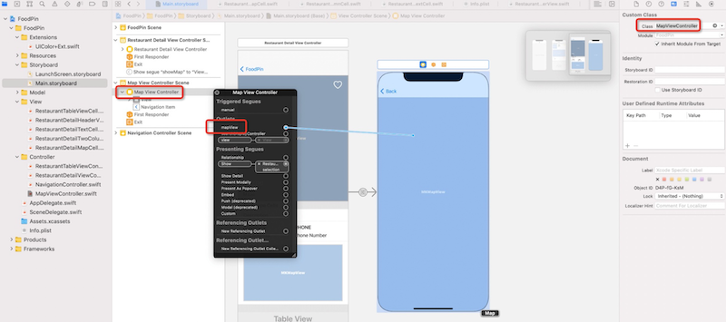
> 地图标识有三种状态：
● 默认是未选中状态，标识个头会略小
● 上面代码中将状态设置为选中，个头会长大
● 第三种状态，书里没讲
3. 最后RestaurantDetailViewController.swift中添加prepare(for:sender:)将restaurant传进去：
``` swift
override func prepare(for segue: UIStoryboardSegue, sender: Any?) {
    if segue.identifier == "ShowMap"{
        let destinationController = segue.destination as! MapViewController
        destinationController.restaurant = restaurant
    }
}
```

## 自定义地图标识
官方文档中有具体自定义地图标识的方法：https://developer.apple.com/documentation/mapkit/mkmarkerannotationview	
● markerTintColor - 自定义气球背景
● glyphText - 自定义气球文本
● plyphImage - 自定义气球的图标
 如果要自定义地图标识的样式，需要让MapViewController遵守MKMapViewDelegate协议，并实现mapView(_ mapView: annotation:)方法：
``` swift
 class MapViewController: UIViewController {
    @IBOutlet var mapView : MKMapView!
    var restaurant = Restaurant()

    override func viewDidLoad() {
        super.viewDidLoad()
        mapView.delegate = self // 将代理设为自己
        // ……
    }
}

extension MapViewController: MKMapViewDelegate {
    func mapView(_ mapView: MKMapView, viewFor annotation: MKAnnotation) -> MKAnnotationView? {
        let identifier = "MyMarker"
        if annotation.isKind(of: MKUserLocation.self) {
            return nil
        }
        // Reuse the annotation if possible
        var annotationView: MKMarkerAnnotationView? = mapView.dequeueReusableAnnotationView(withIdentifier: identifier) as? MKMarkerAnnotationView
        if annotationView == nil {
            annotationView = MKMarkerAnnotationView(annotation: annotation, reuseIdentifier: identifier)
        }
        annotationView?.glyphText = "😁"
        annotationView?.markerTintColor = UIColor.orange
        return annotationView
    }
}
```

# 第17章 动画、视觉效果和Unwind Segue
本章在详情页的底部添加评价按钮，点击后弹出评价窗口：
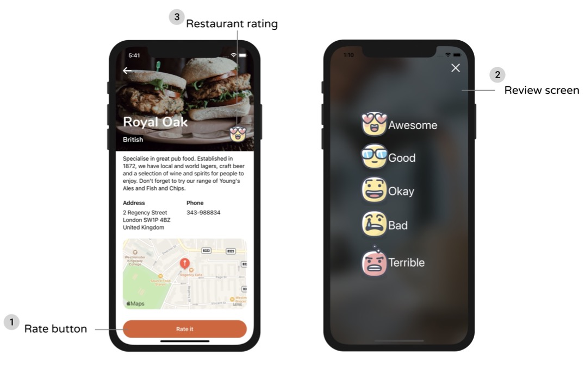
- **本章介绍了几种弹出窗口的方式**
- **退出Segue的方式** 在父窗口中定义IBAction退出函数，在退出窗口中设置触发按钮
- **退出Segue时回传数据** 在父窗口的退出函数根据Segue.identifier获取退出源
- **给评价按钮设置几种动画效果** ：渐现、从一侧飞入等，掌握仿射变换的应用

## 添加评价按钮
1. 把评价按钮图标（http://www.appcoda.com/resources/swift4/FoodPinRatingButtons.zip） 导入工程的Assets。
2. 打开Main.storyboard，选中RestaurantDetailViewController，为了后续操作方便，将Size inspector/Simulated Size/Height设置为1200。在RestaurantDetailViewController底部拖入一个View，并设值高度为90。在该View中拖入一个Button，设置四周边距均为20，不要勾选Contrain to margins，设置文字为Rate it，字体：Headline - Text Style，颜色：white，背景色：NavigationBarTitle color。设置按钮圆角：Identify inspector - 点击+ - 在User Defined Runtime Attributes中添加key Path=cornerRadius，Type=Number，Value=25。

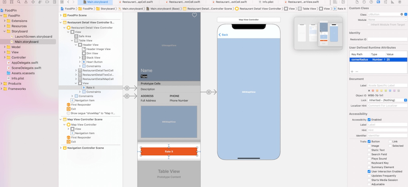
## 创建Restaurant Review VC
1. 拖入一个ViewController，并在其中拖入一个Image View，设置content mode为Aspect fill，四周边距为0。
2. 在右上角拖入一个Button，设置文字为空，图标为xmark，修改Default Symbol Configuration/Configuration为Point Size，Point Size为30，Tint Color为White，并设值右、上边距分别为20、0。

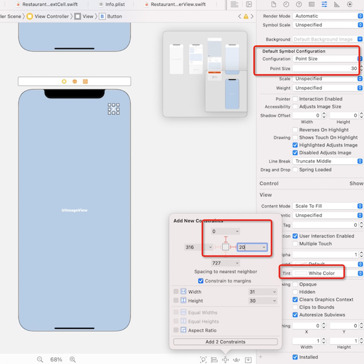
3. 纵向拖入5个Button，设置字体为Large Title，Title和Image分别为：Awesome/love、Good/Cool、Okay/Happy、Bad/Sad、Terrible/Angry，然后把它们装到一个Stack View里，设置该Stack View 的Alignment为Leading，spacing为10。最后设置该Stack View在父窗口中的对齐方式为水平、竖直均居中对齐：

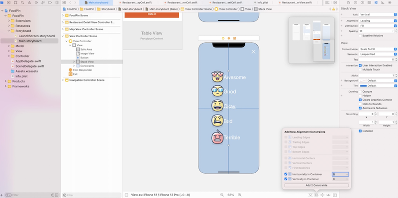
4. 新建文件，模板为Cocoa Touch Class，类名：ReviewViewController，基类：UIViewController，添加代码如下：
``` swift
class ReviewViewController: UIViewController {
    // 背景图 和 传入的restaurant 变量
    @IBOutlet var backgroundImageView: UIImageView!
    var restaurant = Restaurant()

    override func viewDidLoad() {
        super.viewDidLoad()

        // 将传入的restaurant的图片设置为背景图
        backgroundImageView.image = UIImage(named: restaurant.image)
    }
}
```
回到Main.storyboard，将前文添加的VC的类名设置为ReviewViewController，右键，将backgroundImageView关联到ImageView控件上。
## 创建转场
1. 按住Ctrl，从Rate it按钮拖到新的VC，并选择转场类型为Present modally，identifier命名为showReview
2. 更新RestaurantDetailViewController：
``` swift
override func prepare(for segue: UIStoryboardSegue, sender: Any?) {
    switch segue.identifier {
    case "showMap":         // 转场到地图VC
        let destinationController = segue.destination as! MapViewController
        destinationController.restaurant = restaurant
    case "showReview":      // 转场到评价VC
        let destinationContrller = segue.destination as! ReviewViewController
        destinationContrller.restaurant = restaurant
    default:
        break
    }
}
```
> 从iOS13以后，模态窗的出场形式就不再是默认全屏显示了，而是在原有窗体上面盖住一个非全屏的类似卡片的窗体，并且默认支持通过从上到下三指扫的手势将窗体关闭。
在设置转场类型的时候，如果设置成Full Screen，就可以退回到旧版的全屏模态窗体验。

> iOS提供了几种转场的过渡形式，选中Sugue后在Attribute inspector/Transition中可以设置。默认是Cover Vertical（自底而上弹出），其它可选的还有Cross Dissolve（渐变），Flip Horizontal（水平翻转）

## 退出评价VC
如果选择了Full Screen类型的转场模态窗，会令默认的下划退出手势失效，需要自己写退出代码。
1. 在RestaurantDetailViewController中加入退出代码：
``` swift
@IBAction func close(segue: UIStoryboardSegue){
    dismiss(animated: true, completion: nil)
}
```
2. 回到Main.storyboard，摁住Ctrl将右上角的关闭按钮拖到退出图标，在弹出菜单中选择closeWithSegue：

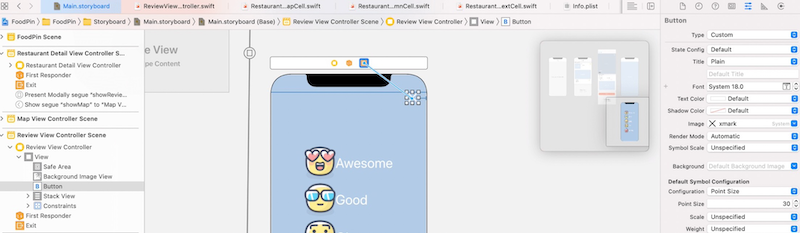
<font color=red>我的问题：触发退出是在评价窗，为啥退出代码是写在父窗体？界面上的拖拽背后代码是怎么写的？</font>

## 背景模糊效果
1. 在ReviewViewController里加入代码：
``` swift
class ReviewViewController: UIViewController {
    // ...
    override func viewDidLoad() {
        super.viewDidLoad()

        // 将传入的restaurant的图片设置为背景图
        backgroundImageView.image = UIImage(named: restaurant.image)
        
        // 创建特效视图
        let blurEffect = UIBlurEffect(style: .dark)
        let blurEffectView = UIVisualEffectView(effect: blurEffect)
        blurEffectView.frame = view.bounds
        // 将特效视图添加到背景视图上
        backgroundImageView.addSubview(blurEffectView)
    }
}
```
模糊效果的style可以选择.dark、.light、.extraLight效果如下：

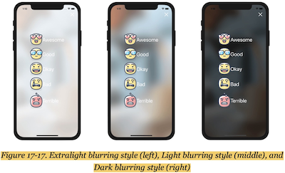

## 关联一个outlet集合
本章五个评价按钮是类似的，因此可以定义一个outlet集合。
1. 在ReviewViewController中定义如下：
``` swift
class ReviewViewController: UIViewController {
    @IBOutlet var rateButtons: [UIButton]!
    // ...
}
```
2. 右键ReviewViewController，将rateButtons拖到5个按钮上各一次

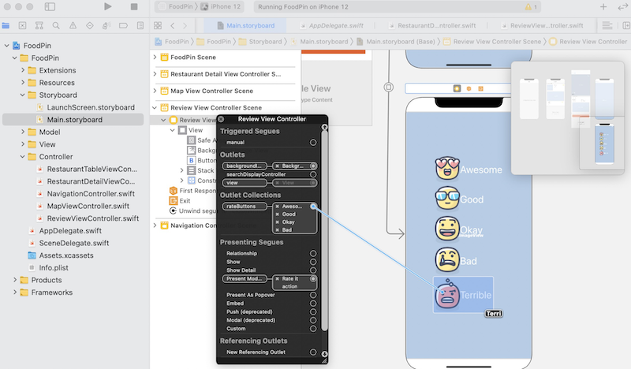

接下来就可以通过如下代码访问五个按钮了：
``` swift
rateButtons[0] // Awesome按钮
rateButtons[1] // Good按钮
rateButtons[2] // Okay按钮
rateButtons[3] // Bad按钮
rateButtons[4] // Terrible按钮
```
## 制定弹出动画
1. 在ReviewViewController中添加如下代码：
``` swift
class ReviewViewController: UIViewController {
    // ...
    override func viewDidLoad() {
        // ...
        
        // 定义初始位置：右移600像素
        let moveRightTransform = CGAffineTransform.init(translationX: 600, y: 0)
        // 设置动画的初始状态：所有评价按钮不可见，并向右平移600个点
        for rateButton in rateButtons{
            rateButton.transform = moveRightTransform
            rateButton.alpha = 0
        }
    }
    
    override func viewWillAppear(_ animated: Bool) {
        // 设置动画的终态：所有评价按钮可见，动画时长2秒钟，并恢复到IB中设置的初始位置
        UIView.animate(withDuration: 0.4, delay: 0.1, options: [], animations: {
            self.rateButtons[0].alpha = 1.0
            self.rateButtons[0].transform = .identity
        }, completion: nil)
        UIView.animate(withDuration: 0.4, delay: 0.15, options: [], animations: {
            self.rateButtons[1].alpha = 1.0
            self.rateButtons[1].transform = .identity
        }, completion: nil)
        UIView.animate(withDuration: 0.4, delay: 0.2, options: [], animations: {
            self.rateButtons[2].alpha = 1.0
            self.rateButtons[2].transform = .identity
        }, completion: nil)
        UIView.animate(withDuration: 0.4, delay: 0.25, options: [], animations: {
            self.rateButtons[3].alpha = 1.0
            self.rateButtons[3].transform = .identity
        }, completion: nil)
        UIView.animate(withDuration: 0.4, delay: 0.3, options: [], animations: {
            self.rateButtons[4].alpha = 1.0
            self.rateButtons[4].transform = .identity
        }, completion: nil)
    }
}
```
结构体CGAffineTransform可以用来定义位移、缩放、旋转视图等各种类型的仿射变换。
上例在viewDidLoad中先将所有按钮右移600点，待要显示时，再设置回IB中的初始位置，这就完成了从右侧飞入的动画效果。
> 单词Affine的意思是仿射，是指一个向量空间进行一次线性变换，并接上一个平移，变换为另一个向量空间，之后再把按钮的transform设置回.identity

多个动画之间可以叠加，比如：
``` swift
let moveRightTransform = CGAffineTransform.init(translationX: 600, y: 0)  // 动画1
let scaleUpTransform = CGAffineTransform.init(scaleX: 5.0, y: 5.0)        // 动画2
let moveScaleTransform = scaleUpTransform.concatenating(moveRightTransform) // 叠加

// Make the button invisible and move off the screen
for rateButton in rateButtons {
    rateButton.transform = moveScaleTransform
    rateButton.alpha = 0
}
```
还可以再加上弹簧效果：
``` swift
UIView.animate(withDuration: 0.8, delay: 0.1, 
usingSpringWithDamping: 0.2,  // 控制振动频率
initialSpringVelocity: 0.3,   // 控制振幅
options: [], animations: {
    self.rateButtons[0].alpha = 1.0
    self.rateButtons[0].transform = .identity
}, completion: nil)
```

## 在转场回退时传递数据
1. 修改Restaurant类型，添加用于存储评价的变量：
``` swift
struct Restaurant: Hashable {
    enum Rating: String{    // 定义评价的数据类型
        case awesome
        case good
        case okay
        case bad
        case terrible
        
        var image: String{
            switch self {
            case .awesome:
                return "love"
            case .good:
                return "cool"
            case .okay:
                return "happy"
            case .bad:
                return "sad"
            case .terrible:
                return "angry"
            }
        }
    }
    var name: String = ""
    var type: String = ""
    var location: String = ""
    var phone: String = ""
    var description: String = ""
    var image: String = ""
    var isFavorite: Bool = false
    var rating: Rating?		// 评价
}
```
> 这里记录评价的变量本质上就是字符串，为什么不直接使用String呢？定义枚举类型可以让编译器帮助检查手误。
2. 回到Main.storyboard，往RestaurantDetailViewController的顶部视图的右下角拖入一个ImageView，这是用来显示评价图标的，设置距离右下侧的边距均为20，宽50，高52
3. 在RestaurantDetailHeaderView中定义评价图标：
``` swift
class RestaurantDetailHeaderView: UIView {
    @IBOutlet var ratingImageView: UIImageView!   // 评价图标
    // ...
}
```
回到Main.storyboard中右键RestaurantHeaderView，将ratingImageView拖到视图中的图标上，建立关联。
4. 在RestaurantDetailViewController中添加回退函数：
``` swift
extension RestaurantDetailViewController: UITableViewDataSource, UITableViewDelegate {
    // 回退处理函数
    @IBAction func rateRestaurant(segue: UIStoryboardSegue){        
    }
```
回到Main.storyboard中摁住Ctrl将每个评价按钮拖到exit图标上，并在弹出菜单中选择rateRestaurantWithSegue，这会在document outline中创建一个回退转场，分别将这些转场identifier命名为评价按钮的文本串：

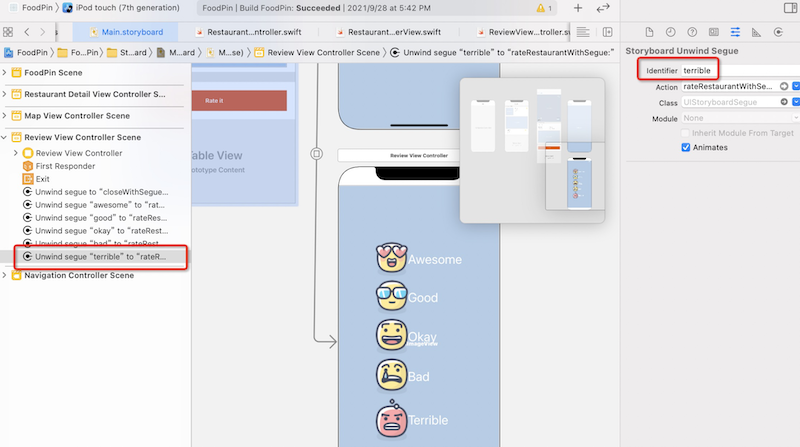
5. 更新回退函数如下：
``` swift
extension RestaurantDetailViewController: UITableViewDataSource, UITableViewDelegate {
    
    @IBAction func rateRestaurant(segue: UIStoryboardSegue){
        // 获取回退转场的id
        guard let identifier = segue.identifier else{
            return
        }
        // 更新评价图标
        if let rating = Restaurant.Rating(rawValue: identifier){
            self.restaurant.rating = rating
            self.headerView.ratingImageView.image = UIImage(named: rating.image)
        }
        dismiss(animated: true, completion: nil)
    }
    // ...
}
```
**最关键的步骤是第5步**：它和上面的点`×`退出是一样的机制，都是定义了退出函数，并在IB中设置触发，只是这里会根据Segue.identifier获知到触发源，并做相应处理

# 第18章 静态表格视图、相机和NSLayoutConstraint
本章允许用户添加新的餐馆：
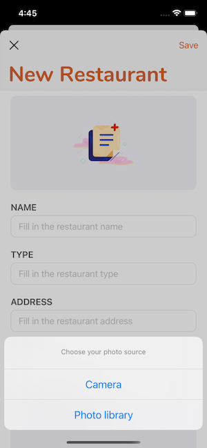
本章要点包括：
- **使用static table view承载新建餐馆信息**，和前面的dynamic table view不同的是：dynamic使用单元格原型设计单元格形式，再动态填充内容，而static的内容都是固定的
- **设置回车后输入框的焦点顺序** 使用输入框的tag记录焦点顺序，通过`resignFirstResponder`/`becomeFirstResponder`控制失去/获取焦点
- **自定义圆角输入框** 通过派生重载UITextField的`textRect(forBounds:)`、`placeHolderRect(forBounds:)`、`editingRect(forBounds:)`定义输入部分的显示区域
- **自定义导航栏字体** 在viewDidLoad中获取导航栏的standardAppearance，可以做修改定制
- **使用UIImagePickerController选择本地照片，并获取被选中的图片**
- **使用代码控制布局约束**
- **点击任意区域收回键盘**

## 新建Restaurant的VC
1. 下载[新建图标](http://www.appcoda.com/resources/swift53/newphotoicon.zip)，并拖到工程的asset下。打开Main.storyboard，添加一个table view controller，选中其下的Table View，在Attribute inspector中将Content option从Dynamic Prototypes**改为Static Cells**，在document outline中选中Table View Section，在Attribute inspector中将Rows由3改为6：

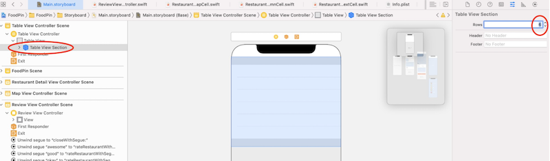
2. **第一个单元格显示图片**。修改第一个Table View Cell，在size inspector设置高度=200，Selection option=None，这样该单元格就无法被选中了。添加一个image view 到该单元格，设置图片为第1步加入的newphoto，背景色=System Gray 6 Color，四个边距=0。
3. **第二个Table View Cell显示名称**，设置Selection option=None。拖入一个label，设置title=NAME，font=Headline style，font color=dark gray。在其下方再拖入一个text field，设置placeholder=Fill in the restaurant name，font type=Body。选中这两个控件，点击右下角Embed - Stack View，将他们包裹在一个Stack View里，设置该Stack View的四边距=0。将Alignment option由Leading设置为Fill，并修改spacing=5。
4. **第三、四、五个单元格同第二个**，只是label title分别为：TYPE、ADDRESS和PHONE。第六个单元格的label title=DESCRIPTION，输入框使用`Text View`，和text field不同的是，该输入框可以输入多行文字，设置initial text：A gread restaurant to try out，background color：System Gray 6 Color，font：Body text style，其余设置同第二个单元格。
5. **将第1步中新建的table view controller用导航栏包裹住** 选中第1步中新建的table view controller，点击菜单 Editor - Embed in - Navigation Controller，点击Table View Controller的navigation bar，设置其Navigation Item/Item为New Restaurant。选中Navigation Controller/Navigation Bar，勾选Attributes inspector/Navigation Bar/Perfers Large Title选项
6. **在首页添加触发新建的按钮** 往Food Pin VC的navigation bar添加一个bar button item，设置Title为空，Image为plus，tint为Label Color。摁住Ctrl将+按钮拖到上面创建的New Restaurant navigation controller上，选择present modally，并将segue identifier设置为addRestaurant。
7. 在New Restaurant VC的navigation bar左上方添加一个bar button item，设置title为空，Image 为xmark，tint为Label Color

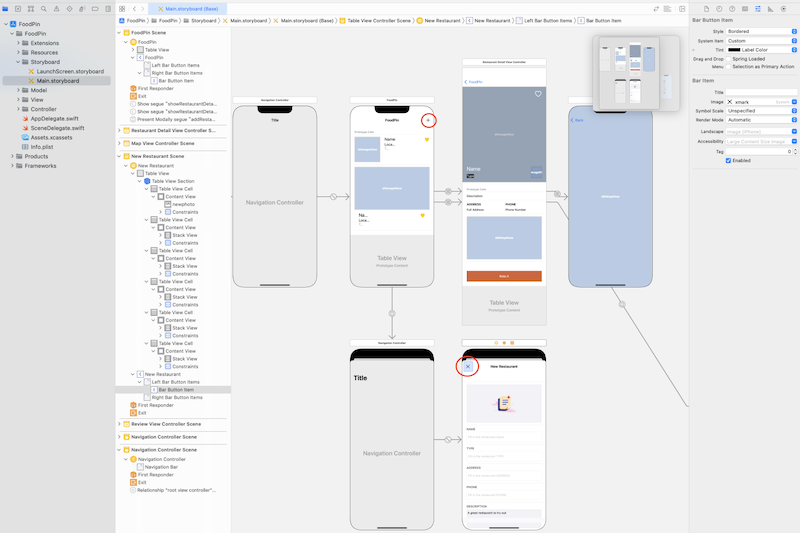

8. 在RestaurantTableViewController中添加转场返回函数：
``` swift
class RestaurantTableViewController: UITableViewController {
    // ...
  
  @IBAction func unwindToHome(segue: UIStoryboardSegue){  // 转场返回函数
    dismiss(animated: true, completion: nil)
  }
}
```
再回到Main.storyboard中，摁住Ctrl将关闭按钮拖到所在VC的Exit图标，选择unwindToHomeWithSegue

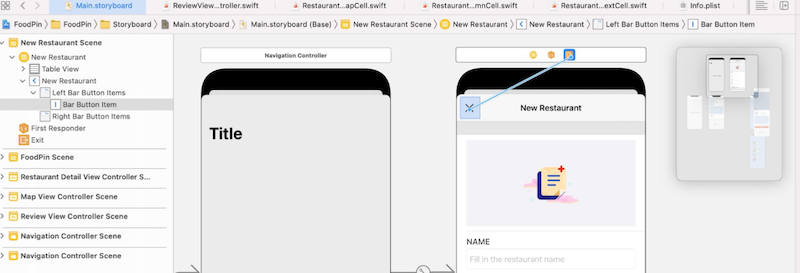

## 构造圆角Text Field
1. 新建文件，选择模板Cocoa Touch Class，类名RoundedTextField，基类UITextField，代码如下：
``` swift
class RoundedTextField: UITextField {
  // 设置缩进尺寸
  let padding = UIEdgeInsets(top: 0, left: 15, bottom: 0, right: 15);
  
  // 返回画text的矩形
  override func textRect(forBounds bounds: CGRect) -> CGRect{
    return bounds.inset(by: padding)
  }
  
  // 返回placeholder文本的矩形
  override func placeholderRect(forBounds bounds: CGRect) -> CGRect {
    return bounds.inset(by: padding)
  }
  
  // 返回输入文本的矩形
  override func editingRect(forBounds bounds: CGRect) -> CGRect {
    return bounds.inset(by: padding)
  }
  
  // 每次重新布局时调用
  override func layoutSubviews() {
    super.layoutSubviews()
    
    self.layer.borderWidth = 1.0  // 边框宽度
    self.layer.borderColor = UIColor.systemGray5.cgColor  // 边框颜色
    self.layer.cornerRadius = 10.0   // 圆角弧度
    self.layer.masksToBounds = true
  }
}
```
2. 将用于输入新创建的Restaurant的Name、Type、Address、Phone的TextField的Class设置为RoundedTextField
## 设置焦点顺序
当在name输入框中点击回车键，我们希望焦点能挪到下一个type输入框中
1. 新建文件，选择模板为Cocoa Touch Class，类名为NewRestaurantController，基类为UITableViewController，更新代码如下：
``` swift
class NewRestaurantTableViewController: UITableViewController {
  // ① 依次设置焦点顺序
  @IBOutlet var nameTextField: RoundedTextField!{
    didSet{
      nameTextField.tag = 1  // 设置焦点顺序
      nameTextField.becomeFirstResponder() // 将name设置为first responder
      nameTextField.delegate = self
    }
  }

  @IBOutlet var typeTextField: RoundedTextField!{
    didSet{
      typeTextField.tag = 2
      typeTextField.delegate = self
    }
  }
  
  @IBOutlet var addressTextField: RoundedTextField!{
    didSet{
      addressTextField.tag = 3
      addressTextField.delegate = self
    }
  }
  
  @IBOutlet var phoneTextField: RoundedTextField!{
    didSet{
      phoneTextField.tag = 4
      phoneTextField.delegate = self
    }
  }
  
  @IBOutlet var descriptionTextView: UITextView!{
    didSet{
      descriptionTextView.tag = 5
      descriptionTextView.layer.cornerRadius = 10.0
      descriptionTextView.layer.masksToBounds = true
    }
  }
  
    override func viewDidLoad() {
        super.viewDidLoad()
    }

    // ② 删除不需要的两个函数
	// override func numberOfSections(in tableView: UITableView) -> Int {
	//	return 0
	// }
	//
	// override func tableView(_ tableView: UITableView, numberOfRowsInSection section: Int) -> Int {
	//	return 0
	// }
}

// 扩展UITextFieldDelegate协议，当点击回车键，移动焦点
extension NewRestaurantControllerTableViewController: UITextFieldDelegate{
  // 当点击回车键
  func textFieldShouldReturn(_ textField: UITextField) -> Bool {
    // 获取下一个输入焦点
    if let nextTextField = view.viewWithTag(textField.tag + 1) {
      textField.resignFirstResponder()     // 释放first responder
      nextTextField.becomeFirstResponder() // 成为first responder
    }
    return true
  }
}
```
## 使用UIImagePickerController显示图片库
1. **弹出显示相机/相册的窗口** 向NewRestaurantController中添加如下代码，当点击首行单元格，则提示选择图片
``` swift
override func tableView(_ tableView: UITableView, didSelectRowAt indexPath: IndexPath) {
    if indexPath.row == 0 {   // 点击首行单元格
        // 定义提示窗，选择照片
        let photoSourceRequestController = UIAlertController(title: "", message: "Choose your photo source", preferredStyle: .actionSheet)

        // 定义行动点，触发拍照
        let cameraAction = UIAlertAction(title: "Camera", style: .default, handler: { (action) in
            if UIImagePickerController.isSourceTypeAvailable(.camera) {
                let imagePicker = UIImagePickerController()
                imagePicker.allowsEditing = false
                imagePicker.sourceType = .camera
                imagePicker.delegate = self  // 拍摄完成后，由self接收
                    
                self.present(imagePicker, animated: true, completion: nil)
            }
        })

        // 定义行动点，触发相册
        let photoLibraryAction = UIAlertAction(title: "Photo library", style: .default, handler: { (action) in
            if UIImagePickerController.isSourceTypeAvailable(.photoLibrary) {
                let imagePicker = UIImagePickerController()
                imagePicker.allowsEditing = false
                imagePicker.sourceType = .photoLibrary
                imagePicker.delegate = self  // 选中图片后，由self接收
                    
                self.present(imagePicker, animated: true, completion: nil)
            }
        })

        // 添加行动点
        photoSourceRequestController.addAction(cameraAction)
        photoSourceRequestController.addAction(photoLibraryAction)

        // For iPad
        if let popoverController = photoSourceRequestController.popoverPresentationController {
            if let cell = tableView.cellForRow(at: indexPath) {
                popoverController.sourceView = cell
                 popoverController.sourceRect = cell.bounds
            }
        }

        // 弹出提示窗
        present(photoSourceRequestController, animated: true, completion: nil)
    }
}
```
弹出的提示窗如下所示：


2. **申请相关权限** 在iOS10及以后的版本中，出于隐私的原因，要求开发者必须显式声明app访问相册或相机的原因，需要在Info.plist中添加两个关键字：NSPohtoLibraryUsageDescription和NSCameraUsageDescription。选中Info.plist - 右键Information Property List - Add Row，
设置key：Privacy - Photo Library Usage Description，
value：You need to grant the app access to your photo library so you can pick your favorite restaurant photo.；
再添加一行:
设置key：Privacy - Camera Usage Description，
value：You need to grant the app access to your camera in order to take photos.
不过我在模拟器下删除这两个关键字，程序依然能正常跑
## 获取被选中的图片
需要让NewRestaurantController实现UIImagePickerControllerDelegate和UINavigationControllerDelegate协议。当从相册中选中一张图片，协议的imagePickerController(_:didFinishPickingMediaWithInfo:)会被调用。
1. 在NewRestaurantController中定义ImageView变量，用于显示图片：
``` swift
class NewRestaurantController: UITableViewController {
    @IBOutlet var photoImageView: UIImageView! {
        didSet {
            photoImageView.layer.cornerRadius = 10.0
            photoImageView.layer.masksToBounds = true
            
        }
    }
    // ...
}
```
并将该变量关联到控件：

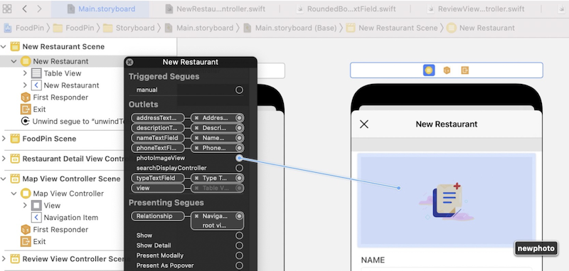
2. 获取被选中的图片，并更新到ImageView上：
``` swift
extension NewRestaurantController: UIImagePickerControllerDelegate, UINavigationControllerDelegate{
    func imagePickerController(_ picker: UIImagePickerController, didFinishPickingMediaWithInfo info: [UIImagePickerController.InfoKey : Any]) {

        // 获取被选中的图片
        if let selectedImage = info[UIImagePickerController.InfoKey.originalImage] as? UIImage {
            photoImageView.image = selectedImage
            photoImageView.contentMode = .scaleAspectFill
            photoImageView.clipsToBounds = true
        }

        dismiss(animated: true, completion: nil)
    }
    
}
```
## 使用代码约束布局&关闭键盘
前面都是在Interface Builder中设置布局约束，使用代码也有等价做法。本节以ImageView为例
1. 首先删除在Interface Builder中的设置的四边距约束。
2. 在NewRestaurantController中更新viewDidLoad函数。
``` swift
class NewRestaurantController: UITableViewController {    
    override func viewDidLoad() {
        super.viewDidLoad()

        // ...
        
        // 获取父窗口的边距
        let margins = photoImageView.superview!.layoutMarginsGuide
        
        // 令布局约束代码生效
        photoImageView.translatesAutoresizingMaskIntoConstraints = false
        
        // 定义ImageView四边距的约束
        photoImageView.leadingAnchor.constraint(equalTo: margins.leadingAnchor).isActive = true
        photoImageView.trailingAnchor.constraint(equalTo: margins.trailingAnchor).isActive = true
        photoImageView.topAnchor.constraint(equalTo: margins.topAnchor).isActive = true
        photoImageView.bottomAnchor.constraint(equalTo: margins.bottomAnchor).isActive = true

        // 当用户点击ImageView的任何区域，都关闭键盘
        let tap = UITapGestureRecognizer(target: view, action: #selector(UIView.endEditing))
        tap.cancelsTouchesInView = false
        view.addGestureRecognizer(tap)
    }
    // ...
}
```
上面函数末尾添加了一个手势——当点击到ImageView任何区域，都调用endEditing来关闭键盘。