# 第19章 使用Core Data
在本章之前，所有数据都是hardcode在代码里的，本章引入Core Data并学习基于该技术的增删改查，当首次冷启没有数据时，首页显示一个引导背景图：
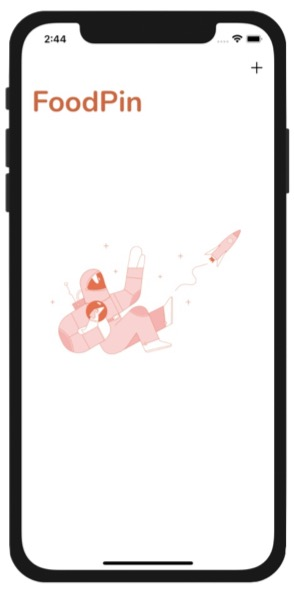

## Core Data基础

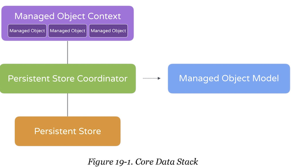
Core Data是iOS提供给开发者通过面向对象方式访问数据的一套framework。如上图所示它由几部分组成：
- Managed Object Context 用来和数据存储层交互的临时缓存，他的职责是管理Core Data framework创建或返回的数据对象。大部分时候，开发者只需要和NSManagedObjectContext对象打交道。
- Managed Object Model 用来描述数据库的schema，在Xcode中，该数据定义在.xcdatamodeld文件中，Xcode提供了可视化的编辑工具。
- Persistent Store Coordinator 它在存储层和Context之间，用来协调持久化数据和缓存之间的关系。上图只有一个Persistent Store，一个app可能会存在多个Persistent Store，Persistent Store Coordinator负责管理多个Persistent Store实例。开发者很少和Persistent Store Coordinator直接打交道。
- Persistent Store 负责数据存储，默认采用的是SQLite，也可以是二进制或XML文件。

## 使用Xcode生成的Core Data代码
创建工程的时候可以勾选Use Core Data，

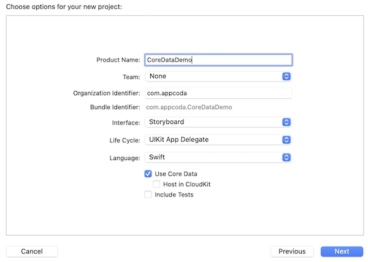
这样Xcode会在AppDelegate类中自动生成相关代码：
``` swift
// NSPersistentContainer封装了Core Data的大部分细节。
// 在iOS10之前，开发者需要自己创建和管理NSManagedObjectModel、
// NSPersistentStoreCoordinator和 NSManagedObjectContext实例。
// 有了NSPersistentContainer之后，它几乎成了程序要唯一需要打交道的数据结构。
lazy var persistentContainer: NSPersistentContainer = {
    let container = NSPersistentContainer(name: "CoreDataDemo")
    container.loadPersistentStores(completionHandler: { (storeDescription, error) in
        if let error = error as NSError? {
        	fatalError("Unresolved error \(error), \(error.userInfo)")
        }
	})
    return container
}()

// 用来保存数据的工具函数
func saveContext () {
    let context = persistentContainer.viewContext
    if context.hasChanges {
        do {
            try context.save()
        } catch {
            let nserror = error as NSError
    		fatalError("Unresolved error \(nserror), \(nserror.userInfo)")
		}
    }
}
```
如果在最初创建工程的时候没有勾选CoreData，也可以在AppDelegate.swift中手动添加代码：
``` swift
import UIKit
import CoreData

@main
class AppDelegate: UIResponder, UIApplicationDelegate {
    // ...
    
    lazy var persistentContainer: NSPersistentContainer = {
        let container = NSPersistentContainer(name: "FoodPin")
        container.loadPersistentStores(completionHandler: { (storeDescription, error) in
            if let error = error as NSError? {
                fatalError("Unresolved error \(error), \(error.userInfo)")
            }
        })
        return container
    }()
    
    // 用来保存数据的工具函数
    func saveContext () {
        let context = persistentContainer.viewContext
        if context.hasChanges {
            do {
                try context.save()
            } catch {
                let nserror = error as NSError
                fatalError("Unresolved error \(nserror), \(nserror.userInfo)")
            }
        }
    }
}
```
## 创建Data Model
1. 新建文件 - 选择Core Data/Data Model - 命名为FoodPin.xcdatamodeld。
2. 点击Add Entity，并修改名称为Restaurant，点击Attribute下方的+，添加8个属性如下：


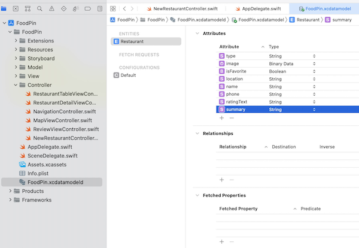
## 创建Managed Objects

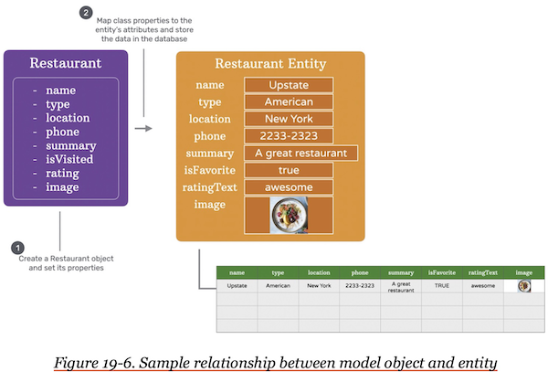
1. 选中Restaurant entity，在Data Model inspector中，Class/Codegen默认是`Class Definition`，这表示当构建项目时，Xcode会自动生成model 类的代码，选择该选项意味着开发者不能再手动修改model类的定义，通常适用于比较简单无需定制的项目。在本项目中我们改为手动生成`Manual/None`：
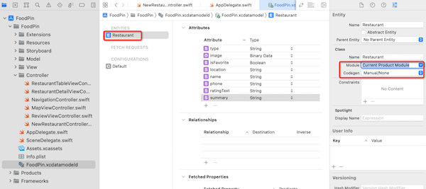
2. 需要对原先的Restaurant.swift做一个较大的改造，成为Managed Object如下：
``` swift
import Foundation
import CoreData

public class Restaurant: NSManagedObject {
    // 获取从数据库中返回的restaurant 数据
    @nonobjc public class func fetchRequest() -> NSFetchRequest<Restaurant> {
        return NSFetchRequest<Restaurant>(entityName: "Restaurant")
    }
    
    // 关键字 @NSManaged 告诉编译器该属性会被Core Data管理
    @NSManaged public var name: String
    @NSManaged public var type: String
    @NSManaged public var location: String
    @NSManaged public var phone: String
    @NSManaged public var summary: String
    @NSManaged public var image: Data
    @NSManaged public var isFavorite: Bool
    @NSManaged public var ratingText: String?
}

// 原先的Restaurant.rating是一个枚举型变量，因此需要再通过extension来转换一下
extension Restaurant{
    enum Rating: String {
        case awesome
        case good
        case okay
        case bad
        case terrible
        
        var image: String {
            switch self {
            case .awesome: return "love"
            case .good: return "cool"
            case .okay: return "happy"
            case .bad: return "sad"
            case .terrible: return "angry"
            }
        }
    }
    var rating: Rating?{
        // 将ratingText转换成Rating
        get {
            guard let ratingText = ratingText else{
                return nil
            }
            return Rating(rawValue: ratingText)
        }
        // 将Rating转换成ratingText
        set{
            self.ratingText = newValue?.rawValue
        }
    }
}
```
> 需要注意：
> - **在AppDelegate创建的persistContainer的名字必须与xcdatamodeld文件的名字一致**；
> - **如果DataModel的代码是手动生成的，则在Data Model Inspector中填写的Class Name必须与手动生成的类名一致**。
> - **在Data Model Inspector中Class/Model须填写为`Current Product Model`，目前还不知道这么写的作用，先备忘吧**。

## 使用Managed Object
1. 原先hard code在RestaurantTableViewController.swift中的数据，都可以删除了：
``` swift
class RestaurantTableViewController: UITableViewController {
    // 原先hard code 的数据，改为空数组
    var restaurants:[Restaurant] = []
    // ... 
}
```
2. 打开RestaurantViewController.swift，这里有两处错误。因为Restaurant的image由原先的String类型的资源名改为Data类型的数据了。改掉他们：
``` swift
// 错误1
cell.thumbnailImageView.image = UIImage(named: restaurant.image)
// 修改为：
cell.thumbnailImageView.image = UIImage(data: restaurant.image)

// 错误2
if let imageToShare = UIImage(named: restaurant.image) {
// 修改为
if let imageToShare = UIImage(data: restaurant.image) {
```
在RestaurantDetailViewController.swift中类似的错误：
``` swift
// 错误
headerView.headerImageView.image = UIImage(named: restaurant.image)
// 修改为
headerView.headerImageView.image = UIImage(data: restaurant.image)
```
在ReviewController中类似的错误：
``` swift
// 错误
backgroundImageView.image = UIImage(named: restaurant.image)
// 修改为
backgroundImageView.image = UIImage(data: restaurant.image)
```
## 处理空Table View
通常在没有任何数据时，Table View可以向用户展现更多信息，以帮助用户做后续操作。可以利用UITableView的backgroundView属性，在没有数据时显示一张引导图片。
1. 下载[背景图](http://www.appcoda.com/resources/swift53/emptydata.zip)，把它添加到Assets.xcasset中，并勾选Preserve Vector Data
2. 回到Main.storyboard，选中Restaurant Table View Controller，添加一个View到该VC的docker上去。之后该docker脑袋顶上会漂浮一个view，如下图：

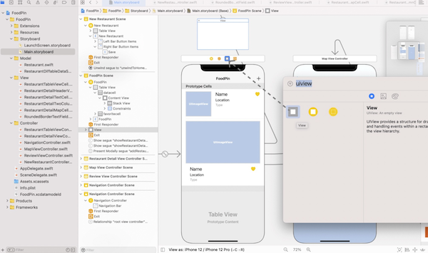
3. 往漂浮的view中再拖入一个image view，设置Image为上面导入的emptydata图片：

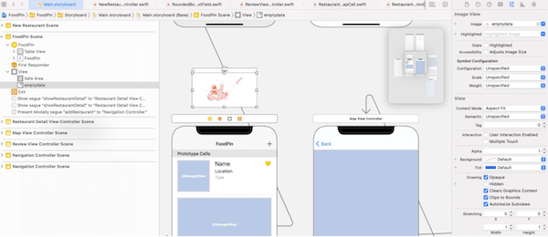
4. 在RestaurantTableViewController.swift中添加变量
``` swift
class RestaurantTableViewController: UITableViewController {
    @IBOutlet var emptyRestaruantView: UIView!
    // ...
}
```
回到Main.storyboard中将该变量关联到上面漂浮的View上。
5. 将漂浮的view设置为首页背景，如果首页列表没有数据，则显示该背景：
``` swift

override func viewDidLoad() {
    super.viewDidLoad()
    // ... ...
    // Prepare the empty view
    tableView.backgroundView = emptyRestaurantView
    tableView.backgroundView?.isHidden = restaurants.count == 0 ? false : true
}
```

## 更新数据库
1. 新建数据
``` swift
class NewRestaurantController: UITableViewController {
    var restaurant: Restaurant! // 暂存创建的restaurant

    @IBAction func saveButtonTapped(sender: UIButton) {
        // ...
        if let appDelegate = (UIApplication.shared.delegate as? AppDelegate){
            // 创建restaurant，并更新字段
            restaurant = Restaurant(context: appDelegate.container.viewContext)
            restaurant.name = nameTextField.text!
            restaurant.type = typeTextField.text!
            restaurant.location = addressTextField.text!
            restaurant.phone = phoneTextField.text!
            restaurant.summary = descriptionTextView.text
            restaurant.isFavorite = false
            
            if let imageData = photoImageView.image?.pngData(){
                restaurant.image = imageData
            }
            appDelegate.saveContext()  // 保存数据
        }
        
        dismiss(animated: true, completion: nil)
    }
    // ...
}
```
2. 加载数据，添加两个函数：fetchRestaurantData从数据库查询数据并更新UI；updateSnapshot更新UI
``` swift
import UIKit
import CoreData

class RestaurantTableViewController: UITableViewController {
    // 缓存查询列表
    var fetchResultController: NSFetchedResultsController<Restaurant>!
    
    // 更新UI
    func updateSnapshot(animatingChange: Bool = false){
        if let fetchedObjects = fetchResultController.fetchedObjects{
            restaurants = fetchedObjects  // 缓存查询数据
        }
        // 创建快照，更新UI
        var snapshot = NSDiffableDataSourceSnapshot<Section, Restaurant>()
        snapshot.appendSections([.all])
        snapshot.appendItems(restaurants, toSection: .all)
        
        dataSource.apply(snapshot, animatingDifferences: animatingChange)
    }
    
    // 查询数据
    func fetchRestaurantData(){
        let fetchRequest: NSFetchRequest<Restaurant> = Restaurant.fetchRequest()
        let sortDescriptor = NSSortDescriptor(key: "name", ascending: true)
        fetchRequest.sortDescriptors = [sortDescriptor]  // 指定排序规则
        
        if let appDelegate = (UIApplication.shared.delegate as? AppDelegate){
            let context = appDelegate.persistentContainer.viewContext
            // 定义查询
            fetchResultController = NSFetchedResultsController(fetchRequest: fetchRequest, managedObjectContext: context, sectionNameKeyPath: nil, cacheName: nil)
            
            // 该delegate将在数据发生变化时，收到通知
            fetchResultController.delegate = self
            do{
                try fetchResultController.performFetch()  // 执行查询
                updateSnapshot()
            }catch{
                print(error)
            }
        }
    }
   
    override func viewDidLoad() {
        // ...
        fetchRestaurantData() // 加载数据
    }
    // ...
}
```
令RestaurantTableViewController遵守NSFetchedResultsControllerDelegate协议，当数据发生变化时，收到通知：
``` swift
// 当fetch results发生变化时，协议NSFetchedResultsControllerDelegate将收到通知
extension RestaurantTableViewController: NSFetchedResultsControllerDelegate {
    // 当数据发生变化时
    // controllerWillChangeContent 和 controllerDidChangeContent 将被调用
    func controllerDidChangeContent(_ controller: NSFetchedResultsController<NSFetchRequestResult>) {
        updateSnapshot()
    } 
}
```
具体是什么数据发生变化时，会收到通知？我猜测应该是fetchResultController，可这是一个实例变量，不属于协议的一部分，代码又怎么知道要监控改变量呢？

## 删除记录
更新RestaurantTableViewController的tableView(_:trailingSwipeActionsConfigurationForRowAt:_)函数：
``` swift
// Delete action
let deleteAction = UIContextualAction(style: .destructive, title: "Delete") { (action, sourceView, completionHandler) in
    if let appDelegate = (UIApplication.shared.delegate as? AppDelegate){
        let context = appDelegate.persistentContainer.viewContext
        context.delete(restaurant)
        appDelegate.saveContext()
    }
            
    // Call completion handler to dismiss the action button
    completionHandler(true)
}
// ...
```

# 第20章 搜索栏和 UISearchController
本章在首页添加了搜索栏，有几个关键步骤：
1. 在viewDidLoad中定义搜索栏，并设置给首页
2. 定义过滤函数，根据搜索栏中的内容，为首页提供过滤后的结果
3. 响应搜索栏的关键词变化动作
4. 注意在搜索栏激活后，首页的列表是不可编辑的，应屏蔽删除按钮

iOS 8以后，系统提供了UISearchController大大简化了搜索栏的创建和搜索结果的管理，开发者不仅可以在table view controller中使用，还可以在其他比如collection view controller中使用。iOS 11以后，苹果进一步对搜索栏做了简化，在导航栏中引入了searchController字段。

## 添加搜索栏
只需在RestaurantTableViewController中添加如下代码：
``` swift
class RestaurantTableViewController: UITableViewController {
    var searchController: UISearchController!  // 定义搜索栏变量
    
    override func viewDidLoad() {
        super.viewDidLoad()

        // 注意：搜索栏相关代码一定要写在navigationController前面，否则会有显示异常
        
        // 创建搜索栏，参数为nil表示搜索结果将和列表在同一个窗口
        let searchController = UISearchController(searchResultsController: nil)
        
        // 负责更新搜索结果的实例
        searchController.searchResultsUpdater = self
        
        // 将搜索栏添加到导航条上
        self.navigationItem.searchController = searchController
        
        // ...
    }
    // ...
}
```
## 过滤内容
搜索是对内容列表执行一个过滤行为，有两种方式可以实现：
- 方法一：通过对当前的restaurant数组做过滤。Swift提供了一个内置的过滤函数filter，该函数接收一个代码块，开发者可在代码块中定制过滤规则，符合条件的返回true，否则返回false。如：
``` swift
let searchResults = restaurant.filter(
    { (restaurant) -> Bool in 
     let isMatch = restaurant.name.localizedCaseInsensitiveContains(searchText)
     return isMatch
    })
```
- 方法二：使用Core Data执行一次查询。可以通过NSFetchRequest指定谓词逻辑，执行一次查询。如：
``` swift
fetchRequest.predicate = NSPredicate(format: "name CONTAINS[c] %@", cafe)
```
将查询name包含"cafe"的所有结果。在本例中，我们将使用第二种方法。

1. 更新RestaurantTableViewController中的函数fetchRestaurantData()：
``` swift
class RestaurantTableViewController: UITableViewController {
    func fetchRestaurantData(searchText: String = ""){
        let fetchRequest: NSFetchRequest<Restaurant> = Restaurant.fetchRequest()
 		// 如果查询词非空，则执行谓词逻辑       
        if !searchText.isEmpty{
            fetchRequest.predicate = NSPredicate(format: "name CONTAINS[c] %@", searchText)
        }
        
        // 后面保持不变
        let sortDescriptor = NSSortDescriptor(key: "name", ascending: true)
        fetchRequest.sortDescriptors = [sortDescriptor]  // 指定排序规则
        
        if let appDelegate = (UIApplication.shared.delegate as? AppDelegate){
            let context = appDelegate.persistentContainer.viewContext
            // 定义查询
            fetchResultController = NSFetchedResultsController(fetchRequest: fetchRequest, managedObjectContext: context, sectionNameKeyPath: nil, cacheName: nil)
            
            fetchResultController.delegate = self
            do{
                try fetchResultController.performFetch()  // 执行查询
                updateSnapshot()
            }catch{
                print(error)
            }
        }
    }
    // ...
}
```
2. 接下来需要在搜索框发生变化时执行搜索——这是即时搜索的效果。怎么捕捉搜索框的变化呢？可以**令RestaurantTableViewController遵循UISearchResultsUpdating协议，当用户选中搜索框或键入内容时，将调用updateSearchResults(for :)方法**。更新RestaurantTableViewController：
``` swift
extension RestaurantTableViewController: UISearchResultsUpdating{
    // 当搜索框发生变化时，调用该函数
    func updateSearchResults(for searchController: UISearchController) {
        guard let searchText = searchController.searchBar.text else{
            return
        }
        fetchRestaurantData(searchText: searchText)  // 搜索词非空，则执行搜索
    }
}
```
3. 更新RestaurantTableViewController的viewDidLoad函数，设置①当搜索框发生变化时，由谁捕捉该信息；②由于本案例中数据列表和搜索结果列表是同一个，因此在搜索过程中背景内容不要变暗：
``` swift
override func viewDidLoad() {
    super.viewDidLoad()
        
    // 创建搜索栏，参数为nil表示搜索结果将和列表在同一个窗口
    searchController = UISearchController(searchResultsController: nil)
    // 将搜索栏添加到导航条上
    self.navigationItem.searchController = searchController
        
    // ① 由谁捕捉“搜索框变化”的信息，
    searchController.searchResultsUpdater = self
    // ② 在搜索过程中，背景内容是否变暗
    searchController.obscuresBackgroundDuringPresentation = false
    // ...
}
```
4. 搜索结果应该是只读的，因此删除和分享都应该隐去

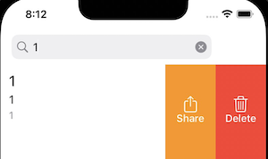

更新tableView(trailingSwipeActionsConfigurationForRowAt:)函数：
``` swift
override func tableView(_ tableView: UITableView, trailingSwipeActionsConfigurationForRowAt indexPath: IndexPath) -> UISwipeActionsConfiguration? {
    if searchController.isActive{
        // 如果搜索框被激活，则返回空配置，就不会扫出 删除和分享 按钮了
        return UISwipeActionsConfiguration()
    }
    // ...
}
```
## 将table view header设置为搜索框
以上是把导航栏设置为搜索框，还可以把table view header设置为搜索框，只需要将这行代码做个替换：
``` swift
// self.navigationItem.searchController = searchController  将该行代码替换为下面这行
tableView.tableHeaderView = searchController.searchBar
```
二者的区别在于：table view header设置为搜索框，① 下面有一道横线；② 搜索框激活后，右侧有取消按钮

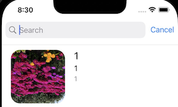


# 第21章 使用UIPageViewController and Container Views构建向导页
本章实现翻页向导——很多APP首次使用时会提供几页向导，用UIPageViewController可以实现该功能。该类可以定制：
- page view 的方向 - 横向还是纵向
- 过渡方式 - 翻页还是滚屏
- 书脊的位置 - 仅适用于翻页
- 页面之间的缝隙 - 仅适用于滚屏，应该是页间距

本章完成的练习如下图所示。

## 为UIPageViewController创建新的storyboard
1. 新建Storyboard，命名为Onboarding.storyboard
2. 在该storyboard中拖入一个page view controller，设置transition style为Scroll，设置storyboardID为WalkthroughController。以前大部分时候都不需要为控件设置storyboardID，接下来我们要在代码里控制该控件，因此需要设置。

### 划屏向导页面的构成
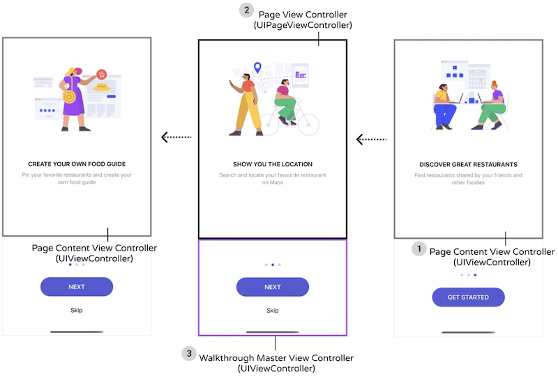
1. 一个普通的UIViewController，显示一张图片和两段文字
2. 一个UIPageViewController来控制1中的UIViewController
3. 一个master ViewController来容纳上半部分的UIPageViewController和下半部分的按钮

## Master View Controller
1. 往Onboarding.storyboard中拖入一个view controller（新建Onboarding.storyboard的时候就已经有一个默认的了，可以直接用这个）。
2. 再往1中拖入一个Container View，并设值高度为500
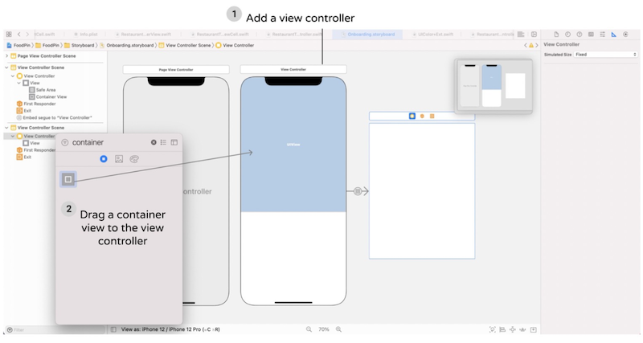
> container view是一个占位对象，表示这里有一个View，拖入container view的同时，就会自动创建一个VC，如上图所示。调整container view 的尺寸会自动调整其所关联的VC尺寸。
3. 在本节中container view里面应该装前面创建的PageViewController，因此删除2中自动生成的segue，按住Ctrl将container view拖动到PageViewController，并选择Embed：

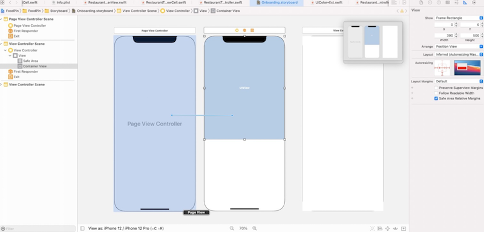
4. 在master VC的下半部拖入一个View，设置左、右、底部边距为0，在document outline中按住Ctrl从View拖到Safe Area，选择Equal Heights，再到size inspector中将该高度的mutiplier从1改成1:3，从而将该View的高度设置为整体VC的底部1/3。
5. 在View中添加一个Button，设置Title为NEXT，font为Headline text style，font color为white，background color为System Indigo Color，添加两条约束：长190，宽50
6. 在Button的下边再添加一个Button，设置Title为Skip，font为Body text style，font color为Label Color
7. 在两个Button上边添加一个page control，设置tint color为System Gray 4 Color，current page color为System Indigo Color
8. 按住⌘选中两个Button和page control，将他们装进一个Stack view，修改spacing为20，添加两个对齐约束：居中偏移均为0
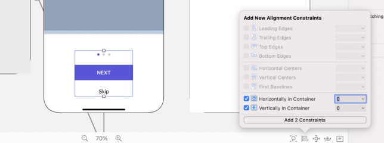
## PageContentViewController
1. 下载图片资源http://www.appcoda.com/resources/swift53/onboarding.zip，拖入到Assets.xcasset中，并勾选Preserve Vector Data选项。
2. 打开Onboarding.storyboard，往PageContentViewController中拖入一个ImageView，设置宽高为：333×229
3. 在ImageView下面添加一个Label，设置name为HEADING，font为Headline text style，alignment为center，font color为Label Color
4. 在下面再添加一个Label，设置name为Subheading，font为Subhead text style，alignment为center，font color为Secondary Label Color
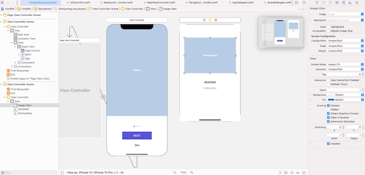
5. 将两个Label圈入一个Stack View，并设值Alignment为Center，Spacing为10
6. 再将上面的ImageView和StackView圈入一个Stack View，并设值Alignment为Center，Spacing为50，并设置四周边距(t, l, r, b = 50, 24, 24, 10)：
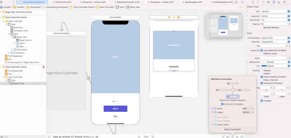
7. 选中ImageView，添加约束：勾选Aspect Ratio 
8. 选中最外层StackView的bottom约束，将Relation由Equal修改为Greater Than or Equal
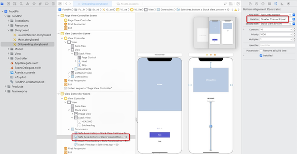
## 创建WalkthroughContentViewController
1. 新建文件，选择Cocoa Touch Class模板，命名：WalkthroughContentViewController，基类为UIViewController
2. 添加变量并更新viewDidLoad：
``` swift
class WalkthroughContentViewController: UIViewController {
    // 定义界面变量
    @IBOutlet var headingLabel: UILabel!{
        didSet{
            headingLabel.numberOfLines = 0      // 支持多行
        }
    }
    
    @IBOutlet var subHeadingLabel: UILabel!{
        didSet{
            subHeadingLabel.numberOfLines = 0
        }
    }
    
    @IBOutlet var contentImageView: UIImageView!
    
    var index = 0       // 当前页序号
    var heading = ""
    var subHeading = ""
    var imageFile = ""
    
    override func viewDidLoad() {
        super.viewDidLoad()

        headingLabel.text = heading
        subHeadingLabel.text = subHeading
        contentImageView.image = UIImage(named: imageFile)
    }
    // ...
}
```
3. 来到Onboard.storyboard，将PageContentViewController的custom class 和 storyboardID均设置为WalkthroughContenViewController：
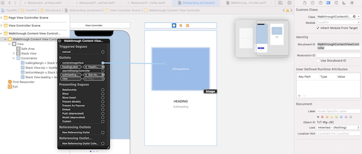
## 实现PageViewController
有两种方式告诉UIPageViewController要显示什么内容：1、由开发者提供视图给到UIPageViewController；2、提供数据源，由UIPageViewController按需获取，每当用户从一页导航到另一页时，UIPageViewController会问数据源接下来它需要显示的content view controller。本节将采用第2种方式。

该数据源将遵循UIPageViewControllerDataSource协议，并实现如下两个方法：
- pageViewController(_:viewControllerBefore:)
- pageViewController(_:viewControllerAfter:)
这两个方法均接收一个VC参数，该函数需要返回该VC前一个/后一个VC

1. 新建文件，模板：Cocoa Touch Class，命名：WalkthroughPageViewController，基类：UIPageViewController
2. 添加变量，用来显示各页面的内容：
``` swift
class WalkthroughPageViewController: UIPageViewController {
    var pageHeadings = ["CREATE YOUR OWN FOOD GUIDE", "SHOW YOU THE LOCATION", "DISCOVER GREAT RESTAURANTS"]
    var pageImages = ["onboarding-1", "onboarding-2", "onboarding-3"]
    var pageSubHeadings = ["Pin your favorite restaurants and create your ownfood guide", "Search and locate your favourite restaurant on Maps", "Find restaurants shared by your friends and other foodies"]
    var currentIndex = 0
    // ...
}
```
3. 扩展UIPageViewControllerDataSource协议，并实现相关接口：
``` swift
extension WalkthroughPageViewController: UIPageViewControllerDataSource {
    // 返回第index个PageContentViewController
    func contentViewController(at index: Int) -> WalkthroughContentViewController? {
        if index < 0 || index >= pageHeadings.count {
            return nil
        }
        // 从Onboarding.storyboard中加载PageContentViewController
        let storyboard = UIStoryboard(name: "Onboarding", bundle: nil)
        if let pageContentViewController = storyboard.instantiateViewController(withIdentifier: "WalkthroughContentViewController") as? WalkthroughContentViewController {
            // 初始化UI内容
            pageContentViewController.imageFile = pageImages[index]
            pageContentViewController.heading = pageHeadings[index]
            pageContentViewController.subHeading = pageSubHeadings[index]
            pageContentViewController.index = index
            return pageContentViewController
        }
        return nil
    }
    
    // 返回前一个PageContentViewController
    func pageViewController(_ pageViewController: UIPageViewController, viewControllerBefore viewController: UIViewController) -> UIViewController? {
        var index = (viewController as! WalkthroughContentViewController).index
        index -= 1
        return contentViewController(at: index)
    }
    
    // 返回下一个PageContentViewController
    func pageViewController(_ pageViewController: UIPageViewController, viewControllerAfter viewController: UIViewController) -> UIViewController? {
        var index = (viewController as! WalkthroughContentViewController).index
        index += 1
        return contentViewController(at: index)
    }
}
```
4. 更新viewDidLoad，完成初始化：
``` swift
class WalkthroughPageViewController: UIPageViewController {
    override func viewDidLoad() {
        super.viewDidLoad()
        
        dataSource = self // 设置数据源
        // 初始化创建第1个页面
        if let startingViewController = contentViewController(at: 0) {
            setViewControllers([startingViewController], direction: .forward, animated: true, completion: nil)
        }
    }
    // ...
}
```
5. 回到Onboarding.storyboard，修改PageViewController的Custom Class和StoryboardID均为WalkthroughPageViewController：
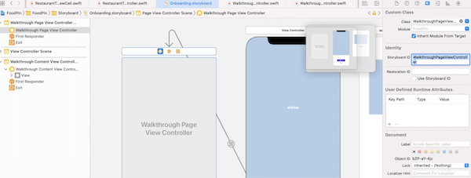
## 实现WalkthroughViewController
1. 新建文件，模板：Cocoa Touch Class，类名：WalkthroughViewController，基类：UIViewController
2. 添加相关UI变量：
``` swift
class WalkthroughViewController: UIViewController {
    @IBOutlet var pageControl: UIPageControl!
    @IBOutlet var nextButton: UIButton!{
        didSet{
            nextButton.layer.cornerRadius = 25.0
            nextButton.layer.masksToBounds = true
        }
    }
    @IBOutlet var skipButton: UIButton!
    // ...
}
```
3. 回到Onboarding.storyboard，将WalkthroughViewController的Custom Class和StoryboardID均设置为：WalkthroughViewController，并将UI变量关联起来：
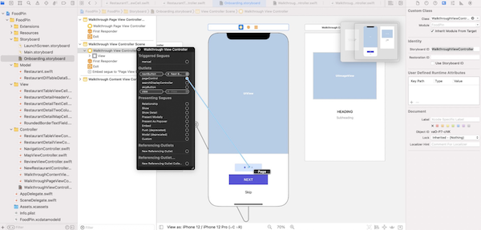
4. 最后在程序启动时显示WalkthroughViewController：
``` swift
class RestaurantTableViewController: UITableViewController {
    // 显示WalkthroughViewControoler
    override func viewDidAppear(_ animated: Bool) {
        let storyboard = UIStoryboard(name: "Onboarding", bundle: nil)
        if let walkthroughViewController = storyboard.instantiateViewController(withIdentifier: "WalkthroughViewController") as? WalkthroughViewController {
            present(walkthroughViewController, animated: true, completion: nil)
        }
    }
    // ...
}
```
## 处理页面指示器和NEXT、Skip按钮
1. 给Skip按钮添加响应处理：
``` swift
class WalkthroughViewController: UIViewController {
    // ...
    @IBAction func skipButtonTapped(sender: UIButton) {
        // UserDefaults.standard.set(true, forKey: "hasViewedWalkthrough")
        dismiss(animated: true, completion: nil)  // 退出向导
    }
}
```
2. 在WalkthroughPageViewController中添加代码：
``` swift
class WalkthroughPageViewController: UIPageViewController {
    // ...
    func forwardPage() {
        // 获取下一个ContentViewController
        currentIndex += 1
        if let nextViewController = contentViewController(at: currentIndex) {
            setViewControllers([nextViewController], direction: .forward, animated: true, completion: nil)
        }
    }
}
```
3. 在WalkthroughViewController中添加代码：
``` swift
class WalkthroughViewController: UIViewController {
	// ...
    var walkthroughPageViewController: WalkthroughPageViewController?
    
    override func prepare(for segue: UIStoryboardSegue, sender: Any?) {
        let destination = segue.destination
        if let pageViewController = destination as? WalkthroughPageViewController {
            walkthroughPageViewController = pageViewController
            walkthroughPageViewController?.walkthroughDelegate = self
        }
    }

    @IBAction func nextButtonTapped(sender: UIButton){
        if let index = walkthroughPageViewController?.currentIndex{
            switch index{
            case 0...1:
                // 更新PageViewController内部内容
                walkthroughPageViewController?.forwardPage()
            case 2:
                break
            default:
                break
            }
        }
        updateUI()  // 更新本VC界面
    }
    
    func updateUI(){
        if let index = walkthroughPageViewController?.currentIndex{
            switch index{
            case 0...1:
                nextButton.setTitle("NEXT", for: .normal)
                skipButton.isHidden = false
            case 2:
                nextButton.setTitle("Get Started", for: .normal)
                skipButton.isHidden = true
            default:
                break
            }
            pageControl.currentPage = index
        }
    }
}
```
还记得在本章初，Master View Controller到Page View Controller是通过一个Segue关联起来的。因此上面代码通过`prepare`函数在WalkthroughtViewController（即Master View Controller）中获取Page View Controller。和之前通过该函数向转场后的VC传递数据不同，这里是通过转场获取后面的VC。

## 划屏后更新Page 指示器
上一小节是在Master View Controller中中点击NEXT按钮后，更新PageViewController；划屏则刚好相反，因为划动的是PageViewController，此时需要通知他所在的Master View Controller更新相关UI。这里通过定义协议，并将Master View Controller指定为PageViewController的协议来完成该通知。
1. 更新WalkthroughPageViewController.swift：
``` swift
// 定义协议，告诉代理端当前的页序号
protocol WalkthroughPageViewControllerDelegate: class {
    func didUpdatePageIndex(currentIndex: Int)
}

class WalkthroughPageViewController: UIPageViewController {
    // 定义代理端
    weak var walkthroughDelegate: WalkthroughPageViewControllerDelegate?
    // ……

    override func viewDidLoad() {
        super.viewDidLoad()

        dataSource = self // 设置数据源
        // 初始化创建第1个页面
        if let startingViewController = contentViewController(at: 0) {
            setViewControllers([startingViewController], direction: .forward, animated: true, completion: nil)
        }
        delegate = self // 设置划屏代理端
    }
}

// 当PageViewController页面划动时，调用该协议方法
extension WalkthroughPageViewController: UIPageViewControllerDelegate {
    
    func pageViewController(_ pageViewController: UIPageViewController, didFinishAnimating finished: Bool, previousViewControllers: [UIViewController], transitionCompleted completed: Bool) {
        
        if completed {
            // 获取PageViewController的ContentViewController
            if let contentViewController = pageViewController.viewControllers?.first as? WalkthroughContentViewController {
                // 获取页面序号
                currentIndex = contentViewController.index
                // 通知代理端，按照页号更新相关UI
                walkthroughDelegate?.didUpdatePageIndex(currentIndex: contentViewController.index)
            }
        
        }
    }
}

```
上面代码中第一次出现了弱引用，这里不再详述，可参见官方文档之[自用引用计数](https://docs.swift.org/swift-book/LanguageGuide/AutomaticReferenceCounting.html)。
2. 更新Ch21WalkthroughViewController.swift的prepare函数，将划屏代理设置为自己：
``` swift
    // PageViewController是通过Segue和本VC关联在一起的，因此可以通过prepare获取PageViewController
    override func prepare(for segue: UIStoryboardSegue, sender: Any?) {
        let destination = segue.destination
        if let pageViewController = destination as? Ch21WalkthroughPageViewController{
            walkthroughPageViewController = pageViewController
            walkthroughPageViewController?.walkthroughDelegate = self // 设置划屏代理为自己
        }
    }
```

## 使用UserDefaults
UserDefaults可以用来在本地保存用户相关的简单数据，使用非常简单：
``` swift
// 为key设置value值
UserDefaults.standard.set(true, forKey: "hasViewedWalkthrough")
```
还可以设置的数据类型包括：
- array(forKey:) 
- bool(forKey:) 
- data(forKey:) 
- dictionary(forKey:) 
- float(forKey:) 
- integer(forKey:) 
- object(forKey:) 
- stringArray(forKey:) 
- string(forKey:) 
- double(forKey:) 
- url(forKey:)

在本章例子中，需要在用户浏览完向导后设置一个标记，修改如下函数：
``` swift
class Ch21WalkthroughViewController: UIViewController {
    // ...
    @IBAction func nextButtonTapped(sender: UIButton){
        if let index = walkthroughPageViewController?.currentIndex{
            switch index{
            case 0...1:
                // 更新PageViewController内部内容
                walkthroughPageViewController?.forwardPage()
            case 2:
                // 走完向导后设置标记，向导页在app整个生命周期只显示一次
                UserDefaults.standard.set(true, forKey: "hasViewedWalkthrough")
                break
            default:
                break
            }
        }
        updateUI()  // 更新本VC界面
    }
}

// RestaurantTableViewController.swift
override func viewDidAppear(_ animated: Bool) {
    // 如果已经浏览过向导，则直接返回，否则才展现向导
    if UserDefaults.standard.bool(forKey: "hasViewedWalkthrough") {
        return
    }
    let storyboard = UIStoryboard(name: "Onboarding", bundle: nil)
    if let walkthroughViewController = storyboard.instantiateViewController(withIdentifier: "WalkthroughViewController") as? WalkthroughViewController {
        present(walkthroughViewController, animated: true, completion: nil
    }) 
}
```

## 问题
1. 我的应用执行起来之后直接崩掉了，是在弹出向导的那句present，提示container is required
2. Outlet变量的didSet是在什么时机执行的？
``` swift
class WalkthroughViewController: UIPageViewController {
    @IBOutlet var nextButton: UIButton!{
        didSet{			// 这一段是在什么时候执行？构造函数前还是之后？
            nextButton.layer.cornerRadius = 25.0
            nextButton.layer.masksToBounds = true
        }
    }
}
```