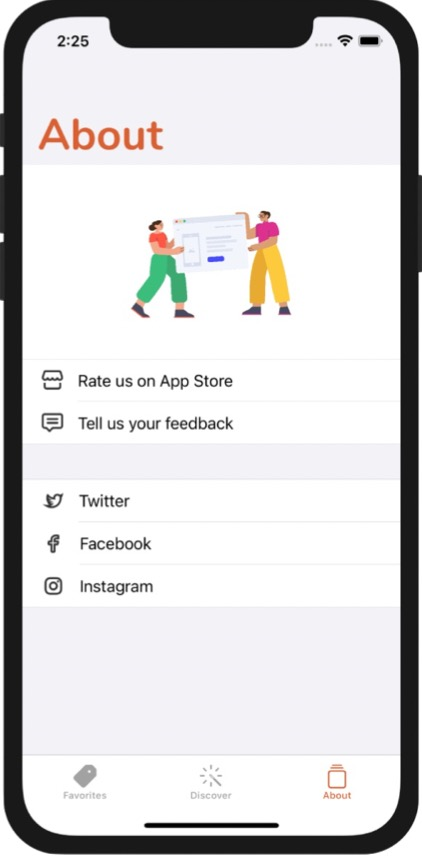
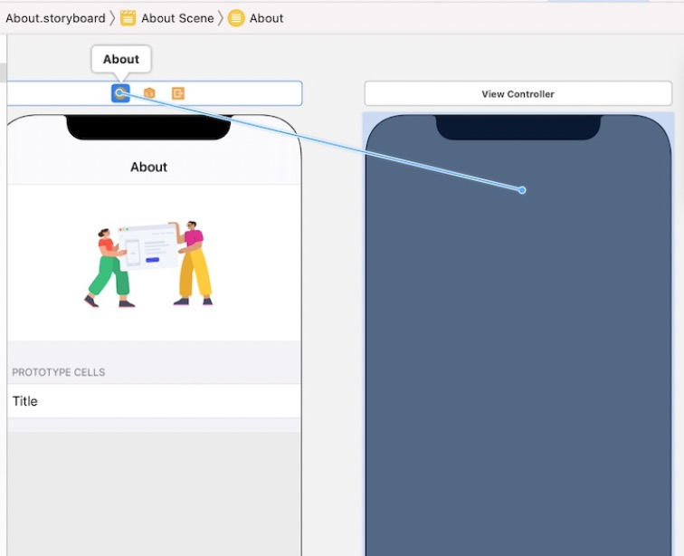

# 第22章  Tab Bar Controller探索 和 Storyboard 
本章将创建包含三个子项的Tab Bar：
- Favorites - 包含餐馆列表
- Discover - 该屏用来发现新餐馆
- About - “关于”页
如下所示：


在本章中，仅演示了怎么添加Tab Bar Item，Discover和About没有具体实现。

## 创建Tab Bar Controller
1. 打开Main.storyboard，选中想要嵌入Tab Bar Controller的VC，本节就是APP启动时的初始VC，即：Navigation Controller
2. 点击菜单Editor - Embed in - Tab Bar Controller，Interface Builder就会把Navigation Controller嵌入到Tab Bar Controller中


3. 修改Tab Bar的图标。点击Navigation Controller 的Tab Bar，可以在Attribute Inspector中修改System Item=Favorites，这是系统提供的默认样式。也可以设置System Item = Custom，在Title和Image中设置自定义的内容，本节的设置为Title=Favorites，Image=tag.fill

## 隐藏Tab Bar
点击了某个restaurant进入详情页后，我们希望把Tab Bar隐藏掉。
1. 在Main.storyboard中选中详情页Restaurant Detail View Controller
2. 在Attribute Inspector中勾选`Hide Bottom Bar on Push` 即可。
也可以通过代码来控制——在RestaurantTableViewController的parepare(for :)方法中加入：
``` swift
destinationController.hidesBottomBarWhenPushed = true
```

## 添加新的Tab页
1. 打开Object Library拖入一个Navigation Controller，设置Title=Discover


2. 按住Ctrl从Tab Bar Controller拖动到上面创建的Navigation Controller，并在弹出菜单中选择Relationship Segue/View Controllers。这样就可以**把Navigation Controller添加为Tab Bar的一个子项**。暂时先将新Navigation Bar底部Table Bar Item的System Item设置为Recents
3. 同样的方法再添加一个Tab页，设置设置Title=About，System Item=square.stack

## 自定义Tab Bar的外观
从iOS 13 以来，苹果引入类UITabBarAppearance可以用来自定义Tab Bar的外观：
``` swift
let tabBarAppearance = UITabBarAppearance()

tabBarAppearance.configureWithDefaultBackground()
tabBarAppearance.configureWithTransparentBackground() // 设置透明背景

tabBarAppearance.backgroundColor = .darkGray
UITabBar.appearance().standardAppearance = tabBarAppearance // 让外观设置生效

UITabBar.appearance().tintColor = UIColor.systemRed  // 修改文字颜色
```
更多Tab Bar外观设置可参见：
https://developer.apple.com/documentation/uikit/uitabbarappearance。

## Storyboard References
当多个人在一个工程下协作时，如果团队里每个成员负责一个Tab Bar，为了避免提交冲突，有必要将每个Tab Bar分割为一个独立的storyboard。Xcode7以后，苹果引入storyboard reference来解决这个问题。
1. 在Main.storyboard选中About Tab页的两个VC，点击菜单Editor - Refactor to Storyboard，命名为About.storyboard。
Xcode会将About Tab也存储在About.storyboard中，在Main.storyboard中双击About会跳转到About.storyboard

# 第23章  使用WKWebView和SFSafariViewController
iOS 9以后，苹果提供了三种显示网页的方式：
- **Mobile Safari** - 跳转到系统浏览器并打开指定URL
- **WKWebView** - iOS 9之前，这是在应用程序中嵌入网页的最便利方式，UIWebView就是一个降级的Safari，负责处理URL请求并显示网页内容。iOS 8 引入的WKWebView是UIWebView的升级版本。它具有Nitro JS引擎的优点，并提供了更多功能。如果你只是需要显示一个指定网页，WKWebView是最佳候选。【注意】UIWebView在iOS 13以后就不再可用了。
- **SFSafariViewController** - 这是在iOS 9 引入的新控件。对WKWebView又做了功能加强，比如前进/后退功能。

本章将定制About页：
- **Rate us on App Store** - 点击后将跳转到App Store
- **Tell us your feedback** - 使用WKWebView加载 *联系我们* 的网页
- **Twitter/Facebook/Instagram** - 使用SFSafariWebViewController加载这些链接


## 设计About View
1. 下载 http://www.appcoda.com/resources/swift53/abouticons.zip 将图片导入Assets.cxasset
2. 打开About.storyboard，向About的table view的header view上拖入一个View对象，在document outline中可以确认其层次关系，将View的高度设置为200

3. 在View中再拖入一个ImageView，将图片设置为about，添加4个约束，将四边缘间距置为0<font color=red>为啥没有在第2步直接放一个ImageView，而是要View套ImageView呢？</font>
4. 选中table view cell，设置identifier=`aboutcell`，style=`Basic`

## 为About View Controller创建对应的类
1. New File - 模板Cocoa Touch Class - 类名AboutTableViewController - 基类UITableViewController，在About.storyboard中将AboutTableViewController设置为table view controller的Class
2. 为AboutTableViewController设置两个section，定义LinkItem，并声明一个LinkItem数组：
``` swift
class AboutTableTableViewController: UITableViewController {
    enum Section {
        case feedback
        case followus
    }

    struct LinkItem: Hashable {
        var text: String
        var link: String
        var image: String
    }
    
    var sectionContent = [
        // Section0 中的内容
        [LinkItem(text: "Rate us on App Store", link: "https://www.apple.com/ios/app-store/", image: "store"),
         LinkItem(text: "Tell us your feedback", link: "http://www.appcoda.com/contact", image: "chat")
        ],
        // Section1 中的内容
        [LinkItem(text: "Twitter", link: "https://twitter.com/appcodamobile", image: "twitter"),
         LinkItem(text: "Facebook", link: "https://facebook.com/appcodamobile", image: "facebook"),
         LinkItem(text: "Instagram", link: "https://www.instagram.com/appcodadotcom", image: "instagram")]
    ]
    // ... 
}
```
3. 我们将采用diffable data source的方式来加载数据，因此先删除AboutTableTableViewController中的`numberOfSections(in)`和`tableView(_:numberOfRowsInSection)`两个函数，再添加下面一套组合代码完成数据源的提供：
``` swift

class AboutTableTableViewController: UITableViewController {
    // ...
    
    lazy var dataSource = configureDataSource()

    override func viewDidLoad() {
        super.viewDidLoad()

        tableView.dataSource = dataSource
        updateSnapshot()
    }
    
    func configureDataSource() -> UITableViewDiffableDataSource<Section, LinkItem> {
        let cellIdentifier = "aboutcell"
        let dataSource = UITableViewDiffableDataSource<Section, LinkItem>(tableView: tableView) { (tableView, indexPath, linkItem) -> UITableViewCell? in
            let cell = tableView.dequeueReusableCell(withIdentifier: cellIdentifier, for: indexPath)
            cell.textLabel?.text = linkItem.text
            cell.imageView?.image = UIImage(named: linkItem.image)
            return cell
        }
        return dataSource
    }
    func updateSnapshot() {
        // Create a snapshot and populate the data
        var snapshot = NSDiffableDataSourceSnapshot<Section, LinkItem>()
        snapshot.appendSections([.feedback, .followus])
        snapshot.appendItems(sectionContent[0], toSection: .feedback)
        snapshot.appendItems(sectionContent[1], toSection: .followus)
        dataSource.apply(snapshot, animatingDifferences: false)
    }
    // ...
}
```
<font color=red>这段套路的具体含义没有弄明白，去前章复习</font>

4. **定制导航栏**，在viewDidLoad函数中插入如下代码：
``` swift
override func viewDidLoad() {
    super.viewDidLoad()

    // 导航栏使用大字体
    navigationController?.navigationBar.prefersLargeTitles = true
        
    // 定制导航栏的外观
    if let appearance = navigationController?.navigationBar.standardAppearance{
        appearance.configureWithTransparentBackground()
        if let customFont = UIFont(name: "Nunito-Bold", size: 45.0) {
            appearance.titleTextAttributes = [.foregroundColor: UIColor(named: "NavigationBarTitle")!]
            appearance.largeTitleTextAttributes = [.foregroundColor: UIColor(named: "NavigationBarTitle")!, .font: customFont]
        }
        navigationController?.navigationBar.standardAppearance = appearance
        navigationController?.navigationBar.compactAppearance = appearance
        navigationController?.navigationBar.scrollEdgeAppearance = appearance
    }
    // ...
}
```
5. **将Section分组**，table view虽然包含两个section，但默认外观和一个section没什么区别，选中该table view，设置Style=`Grouped`或`Inset Grouped`，会为不同的Section之间插入一条分割线

## 使用Mobile Safari打开网页
调用`UIApplication`的`open(_:options:completionHandler:)`函数即可令App跳转到Safari并打开URL，因此只需要在`AboutTableViewController`的`tableView(_didSelectRowAtIndexPath:)`函数中插入如下代码：
``` swift
class AboutTableTableViewController: UITableViewController {
    override func tableView(_ tableView: UITableView, didSelectRowAt indexPath: IndexPath) {
        // 获取被选中的link item
        guard let linkItem = self.dataSource.itemIdentifier(for: indexPath) else {
            return
        }
        if let url = URL(string: linkItem.link) {
            // 使用safari打开URL
            UIApplication.shared.open(url)
        }
        tableView.deselectRow(at: indexPath, animated: false)
    }
    // ...
}
```
<font color=red>此处打开的链接是https://www.apple.com/ios/app-store，怎么打开某个应用？怎么打开评价？</font>

## 使用WKWebView加载网页
WKWebView既可以加载远程网页，也可以加载本地网页，它的前身是UIWebView，但后者已经废弃。
1. 在About.storyboard拖入一个View Controller，再向该View Controller中拖入一个WebKit View，并添加约束将其四边填满View Controller。
2. **创建从About到新VC的Segue**，按住Ctrl从About VC拖到新VC，选择Segue类型为`Present Modally`，并设值该Segue的idenfier=`showWebView`

3. **为新VC定义类代码**，New File - 模板Cocoa Touch Class - 类名WebViewController - 基类UIViewController，添加如下代码：
``` swift
// ...
import WebKit       // WKWebView在WebKit中，因此先导入

class WebViewController: UIViewController {
    @IBOutlet var webView: WKWebView!   // webView控件
    var targetURL = ""                  // 要打开的URL

    override func viewDidLoad() {
        super.viewDidLoad()

        // 用webView 打开URL
        if let url = URL(string: targetURL) {
            let request = URLRequest(url: url)
            webView.load(request)
        }
    }
    // ...
}
```
4. **执行从About到WKWebView的Segue并传递URL**，在AboutTableViewController中添加如下代码：
``` swift
class AboutTableTableViewController: UITableViewController {
    // ...
    // 当点击item时，执行Segue
    override func tableView(_ tableView: UITableView, didSelectRowAt indexPath: IndexPath) {
        performSegue(withIdentifier: "showWebView", sender: self)
        tableView.deselectRow(at: indexPath, animated: false)
    }
    
    // 传递URL给Segue VC
    override func prepare(for segue: UIStoryboardSegue, sender: Any?) {
        if segue.identifier == "showWebView" {
            if let destinationController = segue.destination as? WebViewController,
               let indexPath = tableView.indexPathForSelectedRow,
               let linkItem = self.dataSource.itemIdentifier(for: indexPath) {
                // 将URL传入WebViewController
                destinationController.targetURL = linkItem.link
            }
        }
    }
    // ...
}
```
5. 回到About.storyboard，将包含web view的VC class设置为WebViewController。在Web View Controller上右键，将webView变量拖到控件上，将二者关联起来：


> **打开非HTTPS的URL** iOS 9以后，苹果为了加强APP和网站之间的连接安全，引入了ATS（App Transport Security）机制，要求所有的网络请求必须是HTTPS的，ATS将拦截掉HTTP请求。
可以通过关闭NSAllowsArbitraryLoadsInWebContent开关来绕过该机制。
6. **绕过ATS** 选中Info.plist，右键 - Add Row，添加key为`App Transport Security Settings`，在其下再添加key为`Allow Arbitrary Loads in Web Content`， value为`YES`：


## 使用SFSafariViewController加载网页
在AboutTableTableViewController中添加如下代码：
``` swift
import SafariServices

class AboutTableTableViewController: UITableViewController {
    // ...
    // 当点击item时，执行Segue
    override func tableView(_ tableView: UITableView, didSelectRowAt indexPath: IndexPath) {        
        // section0 依然用WKWebView打开
        // section1 用SFSafariViewController打开
        switch indexPath.section {
        case 0: performSegue(withIdentifier: "showWebView", sender: self)
        case 1: openWithSafariViewController(indexPath: indexPath)
        default: break
        }
        tableView.deselectRow(at: indexPath, animated: false)
    }

    // 使用SFSafariViewController打开URL
    func openWithSafariViewController(indexPath: IndexPath) {
        guard let linkItem = self.dataSource.itemIdentifier(for: indexPath) else {
            return
        }
        if let url = URL(string: linkItem.link) {
            let safariController = SFSafariViewController(url: url)
            present(safariController, animated: true, completion: nil)
        }
    }
}
```
如下图所示，左边是使用WKWebView打开，右边是使用SFSafariViewController打开，后者包含Safari的刷新、前进、后退等按钮：


# 第24章 探索CloudKit
旧版iCloud只允许同一用户多设备间共享数据，2014年iCloud大幅重构，引入了CloudKit，支撑社交网络类的应用，方便用户间信息共享。通过引入CloudKit web service和CloudKit JS，苹果把CloudKit能力提升到新水平。可以使用它来开发web应用，并与APP平等的访问iCloud上的数据。


在WWDC2016上，苹果发布了Shared Database，不仅可以访问个人私密或公开数据，还可以通过CloudKit访问用户群组数据，无需开发自己的服务器，CloudKit只需少量编码，就能令你的APP访问云上资源。

可以免费使用CloudKit访问：
- 10GB 资源文件（如图片资源）
- 100MB 数据库
- 2GB 数据传输

对于单个开发者账户，可以将空间扩充至：
- 1PB 资源文件
- 10TB 数据库
- 200TB 数据传输

## CloudKit Framework
containers和databases是CloudKit framework的基本功能元素。每个app通过container来管理自己的数据。一个app默认只和一个container对话。
container包含public database、shared database 和 private database各一个：
  · public database - 可以访问该应用的所有用户数据
  · shared database - 可以访问一个用户组的共享数据
  · private database - 访问自己的私人数据

开发者需要选择最适合自己应用程序的数据库类型。
例如，类似Instagram的应用程序，可以使用public database保存用户上传公开的照片。
类似Todo的应用程序，可以使用private database存储每个用户的待办事项。

如果没有活动的iCloud帐户，用户可以读取但不能写入public database。
用户需要登录iCloud才能访问其private database。在CloudKit框架中，数据库作为CKDatabase类公开。

database的内部是 Record Zone，数据记录被分割打不同的Record Zone。public和private都有默认的zone，这对于大部分情况都足够了，开发者还可以定制自己的zone。Record Zone以CKRecordZone类公开


数据的最底层结构是Record，以CKRecord类表示。Record是一个kv对，他的类型由开发者在CloudKite仪表盘上定义


## 为工程开启CloudKit
首先，必须注册苹果开发者账户。
在Signing & Capabilities 页下，在Team中填写自己的开发者账号。
在工程导航栏中，选中FoodPin - 选中targets下面的FoodPin，在bundle identifier中填写自己的ID，如[自己的域名].FoodPin。CloudKit使用该bundle identifier来生成container，container的命名空间是在所有开发者中全局唯一的。


点击左上角`+Capability` 按钮，添加iCloud模块，在services option中选择CloudKit，在contianers处点击`+`按钮创建新contianer，命名为`iCloud.com.[bundle-ID]`。确认后，Xcode将在CloudKit服务端自动创建container，并在本地工程中添加所需要的frameworks。


## 在CloudKit仪表盘管理自己的Record
点击`CloudKit Dashboard`按钮会打开网页版的仪表盘，仪表盘首页是你的iCloud container：`iCloud.com.[bundle-ID]`。它有两个版本：Development 和 Production，前者用于开发调试，后者用于线上发布：


点击Development的`Data`进入数据管理，在这里可以做增、删、改、查的操作


- **定义数据类型** 在菜单栏中选择Schema，点击`+ New Type`即可创建数据类型。命名类型名=`Restaurant`，CloudKit会自动创建一些系统字段如：createdBy、createdAt等：

点击`Add Field`按钮可以创建自定义字段，添加如下字段：

|字段名|字段类型|
|----|----|
|name|String|
|type|String|
|location|String|
|phone|String|
|description|String|
|image|Asset|

> CloudKit使用CKAsset对象操作如图片、多媒体、文本等外部文件。当保存asset时，CloudKit仅保存资源数据，而不会存储文件名。除了图像外，还可以为其它字段配置排序、搜索等选项。

- **通过仪表盘添加数据** 数据的增删改查可以通过CloudKit API，也可以在仪表盘上直接操作。回到前面的Data界面下，选择Database=`Public Database`，Zone=`_defaultZone`，Type=`Restaurant`：

点击`+ New Record`即可创建数据。

- **查询数据** 点击`Query Records`，会提示错误：“There was a problem query the Restaurant type: Type is not marked indexable. Enable the queryable index on this field in the indexes section.”必须为database创建索引，才能查询数据。点击顶部Schema菜单栏 - 选择Restaurant - 点击 Edit index - 点击 Add Index。添加字段`recordName`索引类型为`Queryable`，表明该字段可被查询到。再添加字段`createAt`索引类型为`Sortable`。

接下来就可以按照最近创建时间来查询数据了


## 使用Convenience API从Public Database获取数据
CloudKit framework提供了两种类型的API来异步访问iCloud，一种是convenience API，另一种是operational API。convenience API只需要简单几行代码就能访问iCloud：
``` swift
import CloudKit

// 获取默认的CloudKit container和database
let cloudContainer = CKContainer.default()
let publicDatabase = cloudContainer.publicCloudDatabase

// 创建一个query对象执行查询，注意：query必须包含谓词，true表示无条件搜索
let predicate = NSPredicate(value: true)
let query = CKQuery(recordType: "Restaurant", predicate: predicate)

// 异步执行查询，结果会在回调中获取
publicDatabase.perform(query, inZoneWith: nil, completionHandler: {
            (results, error) -> Void in
// Process the records
})
```
## 使用Operational API从Public Database获取数据
Convenience API的perform(_:inZoneWith:completionHandler:)函数只能用于一次性查询完所有数据，如果查询结果非常多，需要分批查询时，就要使用Operational API了：
``` swift
func fetchRecordsFromCloud() {
    // 前面的代码和convenience API一样
    let cloudContainer = CKContainer.default()
    let publicDatabase = cloudContainer.publicCloudDatabase
    let predicate = NSPredicate(value: true)
    let query = CKQuery(recordType: "Restaurant", predicate: predicate)

    let queryOperation = CKQueryOperation(query: query)
    // 指定要查询的字段
    queryOperation.desiredKeys = ["name", "image"]
    queryOperation.queuePriority = .veryHigh
    // 最多查询多少条记录
    queryOperation.resultsLimit = 50
    // 每返回一条记录，执行一次该回调
    queryOperation.recordFetchedBlock = { (record) -> Void in
        self.restaurants.append(record)
    }

    // 所有记录全部返回，执行该回调
    // cursor是一个CKQueryCursor对象，指示本次查询的起止光标
    queryOperation.queryCompletionBlock = { [unowned self] (cursor, error) -> Void in
        if let error = error {
            print("Failed to get data from iCloud - \(error.localizedDescription)")
            return
        }
        print("Successfully retrieve the data from iCloud")
        self.updateSnapshot()
    }
    // 执行查询
    publicDatabase.add(queryOperation)
}
```
## 性能优化
### 转菊花
这里讲的性能优化并非优化技术指标（如RT），而是在端侧优化可感知到的性能，比如提升APP的可响应度。当用户点击了Discover页 且 数据量比较大时，你很难从量级上缩减请求/响应耗时。但是你可以增加比如转菊花提升应用的可响应度。UIKit framework提供了UIActivityIndicatorView类，用以显示转菊花：
``` swift
// ① 在VC中声明 UIActivityIndicatorView 对象
var spinner = UIActivityIndicatorView()

// ② 在 viewDidLoad() 方法中启动转菊花
spinner.style = .medium
spinner.hidesWhenStopped = true
view.addSubview(spinner)

spinner.translatesAutoresizingMaskIntoConstraints = false // 令自动布局失效，使用手动布局
// 距离上边缘150，左右居中
NSLayoutConstraint.activate([ spinner.topAnchor.constraint(equalTo: view.safeAreaLayoutGuide.topAnchor, constant: 150.0), spinner.centerXAnchor.constraint(equalTo: view.centerXAnchor)])
// 启动转菊花
spinner.startAnimating()    

// ...

// ③ 在完成后台操作后，停止转菊花
self.spinner.stopAnimating()
```
### iOS中的UI线程和工作线程
iOS中有两种执行操作的方式：同步 和 异步。同步模式会等待操作完成后才能执行后面的指令，在同步操作执行期间，其它的操作均被阻塞。对于异步操作，应用通常会启动后台线程来执行它，而不必等待它结果完成就能继续执行其他操作了，比如UI更新。当异步操作完成后，通常会调用*完成回调函数*执行扫尾。

在iOS下有一条铁律：**所有的UI更新操作必须在主线程执行。**

在上面的代码中，通常停止转菊花是在一个异步操作的回调函数中触发，比如页面加载或者网络请求这种长程操作会启动转菊花，并异步执行加载/请求。由于“完成函数”也是在后台线程，“停止转菊花”是UI更新，因此，若在完成函数中直接调用“停止转菊花”会违反铁律，导致崩溃。合法的做法如下：
``` swift
// 将UI更新操作插入到主线程中
DispatchQueue.main.async {
    self.spinner.stopAnimating()
}
```

### 图片懒加载
在从iCloud拉取数据时，可以先拉去Restaurant的名称，图片可以先用一张本地的占位图顶上，让界面先展现出来，同时后台继续去iCloud拉取实时图片，完成后再刷新UI。
由于这里的懒加载强依赖iCloud，实际应用大多还是会依赖自己的服务，所以这里具体代码就不再列出了。

### 使用NSCache缓存图片
iOS SDK提供了NSCache类实现缓存功能，它和字典很像，采用KV对来缓存数据，使用setObject(_:forKey:)方法保存数据，使用object(forKey:)方法获取数据。和字典不同之处在于：它会自动执行清理操作，因此容量受限。代码如下：
``` swift
// 在VC中定义Cache对象
private var imageCache = NSCache<CKRecord.ID, NSURL>()

func configureDataSource() -> UITableViewDiffableDataSource<Section, CKRecord> {
    let cellIdentifier = "discovercell"

    let dataSource = UITableViewDiffableDataSource<Section, CKRecord>(tableView: tableView) { (tableView, indexPath, restaurant) -> UITableViewCell? in

        let cell = tableView.dequeueReusableCell(withIdentifier: cellIdentifier, for: indexPath)

        cell.textLabel?.text = restaurant.object(forKey: "name") as? String
        // 先设置一个本地的占位图
        cell.imageView?.image = UIImage(systemName: "photo")
        cell.imageView?.tintColor = .black

        // 检查缓存中是否有该图片
        if let imageFileURL = self.imageCache.object(forKey: restaurant.recordID) {
            // 如果有，则使用缓存
            print("Get image from cache")
            if let imageData = try? Data.init(contentsOf: imageFileURL as URL) {
                cell.imageView?.image = UIImage(data: imageData)
            } else {
                // 从iCloud获取实时图片
                let publicDatabase = CKContainer.default().publicCloudDatabase
                let fetchRecordsImageOperation = CKFetchRecordsOperation(recordIDs: [restaurant.recordID])
                fetchRecordsImageOperation.desiredKeys = ["image"]
                fetchRecordsImageOperation.queuePriority = .veryHigh
                
                fetchRecordsImageOperation.perRecordCompletionBlock = { (record, recordID, error) -> Void in
                    if let error = error {
                        print("Failed to get restaurant image: \(error.localizedDescription)")
                        return
                    }
                    if let restaurantRecord = record,
                    let image = restaurantRecord.object(forKey: "image"),
                    let imageAsset = image as? CKAsset {
                        if let imageData = try? Data.init(contentsOf: imageAsset.fileURL!){
                            // 替换占位图
                            DispatchQueue.main.async {
                                cell.imageView?.image = UIImage(data: imageData)
                                cell.setNeedsLayout()
                            }
                            // 加入缓存
                            self.imageCache.setObject(imageAsset.fileURL! as NSURL, forKey: restaurant.recordID)
                        } 
                    }
                }
            publicDatabase.add(fetchRecordsImageOperation)
        }
        return cell 
    }
    return dataSource
}
```

### 下拉刷新
UIRefreshControl是用于实现下拉刷新的标准控件，只需将它与VC关联起来，即可令VC具备下拉刷新的能力。通常在VC的viewDidLoad函数中添加如下代码：
``` swift
// Pull To Refresh Control
refreshControl = UIRefreshControl()
refreshControl?.backgroundColor = UIColor.white
refreshControl?.tintColor = UIColor.gray
refreshControl?.addTarget(self, action: #selector(fetchRecordsFromCloud), for: UIControl.Event.valueChanged)
```
当UIRefreshControl所在VC被下拉到一定程度，该刷新控件将触发UIControlEvent.valueChanged事件，需将处理函数赋给该事件来执行数据刷新。具体方法就是使用addTarget来注册该事件，在上面的代码中，将VC的fetchRecordsFromCloud方法注册到UIControlEvent.valueChanged事件上。
需要注意：
- fetchRecordsFromCloud函数声明应标注@objc：
``` swift
@objc func fetchRecordsFromCloud() {
    // ...
}
```
这是因为并非所有iOS SDK都是拿Swift写的，有些还是用Objective-C写的，比如Selector，为了在swift中创建一个selector，必须用objc来书写被引用的函数。
- 刷新完成后需要显式调用endRefreshing
当VC完成刷新后，refresh control仍然保持显示的状态，因此需要显式调用如下代码：
``` swift
// 可以将下面的代码放到“停止转菊花”之后
if let refreshControl = self.refreshControl {
    if refreshControl.isRefreshing {
        refreshControl.endRefreshing()
    }
}
```