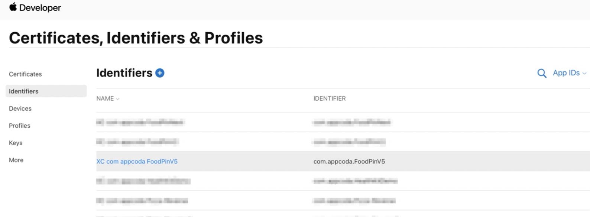

# 第25章  本地化
让应用程序的设计和结构独立于语言和区域，这个过程就叫作**国际化**。比如在显示价格的时候，有的地区显示为$100.50，有的地区显示为$100,50，国际化就是让应用程序能兼容这两种显示格式。

**本地化**是将国际化的应用适配不同语言和区域的处理过程，包括将静态文本翻译为指定语言，并添加和区域相关的元素，比如图片、图像和声音。

## 令APP支持国际化
国际化最主要的步骤就是使用NSLocalizedString宏将硬编码的字符串包裹住，该宏包含两个参数：
- key - 待国际化的字串
- comment - 为翻译提供更多信息
例如，下面的代码： 
``` swift
var sectionContent = [ 
    [LinkItem(text: "Rate us on App Store", link: "https://www.apple.com/ios/app-store/", image: "store"),
    LinkItem(text: "Tell us your feedback", link: "http://www.appcoda.com/contact", image: "chat")
    ],
    [LinkItem(text: "Twitter", link: "https://twitter.com/appcodamobile", image: "twitter"),
    LinkItem(text: "Facebook", link: "https://facebook.com/appcodamobile", image: "facebook"),
    LinkItem(text: "Instagram", link: "https://www.instagram.com/appcodadotcom", image: "instagram")]
]
```
只需作如下处理：
``` swift
var sectionContent = [ 
    [LinkItem(text: 
    NSLocalizedString("Rate us on App Store", comment: "Rate us on App Store"), link: "https://www.apple.com/ios/app-store/", image: "store"),
    LinkItem(text: 
    NSLocalizedString("Tell us your feedback", comment: "Tell us your feedback"), link: "http://www.appcoda.com/contact", image: "chat")
    ],
    [LinkItem(text: 
    NSLocalizedString("Twitter", comment: "Twitter"), 
    link: "https://twitter.com/appcodamobile", image: "twitter"),
    [LinkItem(text: 
    NSLocalizedString("Facebook", commennt: "Facebook"), 
    link: "https://facebook.com/appcodamobile", image: "facebook"),
    LinkItem(text: 
    NSLocalizedString("Instagram", comment: "Instagram"), 
    link: "https://www.instagram.com/appcodadotcom", image: "instagram")]
]
```
Xcode会将本地化的字串保存在Localizable.strings文件中，每种语言对应一个Localizabale.strings文件。
## 添加支持的语言
选中工程名 - Info - PROJECT/FoodPin - 点击`+`添加语言

选择需要本地化的资源文件，通常所有和语言相关的资源都需要本地化


## 导出和导入本地化文件
（略）
# 第26章  真机部署和测试
现在苹果已经无需注册开发者账号，只需要使用你的Apple ID登录Xcode，就可以在真机上部署APP了。如果你需要使用CloudKit或者推送通知服务，则还需要每年花99$注册为苹果开发者账户。

## 理解数字签名和 provisioning profile 文件
为什么需要申请证书？为什么需要走一些复杂的流程，才能将app安装到自己的物理设备上呢？
最主要的原因是出于安全考虑。每个部署在iOS物理设备上的app必须有签名，Xcode使用你的私钥和数字证书来完成签名。有了签名，APP才能在App Store上架。苹果只给合法开发者颁发证书，这样可以阻止未授权开发者在App Store上提交应用。

苹果发行两种数字证书：**开发（Development）证书** 和 **分发（Distribution）证书**。拥有开发证书，就能将APP运行在真机上。拥有分发证书，才能提交APP到商店。

**Provisioning**是指为了让APP在真机上启动需要准备和配置的过程。团队的**provisioning profile**是给APP完成签名并运行在团队成员真机上的必备文件。

## 使用Xcode完成自动签名
自动签名是Xcode 8之后引入的新功能，你需要完成以下任务才能令APP运行在真机上：
- 申请开发证书
- 创建APP ID
- 创建Provisioning Profile文件

有了自动签名功能后，开发者就不需要手动创建开发证书和provisioning profile文件了，Xcode会帮你完成这些任务。Xcode在生成项目时，默认会打开“自动签名”的开关。

完成自动签名的具体步骤为：
1. 连接真机到mac电脑上
2. 在 Xcode 的设备列表选择该真机，这样 Xcode才能在签名期间将此设备注册为合法的测试设备
3. 在工程的 Signing & Capabilities 设置中，点击 Team - Add an account - 填写你的Apple ID 和 密码 - 点击 Add。 Xcode 将自动生成开发证书 和 provisioning profile 文件。 点击 info 图标可以看到详情：


 打开 https://developer.apple.com/membercenter/ 进入会员中心，这里可以看到你的 App ID 和 provisioning profile 文件：

点击 Certificates, IDs & Profiles，进入进入证书、ID、设备 和 provisioning profile 文件的管理页。选择iOS App 下的 identifiers，就可以找到你的应用的 App ID：



## 将应用部署到真机
- **通过 USB 连接部署**。将真机连接到 mac 上，在Xcode设备列表中选择该真机，点击运行即可
> 注意：首次运行App时，Xcode会提示安全错误要求授权。去设备的设置 > 通用 > 设备管理，选择developer profile，点击`信任<Apple ID\>`，以后就能成功运行了。


- **通过 Wifi 连接部署**。这是Xcode9 以后开始支持的功能，不过这里也还需要避坑。首次需要把真机通过 USB 连接到 mac，在 Xcode 中点击菜单 - Window - Devices and Simulators，在 Connected 中选中真机，勾选 Connect via network：


完成以上操作后，只要真机和 mac 在一个 Wi-Fi 网络中，就可以在真机上通过 Wi-Fi 部署 App 了。

# 第27章  使用 TestFlight 进行 Beta 测试，部署CloudKit
2014年苹果收购了 TestFlight 的母公司 Burstly，并将TestFlight整合到App Store Connect 和 iOS，整套机制支持发出 beta 测试邀请，用户可以通过邮箱加入测试。

TestFlight区分了beta测试用户和内部测试用户。**内部测试用户**是指在App Store Connect中加入到开发团队的各种成员角色，最多25人。**beta 测试用户**是指在你公司或团队外部的用户，最多可达10000人。
外部用户测试应用程序之前，该应用程序必须得到苹果的批准，才能发出测试邀请。内部用户则不需要，只需将应用上传到app Store Connect，内部用户就可以开始测试了。

和 CloudKit 类似，TestFlight 也不是免费的，要求开发者必须注册苹果开发者账户。

## 在App Store Connect 创建App Record
App Store Connect（https://appstoreconnect.apple.com） 用于管理在商店上架的应用，上架应用之前，必须先创建 App Record。如下图，点击 My Apps - `+`创建新应用

填写应用相关的各字段，点击 创建 即可完成 App Record 的创建。
左侧菜单 General 下包含了App的一些基本信息。App Information 包含该应用的一般信息，Pricing and Availability 包含上架价格，App Privacy 包含隐私协议。
Prepare for Submission 包含了每个上架版本可能都要更新的一些附加信息，比如应用截屏、描述、图标、联系方式。

以上操作均在web端提交完成，剩下一些步骤需要在Xcode完成：
- **更新Build String** 选中Target - General - 填写Build String相关的几个字段：

- **设置icon和启动图片** 按照引导，需要提交各种规格的icon，比如应用icon要求80×80像素，商店icon要求1024×1024像素：

可以使用在线工具如 https://appicon.com、https://makeappicon.com。
在LaunchScreen.storyboard可以设计你的启动界面，通常这是个静态VC，贴张图就可以了。

## 存档和验证App
来到Xcode，菜单 - Product - Scheme - Edit Scheme - 选中Archive - 将 Build Configuration 设置为 Release

在设备列表中选择 Any iOS Device 或者 连接的真机，点击Xcode菜单 - Product - Archive 执行存档，完成后就能在Organizer中找到改存档。
在上传商店之前，还需要执行下验证，如下图点击 Validate App：

接下来就会提示选择商店分发选项，使用默认设置继续，在下一步选择 自动管理签名 Xcode就会帮你完成签名，点击 Validate 继续，如果要求你生成 苹果分发证书，勾选复选框——这是在商店分发应用时必要的一步。

## 上传应用到商店
验证通过后，点击 Distribute App 上传应用到商店，在 分发方法 一步中选择 App Store Connect，接下来接受默认设置，选择 自动管理签名 选项，点击 上传。

## 管理内部测试
完成上传后，就可以管理测试了。回到 https://appstoreconnect.apple.com ，选择你的应用 - 选择 TestFlight - 点击 管理 来提供导出合规性信息：

点击 Test Information 填写完整测试信息包括：反馈邮箱、隐私信息、URL、TestFlight许可证。从左侧菜单选择 App Store Connect Users - 点击 Add Testers - 确认，TestFlight将通过邮箱通知测试用户。
beta 版本90天将过期，每次更新该 beta 版本，内部测试用户都将接收到该最新版本。
## 管理 面向外部用户的 Beta 测试
在左侧菜单点击 Add External Testers，来为测试用户创建多个组。按照指示填写邮箱来添加新的测试用户。
在发出邀请之前，你的应用必须通过苹果审核，因此在创建完成测试用户之后，需要点击提交审核，通常审核需要一两天的时间。

## 部署 CloudKit 产品
前文 FoodPin 使用 iCloud 仅阐述了如何在开发环境中部署，当应用上架后，需要在线上环境完成部署。回到 CloudKit 仪表盘 - 选择你的 container - 在development section中点击Deploy Schema to Production：

点击 Deploy Changes，部署仅将模式升级到生产环境，而不会把开发环境的数据拷贝到生产环境。

# 第28章 提交应用到商店
## 提交前的准备
提交商店前，最需要关注的坑是避免被拒审。尽管苹果的审核对用户是黑盒，但这里还是有一些可以避免的原则性指引：
- **测试充分** 务必完成真机测试，并邀请内外部用户进行beta测试。
- **遵守商店审核指导** https://developer.apple.com/app-store/review/guidelines/ 这里是苹果审核指导文档，其中有几点需要特别注意：
  - 崩溃的应用会被拒审
  - 出现漏洞的应用将被拒审
  - 如果应用于开发者宣传的性能不符，将被拒审
  - 与应用宣传的功能不符，将被拒审
  - 使用非公开的API，将被拒审
  - 此外，当应用标题包含苹果的商标时，也需要特别注意。有一次我给一个图书应用命名为 iPhone Handbook，立刻遭到拒审，而后改成了 Handbook for iPhone 就被通过了。苹果允许在一些引用短语（如 for）中使用苹果商标

  此外， https://www.apple.com/legal/intellectual-property/guidelinesfor3rdparties.html 这份文档还有一些更细节的描述
    - **满足UI要求** App UI必须干净且用户友好，否则可能会因UI涉及不合格而拒审，详细信息参见 https://developer.apple.com/design/tips/
    - **死链** 所有嵌入在App内的链接必须可用，出现死链会被拒审
    - **使用定稿的图片和文字** 提审应用中所有图片和文字必须是最终定稿版的，如果出现占位符，将被拒审

  常见的拒审原因可参见：https://developer.apple.com/app-store/review/rejections

## 向商店提交应用
回到 https://appstoreconnect.apple.com，假设已经完成 App record 的创建，进入 Prepare for Submission，滚到底部，点击 Select a build before you submit your app 添加并选中将要上架的版本：

点击 Submit for Review 完成提交：

接下来等待审核结果即可。

# 第29章 适配Haptic Touch触控技术和上下文菜单
iPhone 6s 和 6s Plus以来，苹果引入了3D Touch。3D Touch 引有三种与iPhone交互的方式：
- **Quick Actions** - 本质是一种快捷方式，稍用力按压应用图标就会弹出一组快速动作，每个动作直达一个特定操作，可以帮助节省几步点击
- **Peek**
- **Pop**
iPhone 11、11 Pro 和 11 Pro Max以来，苹果又用Haptic Touch替代了 3D Touch，Haptic Touch 不仅支持力度按压，还支持手势。Peep 和 Pop 是 3D Touch中非常好用的功能，可以让用户快速访问到程序的内容。iOS 13之后就被**用上下文菜单（Context Menu）**取代了。系统相册有一个上下文菜单的例子：按住一个缩略图就会弹出图片预览和一个上下文菜单，通过菜单可以快速访问一些相册功能，点击预览图就可以进入完整视图。


## Home Screen 的快捷行动点
快速行动点的实现有**静态**和**动态**两种方式，每个应用最多只能创建4个。
- **静态快速行动点** - 在Info.plist里直接hardcode，只要App安装完成，即使没有启动过，也能访问这种类型的快速行动点。具体创建方法只需在Info.plist中添加一个UIApplicationShortcutItems数组，每个元素都是一个字典，包含如下字段：
  - **UIApplicationShortcutItemType**（必选） - 快速行动点的唯一标识，在所有应用范围内全局唯一，因此最好以bundle ID打头
  - **UIApplicationShortcutItemTitle）**（必选） - 快速行动点的标题
  - **UIApplicationShortcutItemSubtitle**（可选） - 快速行动点的子标题，位于正标题的右下方
  - **UIApplicationShortcutItemIconType**（可选） - 来自系统库中的icon名称，可用的icon可参见 https://developer.apple.com/documentation/uikit/uiapplicationshortcuticon#//apple_ref/c/tdef/UIApplicationShortcutIconType
  - **UIApplicationShortcutItemIconFile**（可选） - 可以指定app bundle中的图片文件，也可以是asset类目中的图片名称。对于图片的要求必须是正方形、单色并包含尺寸35×35（1x）、70×70（2x）和105×105（3x）
  - **UIApplicationShortcutItemUserInfo**（可选） - 包含一些额外信息的字典，通过该字典可以传递比如App版本号等信息。

  下面是一个静态行动点的样例：


- **动态快速行动点** - 由应用程序在运行时创建和更新快速行动点。以系统的新闻App为例，它的快速行动点会展现一些频繁访问的频道

创建动态行动点样例代码如下：
``` swift
// 定义一个带有快速行动点子项
let shortcutItem = UIApplicationShortcutItem(
    type: "com.appcoda.NewRestaurant", 
    localizedTitle: "New Restaurant", 
    localizedSubtitle: nil, 
    icon: UIApplicationShortcutIcon(type: .add), 
    userInfo: nil)
UIApplication.shared.shortcutItems = [shortcutItem]
```
- **响应快速行动点** 在iOS 13后，当用户点击了快速行动点，将调用协议 UIWindowSceneDelegate 的 windowScene(_:performActionFor:completionHandler:) 方法，因此在 SceneDelegate.swift 文件中，
``` swift
// 假设创建了三个快速行动点，这里先定义三个快速行动点的类型
enum QuickAction: String {
    case OpenFavorites = "OpenFavorites"
    case OpenDiscover = "OpenDiscover"
    case NewRestaurant = "NewRestaurant"
    init?(fullIdentifier: String) {
        guard let shortcutIdentifier = fullIdentifier.components(separatedBy: ".").last else {
            return nil 
        }
        self.init(rawValue: shortcutIdentifier)
    }
}

// 当快速行动点被点击时，系统调用该方法，并传入被点击的shortcutItem
func windowScene(_ windowScene: UIWindowScene, performActionFor shortcutItem: UIApplicationShortcutItem, completionHandler: @escaping (Bool) -> Void ){
    completionHandler(handleQuickAction(shortcutItem: shortcutItem))
}

private func handleQuickAction(shortcutItem: UIApplicationShortcutItem) -> Bool {
    let shortcutType = shortcutItem.type
    guard let shortcutIdentifier = QuickAction(fullIdentifier: shortcutType) else {
        return false
    }

    guard let tabBarController = window?.rootViewController as? UITabBarController else {
        return false
    }

    switch shortcutIdentifier {
    case .OpenFavorites: // 只做个简单计数
        tabBarController.selectedIndex = 0
    case .OpenDiscover:
        tabBarController.selectedIndex = 1
    case .NewRestaurant: // 跳转到创建Restaurant页面
        if let navController = tabBarController.viewControllers?[0] {
            let restaurantTableViewController = navController.children[0]
            restaurantTableViewController.performSegue(withIdentifier: "addRestaurant", sender: restaurantTableViewController)
        } else {
            return false
        }
    }
    return true 
}
```

## 上下文菜单 和 预览
在iOS 13之后可以实现上下文菜单来显示屏幕项目的更多功能。它允许用户在不打开实际屏幕的情况下预览内容。上下文菜单可以通过长按触发。通常，在屏幕上长按一个item（例如图像），就会显示带有附加选项的item预览。点击预览，再弹出完整视图。实现协议 UITableViewDelegate 的下两个方法即可创建上下文菜单：
``` swift
// 该方法返回一个 UIContextMenuConfiguration 对象，它包含上下文菜单的详细配置
tableView(_:contextMenuConfigurationForRowAt:point:)
// 该方法实现点击响应
tableView(_:willPerformPreviewActionForMenuWith:animator:)
```
本章将实现 长按某个Restaurant弹出预览页和上下文菜单，点击进入详情页：


1. **添加上下文菜单** 在RestaurantTableViewController中添加如下代码：
``` swift
override func tableView(_ tableView: UITableView, contextMenuConfigurationForRowAt indexPath: IndexPath, point: CGPoint) -> UIContextMenuConfiguration? {
    // 获取选中的Restaurant
    guard let restaurant = self.dataSource.itemIdentifier(for: indexPath)
    else {
        return nil 
    }

    // UIContextMenuConfiguration 接收三个参数：
    // identifier - 菜单配置实例的唯一ID，传入nil则使用系统默认生成ID
    // previewProvider - 返回用于预览的VC，本例中就是详情页
    // actionProvider - 创建上下文菜单
    let configuration = UIContextMenuConfiguration(
        identifier: indexPath.row as NSCopying, 
        previewProvider: {
        // 预览页其实就是详情页
        guard let restaurantDetailViewController = self.storyboard?.instantiateViewController(withIdentifier: "RestaurantDetailViewController") as? RestaurantDetailViewController else {
            return nil 
        }
        restaurantDetailViewController.restaurant = restaurant
        return restaurantDetailViewController
    }) { actions in
        // 这里创建三个行动点用于组装上下文菜单
        let favoriteAction = UIAction(
            title: "Save as favorite", 
            image: UIImage(systemName: "heart")) { action in 
            let cell = tableView.cellForRow(at: indexPath) as! RestaurantTableViewCell
            self.restaurants[indexPath.row].isFavorite.toggle()
            cell.favoriteImageView.isHidden = !self.restaurants[indexPath.row].isFavorite
        }
        let shareAction = UIAction(
            title: "Share", 
            image: UIImage(systemName: "square.and.arrow.up")) { action in
            let defaultText = NSLocalizedString("Just checking in at ", comment: "Just checking in at") + self.restaurants[indexPath.row].name
            let activityController: UIActivityViewController
            if let imageToShare = UIImage(data: restaurant.image as Data){
                activityController = UIActivityViewController(activityItems: [defaultText, imageToShare], applicationActivities: nil)
            }else {
                activityController = UIActivityViewController(activityItems: [defaultText], applicationActivities: nil)
            }

            self.present(activityController, animated: true, completion: nil
        }
        let deleteAction = UIAction(title: "Delete", image: UIImage(systemName: "trash"), attributes: .destructive) { action in 
            // Delete the row from the data store
            if let appDelegate = (UIApplication.shared.delegate as? AppDelegate{
                let context = appDelegate.persistentContainer.viewContext
                let restaurantToDelete = self.fetchResultController.object(at: indexPath)
                context.delete(restaurantToDelete)
                appDelegate.saveContext()
            }
        }
        // 将三个行动点装入上下文菜单
        return UIMenu(title: "", children: [favoriteAction, shareAction, deleteAction])
    }
    return configuration
}
```
2. **响应预览点击，显示完整信息**
``` swift
override func tableView(_ tableView: UITableView, willPerformPreviewActionForMenuWith configuration: UIContextMenuConfiguration, animator: UIContextMenuInteractionCommitAnimating) {
    // 获取被选中的Restaurant
    guard let selectedRow = configuration.identifier as? Int else {
        print("Failed to retrieve the row number")
        return
    }
    // 创建对应的VC
    guard let restaurantDetailViewController = self.storyboard?.instantiateViewController(withIdentifier: "RestaurantDetailViewController") as? RestaurantDetailViewController else {
        return
    }
    restaurantDetailViewController.restaurant = self.restaurants[selectedRow]
    // 设置要弹出的VC和弹出方式
    animator.preferredCommitStyle = .pop
    animator.addCompletion {
        self.show(restaurantDetailViewController, sender: self)
    }
}
```

# 第30章 iOS的用户通知
iOS 10 之前，用户通知仅支持文本，该同志可以在锁屏界面或home页展现，如果用户错过了任何通知，还可以在通知中心里找到，如下图：
由应用程序在运行时创建和更新快速行动点。以系统的新闻App为例，它的快速行动点会展现一些频繁访问的频道

iOS 10 对于用户通知做了较大的改进，，主要支持了图片、动画、音视频和用户自定义UI

用户通知可分为两种：
- **本地通知** 有本地应用程序触发，并呈现在用户设备，比如ToDo会对即将到来的事件做提醒。本章讨论的是这种类型的通知。
- **远程通知** 由服务端触发，从业务服务端将通知发送到 *Apple Push Notification Service（即APNS）* ，再由APNS转发到用户设备。

**User Notifications framework** 提供了三种触发本地通知的方式：
- **基于时间触发** - 可设定一定的时间间隔
- **基于日历触发** - 可设定某个日期/时间
- **基于位置触发** - 当用户到达了某个地点

## 申请授权
在用户设备上触发通知需要获得用户授权，具体步骤在 AppDelegate.swift文件的`application(_:didFinishLaunchingWithOptions:)`方法中插入如下代码
``` swift
import UserNotifications

func application(_ application: UIApplication, didFinishLaunchingWithOptions launchOptions: [UIApplication.LaunchOptionsKey: Any]?) -> Bool {
    // ...

    // 这段代码会弹出用户授权申请
    UNUserNotificationCenter.current().requestAuthorization(options: [.alert, .sound, .badge]) { (granted, error) in
        if granted {
            print("User notifications are allowed.")
        } else {
            print("User notifications are not allowed.")
        } 
    }
}
```
这段代码会在程序启动时弹出如下授权请求弹窗，在系统的 设置 - FoodPin - 通知 里可以修改授权设置：


## 创建基础版日程通知
首先看下一个基本型通知的外观：


创建日程通知的代码如下：
``` swift
// 创建通知内容
let content = UNMutableNotificationContent()
content.title = "Restaurant Recommendation"
content.subtitle = "Try new food today"
content.body = "I recommend you to check out Cafe Deadend."
content.sound = UNNotificationSound.default()  // 如果需要声音提醒，则在此设置

// ...

// 创建触发时间间隔
let trigger = UNTimeIntervalNotificationTrigger(timeInterval: 10, repeats: false)
// 创建一个通知请求
let request = UNNotificationRequest(
    identifier: "foodpin.restaurantSuggestion", // 该id可用于后面修改/删除
    content: content, trigger: trigger)
// 添加到用户通知中心
UNUserNotificationCenter.current().add(request, withCompletionHandler: nil)
```
## 给通知添加图片
``` swift
// 将图片保存到的临时文件路径
let tempDirURL = URL(fileURLWithPath: NSTemporaryDirectory(), isDirectory: true)
let tempFileURL = tempDirURL.appendingPathComponent("suggested-restaurant.jpg")

if let image = UIImage(data: suggestedRestaurant.image as Data) {
    // 把Data的数据类型写入JPEG
    try? image.jpegData(compressionQuality: 1.0)?.write(to: tempFileURL)
    if let restaurantImage = try? UNNotificationAttachment(identifier: "restaurantImage", url: tempFileURL, options: nil) {
        // 最关键的一步在这里，把图片添加到附件
        content.attachments = [restaurantImage]
    }
}
```
下图就是在用户通知内容中添加图片前后的对比：


## 与用户通知交互
如果不提供任何定制实现，点击用户通知会启动应用程序。通过定制可以直接在通知上进行简单交互（如修改、完成或清除日程）而不必进入App，比图：

- **创建并注册定制行为** 本节会在用户通知上实现两个定制行动点
  - **订桌** 点击后讲给餐厅拨打电话
  - **稍后**  点击后将取消通知
  
  代码如下：
``` swift
let categoryIdentifer = "foodpin.restaurantaction"

// ① 创建两个行动点
// 预定 点击后将在前台弹出界面
let makeReservationAction = UNNotificationAction(identifier: "foodpin.makeReservation", title: "Reserve a table", options: [.foreground])
// 稍后 点击后在后台处理 options为空则默认后台
let cancelAction = UNNotificationAction(identifier: "foodpin.cancel", title: "Later", options: [])

// ② 将行动点设置到category上
let category = UNNotificationCategory(identifier: categoryIdentifer, actions: [makeReservationAction, cancelAction], intentIdentifiers: [], options: [])

// ③ 将category注册到用户通知中心
UNUserNotificationCenter.current().setNotificationCategories([category])

// ④ 将category id设置到前面弹出通知的content上，即完成了对通知自定义响应的实现
content.categoryIdentifier = categoryIdentifer
```
完成自定义行动点的注册后，弹出的用户通知就长这样：


## 响应通知的行动点
点击“Reserve a table”后，将启动FoodPin App，但不会给餐馆打电话。由于上面代码并没有给“Later”设置任何option，因此点击“Later”仅把通知消除掉。
协议UNUserNotificationCenterDelegate的`optional func userNotificationCenter(_ center: UNUserNotificationCenter,didReceive response: UNNotificationResponse,withCompletionHandler completionHandler: @escaping () -> Void)`接口用来响应通知行动点。

1. **在通知内容中设置需要传递的数据** 设置给userInfo字段，该字段用于存储通知的自定义数据：
``` swift
// 这里保存的是待预定酒店的电话号码
content.userInfo = ["phone": suggestedRestaurant.phone]
```
2. **响应通知点击**
``` swift
extension AppDelegate: UNUserNotificationCenterDelegate {
    func userNotificationCenter(_ center: UNUserNotificationCenter, didReceive response: UNNotificationResponse, withCompletionHandler completionHandler: @escaping () -> Void) {
        // 如果是从用户通知的“预定”行动点过来
        if response.actionIdentifier == "foodpin.makeReservation" {
            print("Make reservation...")
            // 拿到电话号码，并拨打电话
            if let phone = response.notification.request.content.userInfo["phone"] {
                let telURL = "tel://\(phone)"
                if let url = URL(string: telURL) {
                    if UIApplication.shared.canOpenURL(url) {
                        print("calling \(telURL)")
                        UIApplication.shared.open(url)
                    } 
                }
            }
        }
        completionHandler()  // 告诉系统已经处理完通知
    }
}
```
3. **将协议设置给通知中心** 在AppDelegate的`application(_:didFinishLaunchingWithOptions:)`方法中添加如下代码：
``` swift
UNUserNotificationCenter.current().delegate = self
```