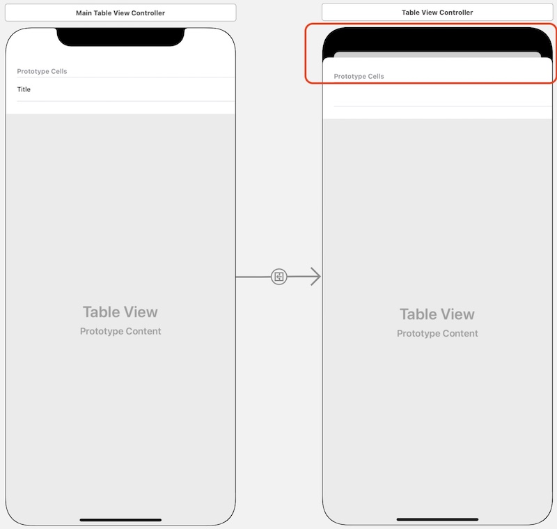
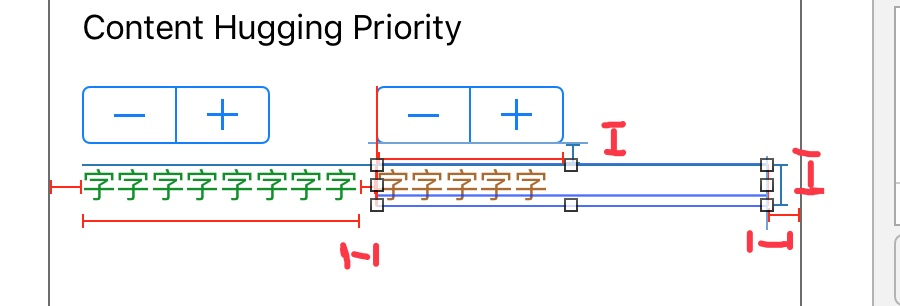

# 函数
## 参数标签 和 参数名称
每个函数参数都有：
- 一个 **参数标签(argument label)**  在调用函数时使用，调用时需将函数的参数标签写在对应的参数前面。
  - **指定参数标签**
  ``` swift
  func someFunction(argumentLabel parameterName: Int) { 
    // 在函数体内，parameterName 代表参数值
  }
  ```
  - **忽略参数标签** 如果你不希望为某个参数添加一个标签，可以使用下划线( _ )来代替明确的参数标签。如果一个参数有标签，那么在调用的时候必须使用标签来标记这个参数。
  ``` swift
  func someFunction(_ firstParameterName: Int, secondParameterName: Int) {
    // 在函数体内，firstParameterName 和 secondParameterName 第一个和第二个参数值
  }
  someFunction(1, secondParameterName: 2)
  ```
  - **默认参数值**
  ``` swift
  func someFunction(parameterWithoutDefault: Int, parameterWithDefault: Int = 12) { 
    // 如在调用时不传第二个参数，parameterWithDefault 会值为 12 传入到函数体中。
  }
  ```

- 一个 **参数名称(parameter name)**  在函数的实现中使用。**默认情况下，使用参数名称来作为它们的参数标签**。


# Segue总结
## 从TableView.cell到VC的常规Segue
从MasterVC.cell通过 *Ctrl拖动* 到DetailVC，并在 **Selection Segue** 中选择Segue模式，通过函数`prepare(for:, sender:)`在Segue前后的VC间传递数据。
## 从不同的TableView.cell到不同VC的Segue
例如有两个DetailVC1 和 DetailVC2。如果在IB中分别创建两个segue: `MasterVC.cell → DetailVC1` 和 `MasterVC.cell → DetailVC2`，IB却只允许创建一个segue！后面创建的segue会覆盖之前创建的segue！
原因是：**在IB中对于同一个MasterVC.cell，只允许创建一个MasterVC.cell → DetailVC的Selection Segue(Accessory Action也是如此)**。这导致我们无法在prepareForSegue方法中通过segue.identifier进行选择性判断。

**【解决办法】**
不再创建`MasterVC.cell → DetailVC`的Selection Segue。**改为创建`MasterVC → DetailVC`的Manual Segue，并实现didSelectRowAtIndexPath方法和prepareSegue方法**。
也就是说，不再把segue跳转关系定义在cell与DetailVC之间，而是定义在两个Controller之间。这样，就可以在一个MaterVC与多个DetailVC之间定义多个segue。此时创建的Segue是Manual Segue。**Manual Segue只是把两个VC关联起来，但并不一定是通过selection的方式进行跳转。具体跳转方式由代码实现确定**。
由于最终还是需要通过点击cell来触发跳转事件，因此需要实现didSelectRowAtIndexPath方法，并在方法中进行逻辑跳转判断。而每一个跳转后的具体内容则由prepareSegue方法实现。如：
``` swift
- (void)tableView:(UITableView *)tableView didSelectRowAtIndexPath:(NSIndexPath *)indexPath {
    //获得被点击的cell
    UITableViewCell *selectedCell = [self.tableViewcellForRowAtIndexPath:indexPath];
    //跳转逻辑判断
    if(indexPath.row%2==1) {
        [self performSegueWithIdentifier:ShowDetail1Segue sender:selectedCell];
    }
    else {
        [self performSegueWithIdentifier:ShowDetail2Segue sender:selectedCell];
    }
}
 
- (void)prepareForSegue:(UIStoryboardSegue *)segue sender:(id)sender {
    NSIndexPath *indexPath = [self.tableView indexPathForCell:sender];
    
    //跳转进行逻辑判断后，实现跳转后的具体内容，例如传递对象，初始化等等。
    if([segue.identifier isEqualToString:ShowDetail1Segue]) {
        DetailViewController1 *detailViewController1 = segue.destinationViewController;
        detailViewController1.text = [self.objects objectAtIndex:indexPath.row];
    }
    else if([segue.identifier isEqualToString:ShowDetail2Segue]) {
        DetailViewController2 *detailViewController2 = segue.destinationViewController;
        detailViewController2.text = [self.objects objectAtIndex:indexPath.row];
    }
}
```
参考[如何使用segue和didSelectRowAtIndexPath进行界面跳转](https://blog.csdn.net/chuzhanao8747/article/details/100907567)
## 在MasterVC有没有导航栏的区别
在MasterVC点击菜单 Editor - Embed in - Navigation Controller，将MasterVC用导航栏包裹住，这样从MasterVC跳转到DetailVC时，顶部导航栏就会显示回退等按钮。
如果不将MasterVC嵌入导航栏，则如论创建何种类型的Segue，DetailVC都不是全屏，如图：



## 在多个Storyboard之间实现Segue
在第22章中讲到了Storyboard Reference——它在多个VC之间完成了转场，再将其中比较独立的VC转到独立的Storyboard中并生成Storyboard Reference。如果我先在独立的Storyboard 中完成了所有设计工作，如何实现在现存的多个Storyboard之间转场呢？
1. 在源Storyboard中打开Library，可以添加Storyboard Reference
2. 选中该Storyboard Reference，在Attribute Inspector/Storyboard中选择目标Storyboard
3. 按住Ctrl从源拖到目标VC创建Segue
4. 注意在目标Storyboard中必须设置某个VC为`Is Initial View Controller`

# 布局、对齐、缩放
## Label的缩放
默认Label是固定字号的，如果文字内容过长，会被`...`自动截断。在Attribute Inspector/Autoshrink中将`Fixed Font Size`改为：
- **Minimum Font Size**，并设置一个字号，比如20 - 这意味着字号会随着Label尺寸自动调整，以显示完整的文字内容，除非Label尺寸过小导致字号＜20时，才用`...`截断
- **Minimum Font Scale**， 并设置一个收缩比例，比如0.5 - 这意味着字号会随Label尺寸自动调整，以显示完整的文字内容，除非Label尺寸过小导致字号收缩比例＜0.5时，才用`...`截断

## Content Hugging Priority 和 Content Compression Resistance Priority
- **Content Hugging Priority** 当两个元素并排放，需要拉伸时，优先拉谁。默认值是250。
**【例如】** 假设水平并排放`Label1`和`Label2`，其文字内容是从网络或取的，因此不定长。要求`Label1`优先显示。即`Label1`有一个最大宽度，当内容超过该宽度，则被压缩，`Label`剩下部分才显示`Label2`。
**【具体操作】** `Label1`设置`Top`、`Left`、`Width`和`Height`四个约束，其中`Width`的形式为≤200。
`Label2`设置`Left`、`Top`、`Right`、`Height`四个约束，其中`Left`是以`Label1`的右边缘为基准

此时就会得倒一个issue：“Content Priority Ambiguity”，即：**两个Label的宽度都不确定，而且其Content Hugging Priority又是一致的，所以在运行时无法确定优先确定哪个Label的宽度**。解决方案是将Label1的Content Hugging Priority的优先级调高，当然Label2的优先级相对就低了。所以Label1会优先的确定其宽度，那么右边Label2的宽度也就是随着确定了，错误也就解决了。
- **Content Compression Resistance Priority** 当两个元素并排放，需要压缩时，谁的压缩阻力更大。默认值是750。
**【例如】** `Label1`设置`Top`、`Left`、`Height`和`Width≥50`四个约束；`Label2`设置`Top`、`Right`、`Height`和`Widt≥102`四个约束，它的`Left`是以`Label1`的右边缘为基准。
此时也会得到一个“Content Priority Ambiguity” issue。解决办法是将`Label2`的Content Compression Resistance Priority由750改为749，这样`Label1`比`Label2`更抗压缩，因此会优先显示`Label1`。


## 问题
- <font color=red>怎样定义一个类，该类的模板类型参数是父类的输入参数，如：
``` swift
// 这么定义就把DiffableDataSource定义死了，如果在其它章节想要复用，且定义自己的Section就不行了
class Ch12RestaurantDiffableDataSource: UITableViewDiffableDataSource<Ch12RestaurantTableViewController.Section, Ch11Restaurant> {
}
```
</font>
可以这么写：
``` swift
class RestaurantDiffableDataSource<SectionType: Hashable, ItemType: Hashable>: UITableViewDiffableDataSource<SectionType, ItemType> {
  // ...
}
```
于是在不同的章节就可以各自定义：
``` swift
let dataSource = RestaurantDiffableDataSource<Ch11Section, Ch11Restaurant>(...)

// ...
let dataSource = RestaurantDiffableDataSource<Ch12Section, Ch12Restaurant>(...)
```